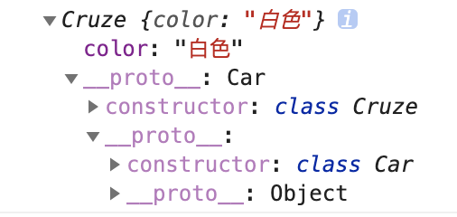
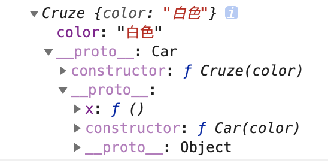

## ES6版本继承

```js
class Car {
    constructor(color) {
        this.color = color;
    }

    static yideng = "京城一灯";
}

class Cruze extends Car {
    constructor(color) {
        super(color);
    }
}
const cruze = new Cruze("白色");

console.log(cruze); // Cruze { color: '白色' }
console.log(cruze instanceof Cruze); // true
console.log(cruze instanceof Car); // true
```



1. 实例cruze的是class Cruze，

## ES5继承

```js
function Car(color) {
    this.color = color;
}
Car.myname = "京城一灯";
Car.prototype.x = function () {
    console.log("父类方法");
};

function Cruze(color) {
    Car.call(this, color);
}

Cruze.prototype = Object.create(Car.prototype, {
    constructor: {
        value: Cruze,
        writable: false,
    },
});

Object.entries(Car).forEach(([key, value]) => {
    Cruze[key] = value;
});
const cruze = new Cruze("白色");
console.log(cruze);
console.log(cruze instanceof Cruze);
console.log(cruze instanceof Car);
```



