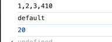

# Symbol

## Symbol.species
用于控制生成新实例时，类的内置方法使用哪个构造器

## Symbol.iterator
用于生成对象的迭代器
```js
var a = {
    1: "张三",
    2: "12"
}
a[Symbol.iterator] = function() {
    index = 0;
    return {
        next: ()=>{
            index++;
            return {
                value: this[index],
                done: !this[index]
            }
        }

    }
}

for (var i of a) {
    console.log(i)
    //张三
    //12
}

```

## Symbol.toPrimitive
在做类型转换时，将对象转为原生类型值

```js
var arr = [1, 2, 3, 4]

console.log(arr + 10)
// 1,2,3,410

arr[Symbol.toPrimitive] = function(hint) {
    console.log(hint)
    if (hint === "default" || typeof hint === "number") {
        return this.reduce((acc,curr)=>acc + curr, 0)
    }
}
console.log(arr + 10)
//20

```


## 常见的Symbol

以下是 JavaScript 中常用的内置 `Symbol` 函数及其作用详解，结合实例说明：

---

### 🔑 一、对象行为控制类
控制对象在语言原生操作（如迭代、类型转换等）中的默认行为。

1. **`Symbol.iterator`**
    - **作用**：定义对象的默认迭代器，使其支持 `for...of` 循环。
    - **示例**：
      ```javascript
      const iterableObj = {
        [Symbol.iterator]: function* () {
          yield 1;
          yield 2;
        }
      };
      for (const num of iterableObj) {
        console.log(num); // 依次输出 1, 2
      }
      ```
      *数组、`Map`、`Set` 等内置此迭代器* 。

2. **`Symbol.asyncIterator`**
    - **作用**：定义对象的异步迭代器，支持 `for await...of` 异步遍历。
    - **示例**：
      ```javascript
      const asyncObj = {
        async* [Symbol.asyncIterator]() {
          yield Promise.resolve(1);
          yield Promise.resolve(2);
        }
      };
      (async () => {
        for await (const num of asyncObj) {
          console.log(num); // 依次输出 1, 2
        }
      })();
      ```
      *用于异步数据流（如分页 API）* 。

3. **`Symbol.toPrimitive`**
    - **作用**：控制对象转换为原始值（如字符串、数字）的行为。
    - **示例**：
      ```javascript
      const obj = {
        [Symbol.toPrimitive](hint) {
          if (hint === "number") return 100;
          if (hint === "string") return "foo";
          return "default";
        }
      };
      console.log(obj + 1); // "default1"（hint 为 "default"）
      console.log(Number(obj)); // 100（hint 为 "number"）
      ```
      *参与运算时自动调用* 。

4. **`Symbol.toStringTag`**
    - **作用**：定制 `Object.prototype.toString()` 返回的标签。
    - **示例**：
      ```javascript
      class CustomClass {
        get [Symbol.toStringTag]() {
          return "MyClass";
        }
      }
      console.log(Object.prototype.toString.call(new CustomClass())); 
      // 输出: [object MyClass]
      ```
      *默认返回 `[object Object]`* 。

---

### ⚙️ 二、运算符与内置方法重写类
覆盖语言原生运算符或方法的行为。

1. **`Symbol.hasInstance`**
    - **作用**：自定义 `instanceof` 运算符的判定逻辑。
    - **示例**：
      ```javascript
      class MyArray {
        static [Symbol.hasInstance](instance) {
          return Array.isArray(instance);
        }
      }
      console.log([] instanceof MyArray); // true（原应返回 false）
      ```
      *改变 `instanceof` 的默认行为* 。

2. **`Symbol.match`**
    - **作用**：重定义 `String.prototype.match()` 的匹配逻辑。
    - **示例**：
      ```javascript
      const customMatcher = {
        [Symbol.match](str) {
          return str.includes("hello") ? "Found" : null;
        }
      };
      console.log("hello world".match(customMatcher)); // "Found"
      ```
      *使非正则对象支持 `match()`* 。

3. **`Symbol.replace` / `Symbol.search` / `Symbol.split`**
    - **作用**：分别自定义 `String.prototype.replace()`、`search()`、`split()` 的行为。
    - **示例**（`Symbol.replace`）：
      ```javascript
      const replacer = {
        [Symbol.replace](str, replacement) {
          return str.replace(/foo/, replacement);
        }
      };
      console.log("bar foo".replace(replacer, "baz")); // "bar baz"
      ```
      *扩展字符串方法的功能* .

---

### 🧩 三、元编程与构造控制类
影响对象构造或元属性。

1. **`Symbol.species`**
    - **作用**：指定派生对象（如 `map()`、`filter()` 返回的新对象）的构造函数。
    - **示例**：
      ```javascript
      class MyArray extends Array {
        static get [Symbol.species]() {
          return Array; // 派生实例使用原生 Array 而非 MyArray
        }
      }
      const arr = new MyArray(1, 2, 3);
      const mapped = arr.map(x => x * 2);
      console.log(mapped instanceof MyArray); // false
      console.log(mapped instanceof Array);   // true
      ```
      *控制派生对象的类型* 。

2. **`Symbol.isConcatSpreadable`**
    - **作用**：控制数组或类数组对象在 `concat()` 中是否展开。
    - **示例**：
      ```javascript
      const arr = [1, 2];
      arr[Symbol.isConcatSpreadable] = false; // 禁止展开
      console.log([].concat(arr)); // 输出: [[1, 2]]
      ```
      *默认数组展开，类数组对象需显式启用* 。

---

### 🌐 四、全局共享与注册类
管理跨模块/环境的 Symbol 共享。

1. **`Symbol.for()`**
    - **作用**：从全局注册表获取或创建 Symbol（相同描述符返回同一 Symbol）。
    - **示例**：
      ```javascript
      const s1 = Symbol.for("foo");
      const s2 = Symbol.for("foo");
      console.log(s1 === s2); // true
      ```
      *适用于跨 Realm（如 iframe）共享 Symbol* 。

2. **`Symbol.keyFor()`**
    - **作用**：返回全局注册表中 Symbol 的描述字符串（仅限 `Symbol.for()` 创建的 Symbol）。
    - **示例**：
      ```javascript
      const s = Symbol.for("foo");
      console.log(Symbol.keyFor(s)); // "foo"
      ```
      *查询全局 Symbol 的键名* 。

---

### 💎 总结
| **Symbol**             | **核心作用**                     | **典型场景**                     |
|------------------------|----------------------------------|----------------------------------|
| `Symbol.iterator`      | 定义迭代逻辑                     | 使对象支持 `for...of`            |
| `Symbol.asyncIterator` | 定义异步迭代逻辑                 | 异步数据遍历                     |
| `Symbol.toPrimitive`   | 控制对象转原始值                 | 参与运算或类型转换               |
| `Symbol.toStringTag`   | 定制对象类型标签                 | 调试时识别自定义类               |
| `Symbol.hasInstance`   | 重写 `instanceof` 行为           | 自定义类型检查                   |
| `Symbol.species`       | 指定派生对象的构造函数           | 控制 `map`/`filter` 的返回类型   |
| `Symbol.for`           | 全局共享 Symbol                  | 跨模块/环境使用同一 Symbol       |

这些内置 Symbol 是 JavaScript 元编程的核心工具，通过覆盖语言底层行为实现高度灵活的定制。
