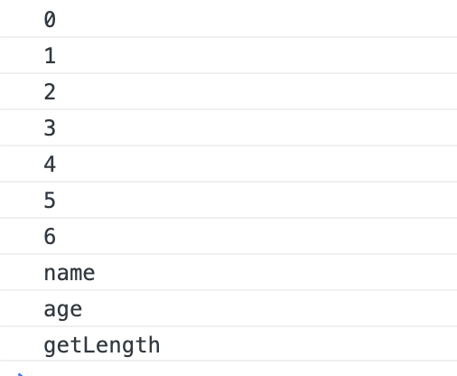
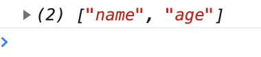

# 区别

for-in是javascript中最常见的迭代语句,常常用来枚举对象的属性, 某些情况下,可能按照随机遍历数组元素

而Object构造器又一个实例属性为keys,则可以返回以对象的属性为元素的数组,数组中的属性名的顺序跟使用for-in遍历的返回顺序是一样的

for-in 循环会枚举对象原型链上的可枚举属性, 而 Obejct.keys不会

# for in

* 遍历对象及其原型链上的可枚举属性
* 如果用于遍历数组,除了遍历其元素外,还会遍历开发者对数组对象自定义的可枚举属性及其原型链上的可枚举属性
* 遍历对对象返回的属性名和遍历数组返回的索引都是string类型
* 某些情况下,可能按随机顺序遍历数组元素

```js
Array.prototype.getLength = function () {
    return this.length
}

var arr = ['a', 'b', 'c', 'd', 'e', 'f', 'g']

arr.name = 'yd'

Object.defineProperty(arr, 'age', {
    enumerable: true,
    value: 5,
    writable: true,
    configurable: true,
})

for (var i in arr) {
    console.log(i)
}
```



# Object.keys

* 返回对象自身可枚举属性组成的数组
* 不会遍历对象原型链上的属性以及Symbol属性
* 对数组的遍历顺序和`for in`一致

```js
function Company() {
    this.name = 'yd'
}

Company.prototype.getName = function () {
    return this.name
}

const yd = new Company()

Object.defineProperty(yd, 'age', {
    enumerable: true,
    value: 5,
    writable: true,
    configurable: true,
})

Object.defineProperty(yd, 'address', {
    enumerable: false,
    value: '北京',
    writable: true,
    configurable: true,
})

console.log(Object.keys(yd))
```



# for of 

* es6 中添加的循环遍历语法
* 支持遍历数组, 类数组对象(DOM NodeList), 字符串, Map对象, Set对象
* 不支持遍历普通对象
* 遍历后输出的结果为数组元素的值
* 可搭配实例方法entries(), 同时输出数组的内容和索引

```js
// 不会遍历到对象属性及其原型属性
Array.prototype.getLength = function () {
    return this.length
}

const arr = ['a', 'b', 'c', 'd', 'e']

arr.name = 'yd'

Object.defineProperty(arr, 'age', {
    enumerable: true,
    value: 17,
    writable: true,
    configurable: true,
})

for (let i of arr) {
    console.log(i) // a, b, c
}

// 如果遍历对象, 可与Object.keys配合
const company = {
    name: 'yd',
    age: 5,
    city: 'beijing',
}

for (let key of Object.keys(company)) {
    console.log(company[key]) // yd, 5, beijing
}

// 配合entries 输出数组索引和值/对象的键值
const arr = ['a', 'b', 'c']
for (let [index, value] of Object.entries(arr)) {
    console.log(index, ':', value)
    // 0:a, 1: b, 2: c
}

const obj = {
    name: 'yd',
    age: 5,
    city: 'beijing',
}

for (let [key, value] of Object.entries(obj)) {
    console.log(key, ': ', value)

    // name: yd, age: 5, city: beijing
}
```

# Object.entries

Object.entries(obj): 如果参数的数据结构具有键和值,则返回一个二元数组, 数组的每个元素为参数的[key, value]数组

```js
// Symbol 属性会被忽略

    Object.entries({
        [Symbol()]: 1,
        name: 'yd',
        age: 5,
    })

    // [[name, yd], [age, 5]]
```