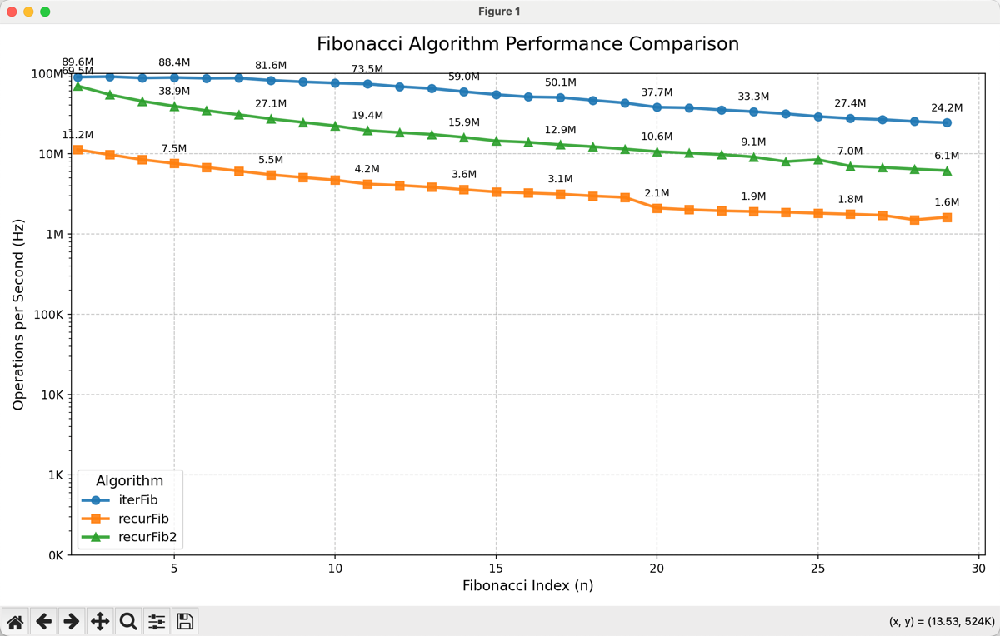

# 尾调用 (Tail Call)

## 什么是尾调用（Tail Call）？

尾调用是指函数作为另一个函数的最后一步操作被调用。在尾调用优化（Tail Call Optimization, TCO）的支持下，JavaScript引擎可以重用当前函数的调用栈帧，而不是创建新的栈帧，从而避免栈溢出并提高性能。

## 尾调用优化的基本条件

1. **函数调用必须是最后一步操作**（即返回语句中直接调用）
2. **调用后不能有其他操作**（如计算、逻辑判断等）
3. **在严格模式下才能保证优化**

## 示例代码对比

### 1. 常规递归（非尾调用）
```javascript
function factorial(n) {
    if (n <= 1) return 1;
    return n * factorial(n - 1); // 不是尾调用，返回前需要乘法运算
}

// 调用栈会随着n增加而增长
console.log(factorial(5)); // 120
```

### 2. 尾递归优化版本
```javascript
"use strict"; // 必须启用严格模式

function factorial(n, total = 1) {
    if (n <= 1) return total;
    return factorial(n - 1, n * total); // 尾调用：直接返回函数结果
}

// 调用栈会被复用，不会增加栈深度
console.log(factorial(5)); // 120
```

### 3. 斐波那契数列尾递归实现
```javascript
"use strict";

function fibonacci(n, a = 0, b = 1) {
    if (n === 0) return a;
    if (n === 1) return b;
    return fibonacci(n - 1, b, a + b); // 尾调用优化
}

console.log(fibonacci(10)); // 55
```

## 尾调用优化的关键点

- **严格模式要求**：大多数引擎只在严格模式下实现TCO
- **参数传递**：通过参数累加结果，避免返回时计算
- **调用位置**：必须是函数的最后一步操作
- **引擎支持**：虽然ES6规范包含TCO，但各引擎实现情况不同

## 浏览器兼容性说明

| 浏览器/引擎 | 尾调用优化支持 |
|------------|---------------|
| Safari      | ✅ 完全支持    |
| Chrome      | ❌ 不支持      |
| Firefox     | ✅ 支持（需严格模式） |
| Node.js     | ❌ 默认不支持   |

> 注意：由于兼容性问题，生产环境中应谨慎使用尾递归

## 替代方案

当目标环境不支持尾调用优化时，可以使用以下替代方案：

### 1. 循环替代递归
```javascript
function factorial(n) {
    let result = 1;
    for (let i = 2; i <= n; i++) {
        result *= i;
    }
    return result;
}
```

### 2. 使用蹦床函数（Trampoline）
```javascript
function trampoline(fn) {
    return (...args) => {
        let result = fn(...args);
        while (typeof result === 'function') {
            result = result();
        }
        return result;
    };
}

const factorial = trampoline(function myself(n, total = 1) {
    if (n <= 1) return total;
    return () => myself(n - 1, n * total);
});

console.log(factorial(5)); // 120
```

## 何时使用尾调用优化？

- 需要深度递归操作时（如处理树形结构）
- 性能关键路径且递归深度较大
- 目标环境确认支持TCO（如Safari或Firefox）

## 总结

尾调用优化是JavaScript中一项重要的性能优化技术，特别适合处理递归问题。尽管当前浏览器支持有限，但了解其原理有助于编写更高效的代码。在实际开发中，请根据目标环境选择适当的递归策略或替代方案。

> 提示：在开发环境中可以使用尾递归优化，生产环境建议使用循环或蹦床函数替代

## 斐波拉契数列

使用动态规划和递归方式求解斐波那契数列
```js
//递归记忆函数
function recurFib(n, memo = {}) {
    // 基础情况：n 为 0 或 1 时直接返回
    if (n < 2) return n;

    // 检查结果是否已缓存
    if (memo[n] !== undefined) {
        return memo[n];
    }
    // 递归计算并缓存结果
    memo[n] = recurFib(n - 1, memo) + recurFib(n - 2, memo);
    return memo[n];
}

// 尾递归函数
function recurFib2(n) {
    function fn(m, result) {
        if (m <= 2) {
            return result + 1;
        }
        return fn(m - 1, result + m)
    }

    return fn(n, 1)
}

// 迭代函数
function iterFib(n) {
    if (n < 1) return 0;
    let a = 0;
    let b = 1;

    for (let i = 1; i < n; i++) {
        const next = a + b;
        a = b;
        b = next;
    }
    return b;
}
```

## 性能测试

横坐标为feibonacci数列的第n项，纵坐标为每秒计算次数
次数数值越高说明执行效率越高

