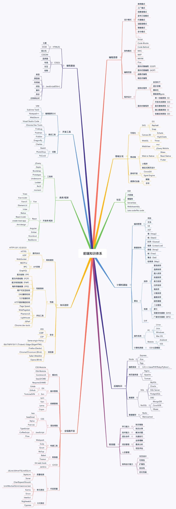
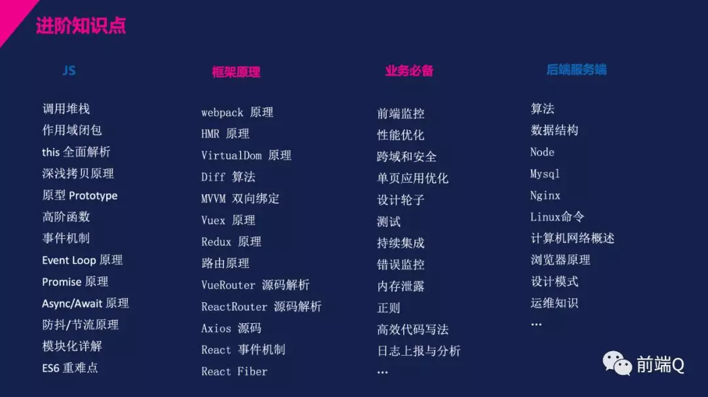
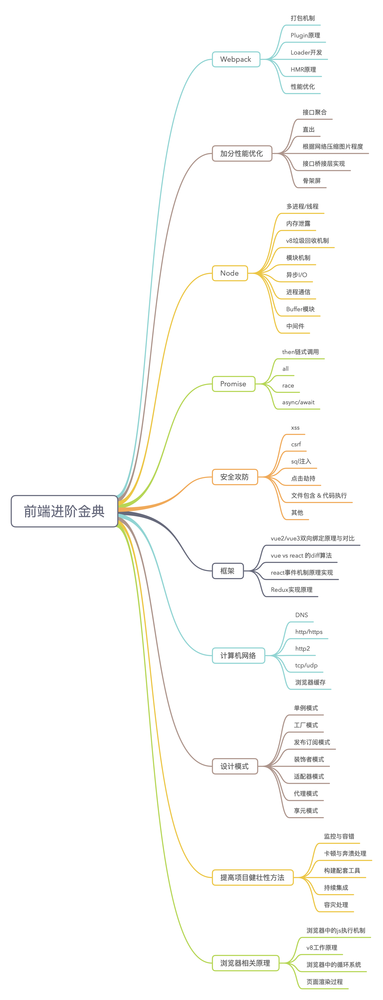

---
# https://vitepress.dev/reference/default-theme-home-page
layout: home

hero:
  name: "点滴生活"
  text: "记录个人成长"
  tagline: 记录个人成长
  image:
    src: /favicon.svg
    alt: VitePress
  actions:
    - theme: brand
      text: 个人随想
      link: /CSS/BFC布局.html
  

features:
  - title: 3D编辑器
    link: https://pinia.work/tool
    details: 简单的3D编辑器
  - title: 个人后台管理
    link: https://pinia.work/admin
    details: 个人后台管理系统
  - title: three-learn
    link: https://lidenghui.github.io/three-learn/
    details: three demo
---

<script setup>
import BlogList from './components/BlogList.vue';
import PackageList from "./components/PackageList.vue";

</script>
<PackageList > </PackageList>
<BlogList></BlogList>








```mindmap
# A
## B
### C
#### D
##### E
# 1
## 2
### 3
#### 4
##### 5
```
