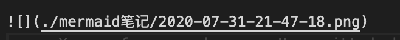

---
title: Paste Image
tags:
    - markdown
    - vscode
categories:
    - 技术文档
    - 工具
    - markdown
date: 2020-07-30 23:52:11
---

# 1. Paste Image

MarkDown 编辑时粘贴图片处理

## 安装 Hexo

> npm install hexo-simple-image

在写markdown时用相对路径

在外部`_config.yml`中 开启`post_asset_folder: true`

## 1.1. 常用变量

| 变量                          | 名称           |
| ----------------------------- | -------------- |
| \${currentFileName}           | 当前文件名     |
| \${currentFIleNameWithoutExt} | 当前文件名     |
| \${currentFileDir}            | 当前文件夹目录 |
| \${projectRoot}               | 项目跟路径     |

## 1.2. 常用操作

| 操作     | 快捷键            |
| -------- | ----------------- |
| 复制图片 | Command + Alt + V |

## 常用配置

| 配置项       | 作用         | 常用配置                                         |
| ------------ | ------------ | ------------------------------------------------ |
| Base Path    | 图片地址     | `${currentFileDir}`                              |
| Default Name | 图片名称     | `Y-MM-DD-HH-mm-ss`                               |
| Path         | 图片插入地址 | `${currentFileDir}/${currentFileNameWithoutExt}` |
| Prefix       | 前缀         | `./ `                                            |