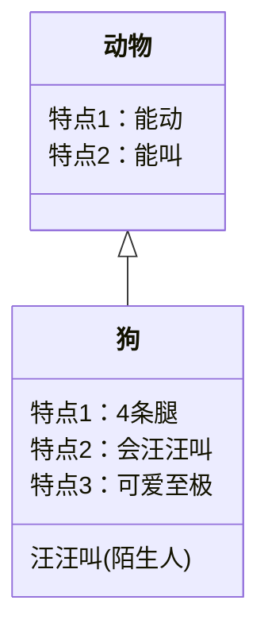

# 安装

## 安装 VSCode

安装插件


## Hexo支持mermaid

1. `yarn add hexo-filter-mermaid-diagrams`

2. 在主题中的`_config.yml`中添加

```yml
mermaid:
    enable: true # Available themes: default | dark | forest | neutral
    theme: forest
    cdn: //cdn.jsdelivr.net/npm/mermaid@8/dist/mermaid.min.js
```
3. 在主题找到资源加载文件`layout/_partial/head.ejs`添加代码

```html
<% if (theme.mermaid.enable) { %>
<script src="<%= theme.mermaid.cdn %>"></script>
<script>
    if (window.mermaid) {
        mermaid.initialize({ theme: '<%= theme.mermaid.theme %>' })
    }
</script>
<% } %>
```


## 类图




参考资料：

http://lightzhan.xyz/index.php/2020/05/10/markdown-mermaid-tutorial-2/

http://lightzhan.xyz/index.php/2020/04/06/markdown-mermaid-tutorial/


