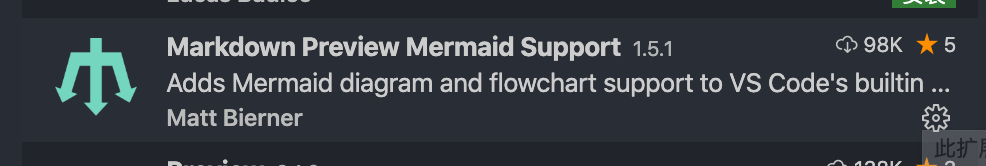
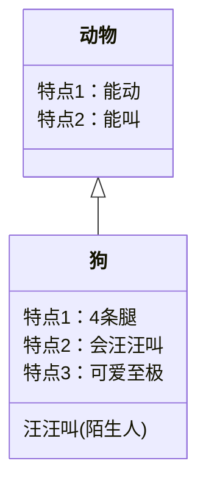
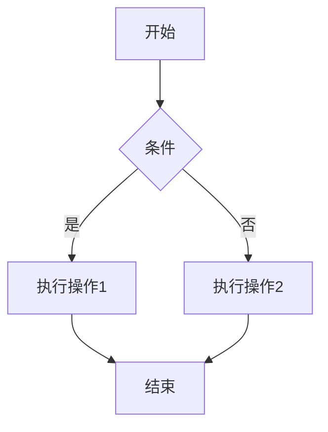
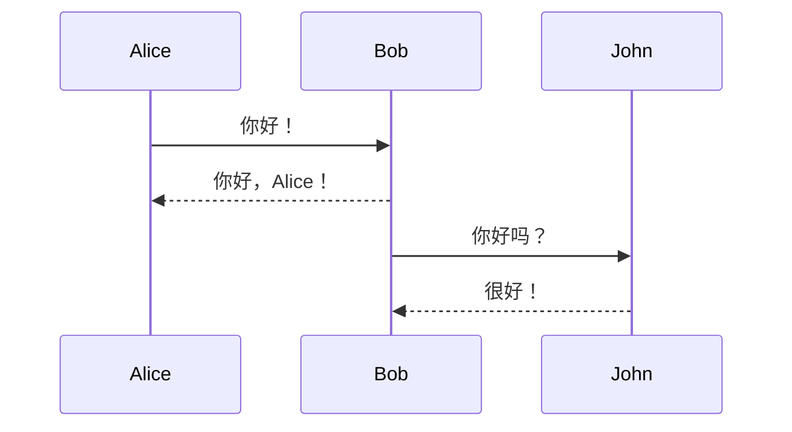
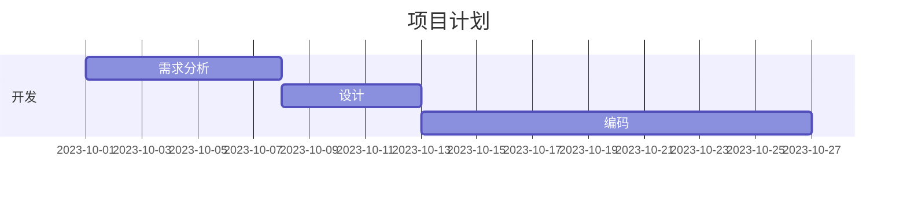
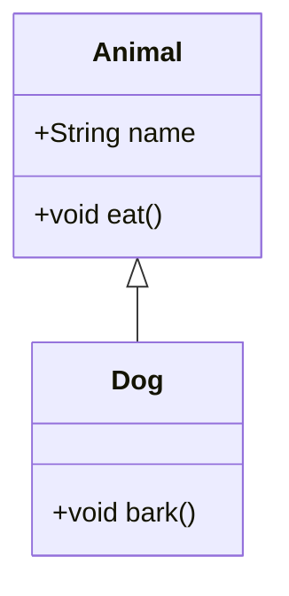
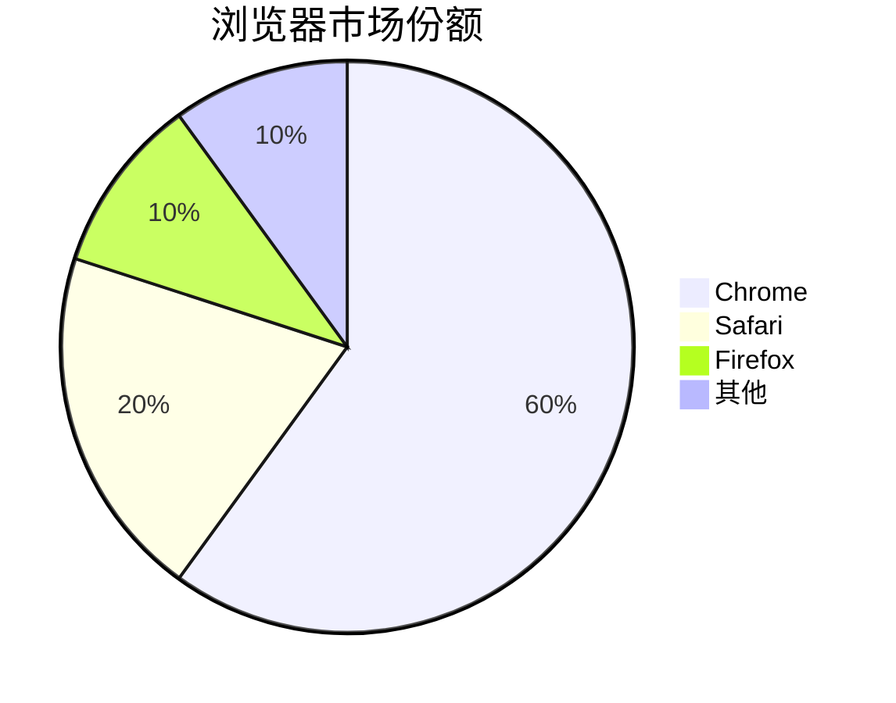
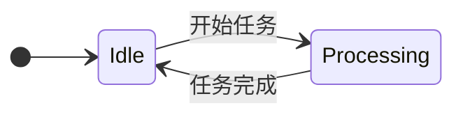
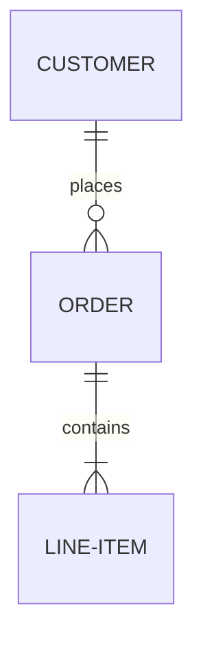

# 安装

## 安装 VSCode

安装插件




## Hexo支持mermaid

1. `yarn add hexo-filter-mermaid-diagrams`

2. 在主题中的`_config.yml`中添加

```yml
mermaid:
    enable: true # Available themes: default | dark | forest | neutral
    theme: forest
    cdn: //cdn.jsdelivr.net/npm/mermaid@8/dist/mermaid.min.js
```
3. 在主题找到资源加载文件`layout/_partial/head.ejs`添加代码

```html
<% if (theme.mermaid.enable) { %>
<script src="<%= theme.mermaid.cdn %>"></script>
<script>
    if (window.mermaid) {
        mermaid.initialize({ theme: '<%= theme.mermaid.theme %>' })
    }
</script>
<% } %>
```


## 类图




Mermaid 是一个用于生成图表和流程图的标记语言，基于 JavaScript，可以通过简单的文本描述来创建各种可视化图表。以下是 Mermaid 常用的语法示例：

---

### 1. **流程图 (Flowchart)**

**语法说明：**
- `graph TD`：定义垂直方向（Top-Down）的流程图。
- `A[开始]`：节点用方括号 `[]` 表示。
- `-->`：箭头表示流程方向。
- `B{条件}`：菱形表示判断条件。

---

### 2. **序列图 (Sequence Diagram)**

**语法说明：**
- `->>`：实线箭头（有箭头）。
- `-->>`：虚线箭头（有箭头）。

---

### 3. **甘特图 (Gantt Chart)**

**语法说明：**
- `dateFormat`：定义日期格式。
- `section`：分组任务。
- `after`：表示任务依赖关系。

---

### 4. **类图 (Class Diagram)**

**语法说明：**
- `+`：表示公共属性/方法。
- `<|--`：表示继承关系。

---

### 5. **饼图 (Pie Chart)**


---

### 6. **状态图 (State Diagram)**


---

### 7. **实体关系图 (ER Diagram)**


---

### 注意事项：
1. Mermaid 代码需要放在 Markdown 的代码块中，并标注语言为 `mermaid`。
2. 部分工具（如 GitHub、VS Code 的 Markdown 预览）需要插件支持。
3. 方向定义：
    - `TB` / `TD`：从上到下（Top-Bottom/Top-Down）
    - `BT`：从下到上
    - `LR`：从左到右
    - `RL`：从右到左

可以参考 [Mermaid 官方文档](https://mermaid.js.org/)。
参考资料：

http://lightzhan.xyz/index.php/2020/05/10/markdown-mermaid-tutorial-2/

http://lightzhan.xyz/index.php/2020/04/06/markdown-mermaid-tutorial/


