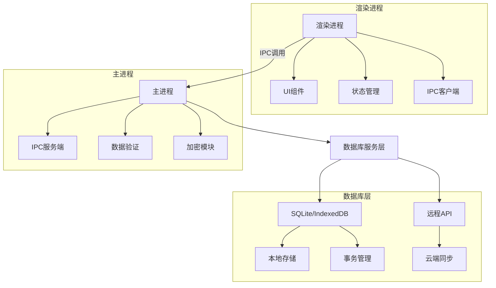
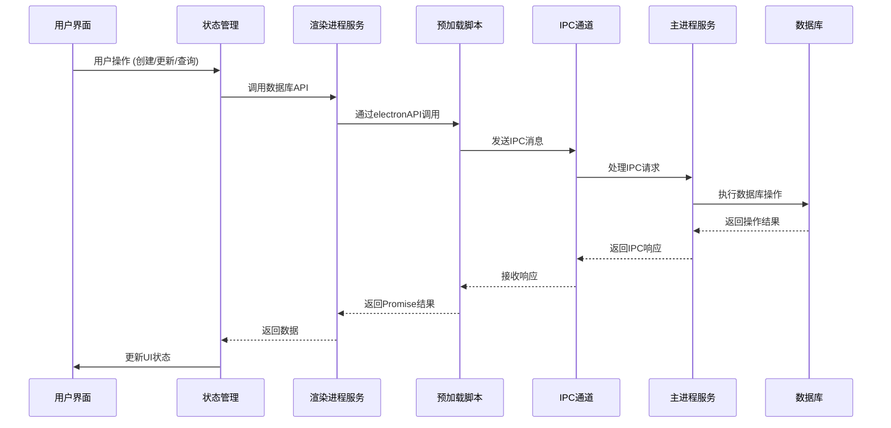
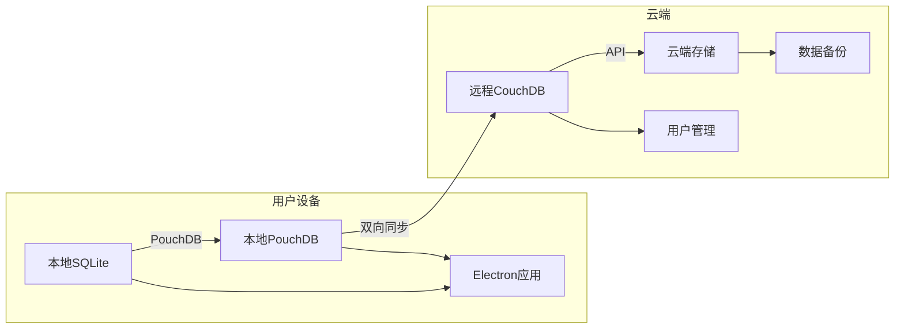

# Electron开发手册

# Electron 数据库操作与数据持久化架构设计

作为前端架构师，我将设计一个完整的 Electron 数据库操作架构，确保数据安全、高效和可维护。以下是完整的架构设计方案：

## 整体架构设计



## 技术选型
- **本地数据库**：SQLite（关系型） + Dexie.js（IndexedDB封装）
- **状态管理**：MobX 或 Zustand
- **数据加密**：Node.js crypto 模块
- **数据同步**：PouchDB + CouchDB
- **ORM**：TypeORM 或 Sequelize

## 文件结构设计

```
src/
├── main/                  # 主进程代码
│   ├── database/          # 数据库核心
│   │   ├── models/        # 数据模型
│   │   ├── services/      # 数据库服务
│   │   ├── migrations/    # 数据库迁移
│   │   └── index.ts       # 数据库初始化
│   ├── ipc/              # IPC通信处理
│   ├── security/         # 安全模块
│   └── main.ts           # 主进程入口
│
├── renderer/             # 渲染进程代码
│   ├── stores/           # 状态管理
│   ├── services/         # API服务
│   ├── components/       # UI组件
│   └── App.tsx           # 主应用组件
│
├── preload/              # 预加载脚本
│   └── index.ts          
│
├── resources/            # 静态资源
└── types/                # 类型定义
```

## 数据库服务层设计

### 1. 数据库初始化 (main/database/index.ts)

```typescript
import { app } from 'electron';
import path from 'path';
import { Sequelize } from 'sequelize';

class Database {
  private sequelize: Sequelize;
  
  constructor() {
    const dbPath = path.join(app.getPath('userData'), 'app-database.sqlite');
    
    this.sequelize = new Sequelize({
      dialect: 'sqlite',
      storage: dbPath,
      logging: process.env.NODE_ENV === 'development',
    });
  }

  async init() {
    try {
      await this.sequelize.authenticate();
      console.log('Database connection established');
      
      // 运行数据库迁移
      await this.runMigrations();
      
      // 初始化模型
      this.initializeModels();
      
      return this.sequelize;
    } catch (error) {
      console.error('Database initialization failed:', error);
      throw error;
    }
  }

  private async runMigrations() {
    // 数据库迁移逻辑
  }

  private initializeModels() {
    // 注册所有数据模型
  }

  get instance() {
    return this.sequelize;
  }
}

export default new Database();
```

### 2. 数据模型设计 (main/database/models/User.ts)

```typescript
import { DataTypes, Model } from 'sequelize';
import db from '../index';

class User extends Model {
  public id!: number;
  public username!: string;
  public email!: string;
  public passwordHash!: string;
  public createdAt!: Date;
  public updatedAt!: Date;
}

User.init(
  {
    id: {
      type: DataTypes.INTEGER,
      autoIncrement: true,
      primaryKey: true,
    },
    username: {
      type: DataTypes.STRING(50),
      allowNull: false,
      unique: true,
    },
    email: {
      type: DataTypes.STRING(100),
      allowNull: false,
      unique: true,
      validate: {
        isEmail: true,
      },
    },
    passwordHash: {
      type: DataTypes.STRING(128),
      allowNull: false,
    },
  },
  {
    sequelize: db.instance,
    tableName: 'users',
    timestamps: true,
    indexes: [
      {
        unique: true,
        fields: ['username'],
      },
      {
        unique: true,
        fields: ['email'],
      },
    ],
  }
);

export default User;
```

### 3. 数据库服务层 (main/database/services/UserService.ts)

```typescript
import User from '../models/User';
import { hashPassword } from '../../security/crypto';
import { IpcMainInvokeEvent } from 'electron';

interface CreateUserParams {
  username: string;
  email: string;
  password: string;
}

interface UpdateUserParams {
  id: number;
  username?: string;
  email?: string;
  password?: string;
}

class UserService {
  async createUser(event: IpcMainInvokeEvent, params: CreateUserParams) {
    try {
      const passwordHash = await hashPassword(params.password);
      
      const user = await User.create({
        username: params.username,
        email: params.email,
        passwordHash,
      });
      
      return {
        success: true,
        data: user.toJSON(),
      };
    } catch (error) {
      return {
        success: false,
        error: error.message,
      };
    }
  }

  async updateUser(event: IpcMainInvokeEvent, params: UpdateUserParams) {
    try {
      const user = await User.findByPk(params.id);
      
      if (!user) {
        throw new Error('User not found');
      }
      
      if (params.username) user.username = params.username;
      if (params.email) user.email = params.email;
      
      if (params.password) {
        user.passwordHash = await hashPassword(params.password);
      }
      
      await user.save();
      
      return {
        success: true,
        data: user.toJSON(),
      };
    } catch (error) {
      return {
        success: false,
        error: error.message,
      };
    }
  }

  async getUserById(event: IpcMainInvokeEvent, id: number) {
    try {
      const user = await User.findByPk(id, {
        attributes: { exclude: ['passwordHash'] },
      });
      
      if (!user) {
        throw new Error('User not found');
      }
      
      return {
        success: true,
        data: user.toJSON(),
      };
    } catch (error) {
      return {
        success: false,
        error: error.message,
      };
    }
  }

  async listUsers(event: IpcMainInvokeEvent, page = 1, pageSize = 20) {
    try {
      const offset = (page - 1) * pageSize;
      
      const { count, rows } = await User.findAndCountAll({
        attributes: { exclude: ['passwordHash'] },
        offset,
        limit: pageSize,
        order: [['createdAt', 'DESC']],
      });
      
      return {
        success: true,
        data: {
          total: count,
          page,
          pageSize,
          users: rows.map(u => u.toJSON()),
        },
      };
    } catch (error) {
      return {
        success: false,
        error: error.message,
      };
    }
  }
}

export default new UserService();
```

## IPC 通信架构

### 1. IPC 服务端 (main/ipc/index.ts)

```typescript
import { ipcMain } from 'electron';
import userService from '../database/services/UserService';

function setupDatabaseIPC() {
  // 用户管理
  ipcMain.handle('db:createUser', userService.createUser);
  ipcMain.handle('db:updateUser', userService.updateUser);
  ipcMain.handle('db:getUserById', userService.getUserById);
  ipcMain.handle('db:listUsers', userService.listUsers);
  
  // 其他数据库操作...
}

export function initializeIPC() {
  setupDatabaseIPC();
  // 其他IPC设置...
}
```

### 2. 预加载脚本 (preload/index.ts)

```typescript
import { contextBridge, ipcRenderer } from 'electron';

contextBridge.exposeInMainWorld('electronAPI', {
  // 数据库操作
  createUser: (params) => ipcRenderer.invoke('db:createUser', params),
  updateUser: (params) => ipcRenderer.invoke('db:updateUser', params),
  getUserById: (id) => ipcRenderer.invoke('db:getUserById', id),
  listUsers: (page, pageSize) => ipcRenderer.invoke('db:listUsers', page, pageSize),
  
  // 其他API...
});
```

### 3. 渲染进程服务封装 (renderer/services/api.ts)

```typescript
class DatabaseAPI {
  async createUser(userData) {
    try {
      const result = await window.electronAPI.createUser(userData);
      if (!result.success) throw new Error(result.error);
      return result.data;
    } catch (error) {
      console.error('Create user failed:', error);
      throw error;
    }
  }

  async updateUser(userData) {
    try {
      const result = await window.electronAPI.updateUser(userData);
      if (!result.success) throw new Error(result.error);
      return result.data;
    } catch (error) {
      console.error('Update user failed:', error);
      throw error;
    }
  }

  async getUserById(id) {
    try {
      const result = await window.electronAPI.getUserById(id);
      if (!result.success) throw new Error(result.error);
      return result.data;
    } catch (error) {
      console.error('Get user failed:', error);
      throw error;
    }
  }

  async listUsers(page = 1, pageSize = 20) {
    try {
      const result = await window.electronAPI.listUsers(page, pageSize);
      if (!result.success) throw new Error(result.error);
      return result.data;
    } catch (error) {
      console.error('List users failed:', error);
      throw error;
    }
  }
}

export const dbAPI = new DatabaseAPI();
```

## 安全模块设计

### 1. 数据加密 (main/security/crypto.ts)

```typescript
import crypto from 'crypto';
import { app } from 'electron';
import path from 'path';
import fs from 'fs';

const ALGORITHM = 'aes-256-cbc';
const IV_LENGTH = 16;

// 安全获取加密密钥
function getEncryptionKey(): Buffer {
  const keyPath = path.join(app.getPath('userData'), 'secret.key');
  
  if (fs.existsSync(keyPath)) {
    return fs.readFileSync(keyPath);
  }
  
  const key = crypto.randomBytes(32);
  fs.writeFileSync(keyPath, key);
  return key;
}

export function encrypt(text: string): string {
  const iv = crypto.randomBytes(IV_LENGTH);
  const cipher = crypto.createCipheriv(ALGORITHM, getEncryptionKey(), iv);
  let encrypted = cipher.update(text, 'utf8', 'hex');
  encrypted += cipher.final('hex');
  return `${iv.toString('hex')}:${encrypted}`;
}

export function decrypt(text: string): string {
  const [ivHex, encryptedText] = text.split(':');
  const iv = Buffer.from(ivHex, 'hex');
  const decipher = crypto.createDecipheriv(ALGORITHM, getEncryptionKey(), iv);
  let decrypted = decipher.update(encryptedText, 'hex', 'utf8');
  decrypted += decipher.final('utf8');
  return decrypted;
}

export async function hashPassword(password: string): Promise<string> {
  return new Promise((resolve, reject) => {
    const salt = crypto.randomBytes(16).toString('hex');
    
    crypto.scrypt(password, salt, 64, (err, derivedKey) => {
      if (err) reject(err);
      resolve(`${salt}:${derivedKey.toString('hex')}`);
    });
  });
}

export async function verifyPassword(password: string, hash: string): Promise<boolean> {
  return new Promise((resolve, reject) => {
    const [salt, key] = hash.split(':');
    crypto.scrypt(password, salt, 64, (err, derivedKey) => {
      if (err) reject(err);
      resolve(key === derivedKey.toString('hex'));
    });
  });
}
```

## 状态管理集成 (渲染进程)

### 用户状态管理 (renderer/stores/userStore.ts)

```typescript
import { makeAutoObservable } from 'mobx';
import { dbAPI } from '../services/api';

class UserStore {
  users = [];
  currentUser = null;
  loading = false;
  error = null;
  
  constructor() {
    makeAutoObservable(this);
  }
  
  async loadUsers(page = 1, pageSize = 20) {
    this.loading = true;
    this.error = null;
    
    try {
      const result = await dbAPI.listUsers(page, pageSize);
      this.users = result.users;
    } catch (error) {
      this.error = error.message;
    } finally {
      this.loading = false;
    }
  }
  
  async createUser(userData) {
    this.loading = true;
    this.error = null;
    
    try {
      const newUser = await dbAPI.createUser(userData);
      this.users = [newUser, ...this.users];
      return newUser;
    } catch (error) {
      this.error = error.message;
      throw error;
    } finally {
      this.loading = false;
    }
  }
  
  async updateUser(userData) {
    this.loading = true;
    this.error = null;
    
    try {
      const updatedUser = await dbAPI.updateUser(userData);
      this.users = this.users.map(u => 
        u.id === updatedUser.id ? updatedUser : u
      );
      return updatedUser;
    } catch (error) {
      this.error = error.message;
      throw error;
    } finally {
      this.loading = false;
    }
  }
  
  async login(username, password) {
    this.loading = true;
    this.error = null;
    
    try {
      // 实际项目中会有专门的认证服务
      const user = await dbAPI.getUserByUsername(username);
      const isValid = await verifyPassword(password, user.passwordHash);
      
      if (!isValid) {
        throw new Error('Invalid credentials');
      }
      
      this.currentUser = user;
      return user;
    } catch (error) {
      this.error = error.message;
      throw error;
    } finally {
      this.loading = false;
    }
  }
  
  logout() {
    this.currentUser = null;
  }
}

export default new UserStore();
```

## 数据流架构图



## 数据同步机制

### 1. 本地-云端同步设计



### 2. 同步服务实现 (main/database/syncService.ts)

```typescript
import PouchDB from 'pouchdb';
import PouchDBFind from 'pouchdb-find';
import { remoteDBUrl } from '../../config';

PouchDB.plugin(PouchDBFind);

class SyncService {
  private localDB: PouchDB.Database;
  private remoteDB: PouchDB.Database;
  
  constructor() {
    this.localDB = new PouchDB('local-sync-db');
    this.remoteDB = new PouchDB(remoteDBUrl);
  }
  
  async startSync() {
    try {
      // 初始同步
      await this.initialSync();
      
      // 设置实时同步
      this.localDB.sync(this.remoteDB, {
        live: true,
        retry: true,
      })
      .on('change', (info) => {
        console.log('Sync change:', info);
      })
      .on('error', (err) => {
        console.error('Sync error:', err);
      });
    } catch (error) {
      console.error('Sync initialization failed:', error);
    }
  }
  
  private async initialSync() {
    // 获取最后同步时间
    const lastSync = await this.getLastSync();
    
    // 执行初始同步
    await this.localDB.replicate.from(this.remoteDB, {
      since: lastSync,
      batch_size: 100,
      batches_limit: 5,
    });
    
    // 更新最后同步时间
    await this.setLastSync();
  }
  
  private async getLastSync(): Promise<string> {
    // 从本地存储获取最后同步时间
    // 实现省略...
    return '0';
  }
  
  private async setLastSync() {
    // 保存当前同步时间
    // 实现省略...
  }
}

export default new SyncService();
```

## 最佳实践

1. **数据安全**：
    - 使用加密存储敏感数据
    - 主进程验证所有输入数据
    - 使用预加载脚本隔离上下文

2. **性能优化**：
    - 批量处理数据库操作
    - 使用分页加载大数据集
    - 缓存常用查询结果

3. **错误处理**：
    - 统一错误处理中间件
    - 用户友好的错误消息
    - 详细的日志记录

4. **数据迁移**：
    - 使用迁移脚本管理数据库变更
    - 支持版本回滚
    - 备份重要数据

5. **测试策略**：
    - 单元测试数据库服务
    - 集成测试IPC通信
    - E2E测试用户流程

## 总结

本架构设计提供了一个完整的 Electron 数据库操作解决方案，关键优势包括：

1. **分层架构**：清晰的职责分离（渲染进程/主进程/数据库）
2. **安全设计**：数据加密、输入验证、安全通信
3. **可扩展性**：模块化设计便于功能扩展
4. **数据同步**：本地优先策略与云端同步
5. **错误恢复**：事务支持与数据备份机制

此架构适用于需要本地数据存储的 Electron 应用，如笔记应用、数据管理工具、离线应用等。实际实施时，应根据具体业务需求调整数据模型和同步策略。