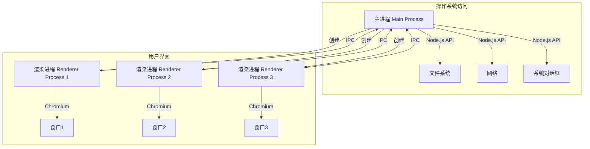
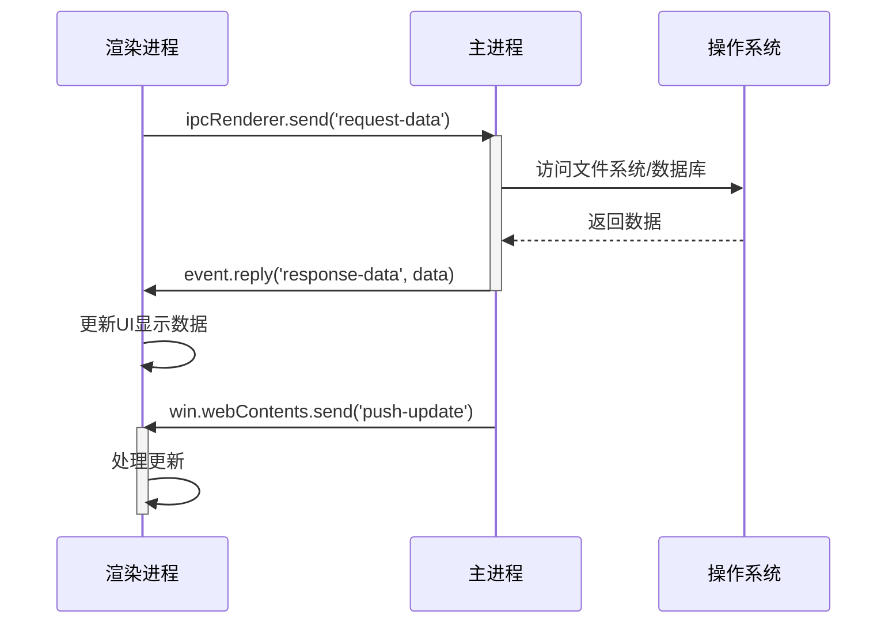
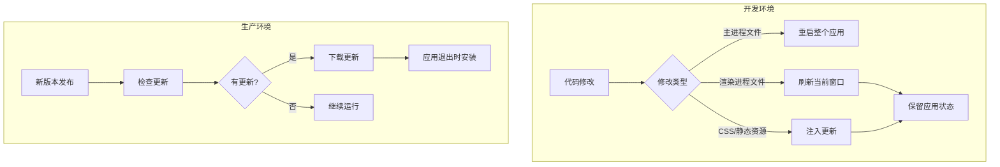
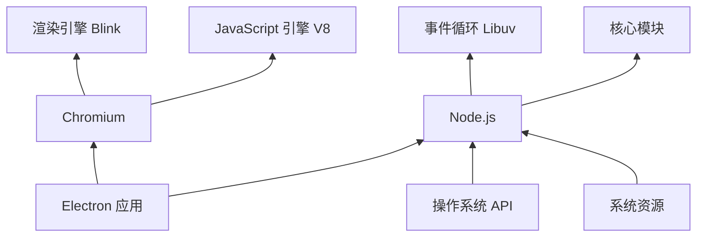
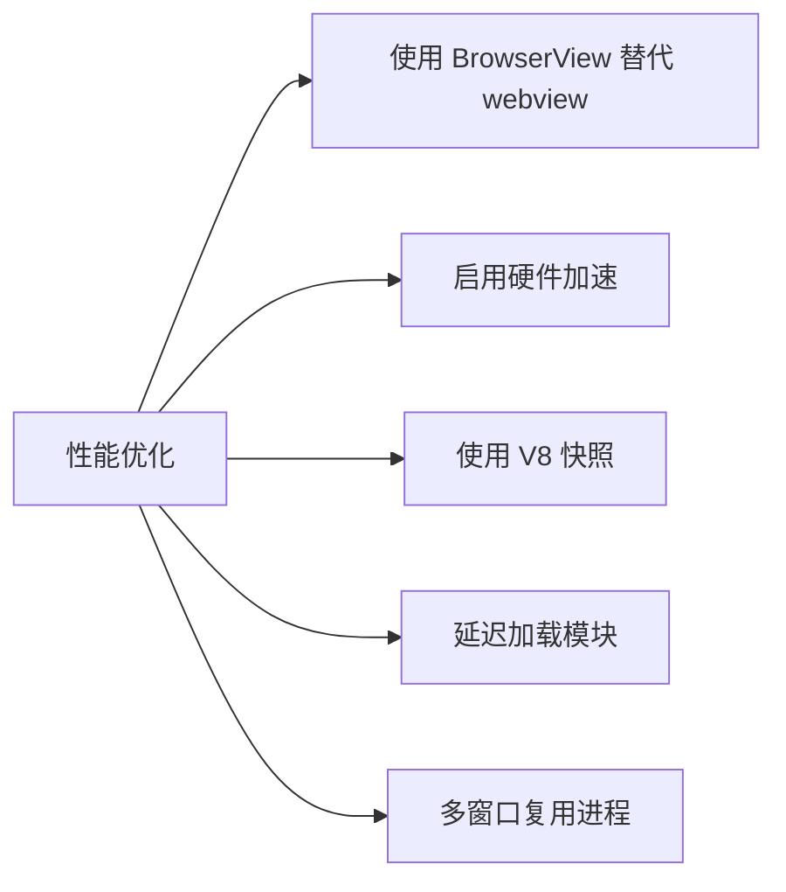

# Electron 应用开发文档

## 目录
1. [架构设计](#架构设计)
2. [安装指南](#安装指南)
3. [数据交互原理](#数据交互原理)
4. [热更新机制](#热更新机制)
5. [原理说明](#原理说明)
6. [最佳实践](#最佳实践)

---

## 1. 架构设计 <a name="架构设计"></a>

Electron 应用采用**主进程-渲染进程**架构模型：



### 架构说明：
- **主进程**：
    - 应用程序入口点
    - 使用 Node.js 环境
    - 管理所有窗口和应用程序生命周期
    - 访问操作系统 API
    - 只有一个主进程实例

- **渲染进程**：
    - 每个窗口一个独立进程
    - 基于 Chromium 的浏览器环境
    - 运行前端代码（HTML/CSS/JS）
    - 默认情况下无法直接访问 Node.js API

- **进程间通信 (IPC)**：
    - 主进程与渲染进程通信的桥梁
    - 使用 `ipcMain` 和 `ipcRenderer` 模块
    - 支持同步和异步通信

---

## 2. 安装指南 <a name="安装指南"></a>

### Electron 开发环境安装流程


### 详细步骤：
1. **安装 Node.js**
   ```bash
   # 推荐安装 LTS 版本
   https://nodejs.org/
   ```

2. **创建项目结构**
   ```bash
   mkdir my-electron-app
   cd my-electron-app
   ```

3. **初始化 npm 项目**
   ```bash
   npm init -y
   ```

4. **安装 Electron**
   ```bash
   npm install electron --save-dev
   ```

5. **配置 package.json**
   ```json
   {
     "name": "my-electron-app",
     "version": "1.0.0",
     "main": "main.js",
     "scripts": {
       "start": "electron ."
     },
     "devDependencies": {
       "electron": "^25.0.0"
     }
   }
   ```

6. **创建主进程文件 (main.js)**
   ```javascript
   const { app, BrowserWindow } = require('electron')
   
   function createWindow() {
     const win = new BrowserWindow({
       width: 800,
       height: 600,
       webPreferences: {
         nodeIntegration: true,
         contextIsolation: false
       }
     })
   
     win.loadFile('index.html')
   }
   
   app.whenReady().then(createWindow)
   ```

7. **创建渲染进程文件 (index.html)**
   ```html
   <!DOCTYPE html>
   <html>
   <head>
     <meta charset="UTF-8">
     <title>Electron App</title>
   </head>
   <body>
     <h1>Hello Electron!</h1>
     <p>Welcome to your first Electron application</p>
   </body>
   </html>
   ```

8. **启动应用**
   ```bash
   npm start
   ```

---

## 3. 数据交互原理 <a name="数据交互原理"></a>

Electron 进程间通信模型：



### 通信方法：

1. **渲染进程 → 主进程**
   ```javascript
   // 渲染进程中
   const { ipcRenderer } = require('electron')
   ipcRenderer.send('request-data', {param: 'value'})
   
   // 主进程中
   ipcMain.on('request-data', (event, args) => {
     // 处理请求
     event.reply('response-data', result)
   })
   ```

2. **主进程 → 渲染进程**
   ```javascript
   // 主进程中
   const win = new BrowserWindow({...})
   win.webContents.send('update-data', data)
   
   // 渲染进程中
   ipcRenderer.on('update-data', (event, data) => {
     // 更新UI
   })
   ```

3. **渲染进程 ↔ 渲染进程**
    - 通过主进程中转
    - 使用 `window.postMessage`

---

## 4. 热更新机制 <a name="热更新机制"></a>

开发环境热更新方案：



### 实现方案：

1. **开发热重载**
   ```javascript
   // 安装 electron-reloader
   npm install electron-reloader --save-dev
   
   // 在主进程文件中
   try {
     require('electron-reloader')(module, {
       watchRenderer: true
     });
   } catch (_) {}
   ```

2. **生产环境自动更新**
   ```javascript
   // 主进程中
   const { autoUpdater } = require('electron-updater')
   
   autoUpdater.checkForUpdatesAndNotify()
   
   autoUpdater.on('update-downloaded', () => {
     autoUpdater.quitAndInstall()
   })
   ```

3. **状态保持技巧**
   ```javascript
   // 在渲染进程中使用 localStorage
   localStorage.setItem('appState', JSON.stringify(state))
   
   // 应用启动时恢复
   const savedState = localStorage.getItem('appState')
   ```

---

## 5. 原理说明 <a name="原理说明"></a>

### Electron 运行原理



### 核心概念：
1. **Chromium 集成**
    - 提供现代浏览器功能
    - 支持 Web 标准（HTML5, CSS3, ES6+）
    - 多进程架构保障稳定性

2. **Node.js 集成**
    - 访问文件系统和操作系统功能
    - 使用 npm 生态系统
    - 支持原生模块

3. **进程隔离**
    - 主进程：操作系统资源访问
    - 渲染进程：DOM 操作和 UI 渲染
    - 通过 IPC 安全通信

4. **上下文隔离**
    - 默认启用安全隔离
    - 通过预加载脚本暴露安全 API
   ```javascript
   // 预加载脚本
   const { contextBridge, ipcRenderer } = require('electron')
   
   contextBridge.exposeInMainWorld('electronAPI', {
     openFile: () => ipcRenderer.invoke('dialog:openFile')
   })
   
   // 渲染进程中使用
   window.electronAPI.openFile()
   ```

---

## 6. 最佳实践 <a name="最佳实践"></a>

### 安全建议
1. 始终启用 `contextIsolation`
2. 禁用 `nodeIntegration`（使用预加载脚本代替）
3. 验证 IPC 消息来源
4. 使用 CSP 内容安全策略

### 性能优化


### 调试技巧
1. **主进程调试**
   ```bash
   electron --inspect=5858 .
   ```
   然后在 Chrome 中访问 `chrome://inspect`

2. **渲染进程调试**
   ```javascript
   // 创建窗口时
   win.webContents.openDevTools()
   ```

3. **性能分析**
   ```javascript
   const { session } = require('electron')
   session.defaultSession.loadExtension('path/to/devtools-extension')
   ```

### 打包发布
推荐工具：
- electron-builder
- electron-forge

```bash
# 安装 electron-builder
npm install electron-builder --save-dev

# 添加打包脚本
"scripts": {
  "pack": "electron-builder --dir",
  "dist": "electron-builder"
}

# 创建配置文件 (electron-builder.yml)
appId: com.example.myapp
productName: My Electron App
directories:
  output: dist
files:
  - "**/*"
  - "!node_modules/*/{CHANGELOG.md,README.md,README,readme.md,readme}"
win:
  target: nsis
mac:
  target: dmg
linux:
  target: AppImage
```

---

本文档提供了 Electron 开发的全面指南，包括架构设计、安装流程、数据交互机制、热更新方案和核心原理。实际开发中请根据应用需求调整配置，并始终遵循安全最佳实践。