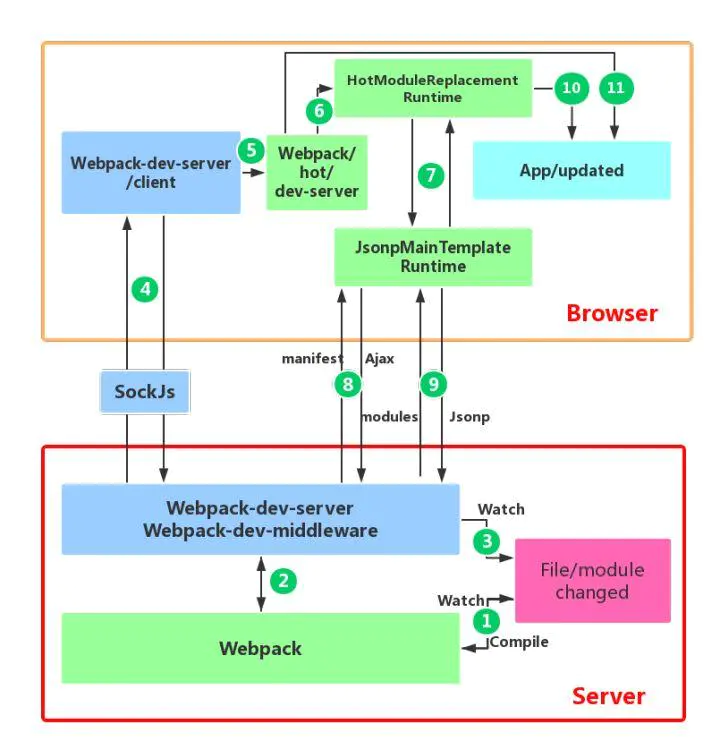

Hot Module Replacement (简称 HMR)




# 1. webpack对文件系统进行watch打包到内存

webpack-dev-middleware 调用 webpack 的api对文件系统watch, 当文件发生改变后,webpack重新对文件进行编译打包,然后保存到内存中.

webpack 将bundle.js 文件打包到内存中, 不生成文件的原因在于访问内存中的代码比访问文件系统中的文件更快,而且也减少了代码写入文件的开销

这一切都归功与mermory-fs, memory-fs是webpack-dev-middleware的一个依赖库,webpack-dev-middleware将webpack原本的outputFileSystem替换成了MemoryFileSystem实例, 这样代码就将输出到内存中.

webpack-dev-middleware 中该部分源码如下

```js
  // compiler
  // webpack-dev-middleware/lib/Shared.js
  var isMemoryFs = !compiler.compilers &&
                  compiler.outputFileSystem instanceof MemoryFileSystem;
  if(isMemoryFs) {
      fs = compiler.outputFileSystem;
  } else {
      fs = compiler.outputFileSystem = new MemoryFileSystem();
  }
```

# 2. devServer 通知浏览器端文件发生变化

在启动devServer的时候,sockjs在服务器和浏览器端建立了一个websocket长连接,以便将webpack编译和打包的哥哥阶段状态告知浏览器, 最关键的步骤还是 webpack-dev-server调用webpack api监听 compile 的done 事件们当compile完成后,webpack-dev-server通过_sendStatus 方法将编译打包后的新模块hash值发送到浏览器端

```js
// webpack-dev-server/lib/Server.js
  compiler.plugin('done', (stats) => {
    // stats.hash 是最新打包文件的 hash 值
    this._sendStats(this.sockets, stats.toJson(clientStats));
    this._stats = stats;
  });
  Server.prototype._sendStats = function (sockets, stats, force) {
    if (!force && stats &&
    (!stats.errors || stats.errors.length === 0) && stats.assets &&
    stats.assets.every(asset => !asset.emitted)
    ) { return this.sockWrite(sockets, 'still-ok'); }
    // 调用 sockWrite 方法将 hash 值通过 websocket 发送到浏览器端
    this.sockWrite(sockets, 'hash', stats.hash);
    if (stats.errors.length > 0) { this.sockWrite(sockets, 'errors', stats.errors); } 
    else if (stats.warnings.length > 0) { this.sockWrite(sockets, 'warnings', stats.warnings); }      
    else { this.sockWrite(sockets, 'ok'); }
  };
```

# 3. webpack-dev-server/client 接收到服务端消息做出响应

webpack-dev-server 修改了pack配置中的entry属性,在里面添加了webpack-dev-client的代码,这样在最后bundle.js文件中就会接收到websocket消息的代码了

webpack-dev-server/client 当接收到type为hash消息后会将hash值暂存起来,当接收到type为ok的消息后对应用执行reload操作

在reload操作中,webpack-dev-server/client 会根据hot配置决定是刷新浏览器还是对当前代码进行热更新

```js
// webpack-dev-server/client/index.js
  hash: function msgHash(hash) {
      currentHash = hash;
  },
  ok: function msgOk() {
      // ...
      reloadApp();
  },
  // ...
  function reloadApp() {
    // ...
    if (hot) {
      log.info('[WDS] App hot update...');
      const hotEmitter = require('webpack/hot/emitter');
      hotEmitter.emit('webpackHotUpdate', currentHash);
      // ...
    } else {
      log.info('[WDS] App updated. Reloading...');
      self.location.reload();
    }
  }
```

# 4. webpack 接收到最新hash值验证并请求模块代码

首先 webpack/hot/dev-server (一下简称 dev-server) 监听第三步 webpack-dev-server/client发送的webpackHotUpdate消息,调用webpack/lib/HotModuleReplacement.runtime(简称HMR runtime)中的check方法,检测是否有新的更新

在check过程中会利用webpack/lib/JsonpMainTemplate.runtime (简称jsonp runtime)中的两个方法 hotDownloadManifest 和 hostDownloadUpdateChunk

hotDownloadManifest是调用Ajax 向服务端请求是否有更新的文件,如果有将发更新的文件列表返回浏览器端.该方法返回的是最新的hash值

hotDownloadUpdateChunk 是通过jsonp请求最新的模块代码,然后将代码返回给HMR runtime,HMR runtime 会根据返回的新模块代码做进一步处理,可能是刷新页面,也可能是对模块进行热更新.该方法返回的就是最新hash值对应的代码块

附: 为什么更新模块的代码不直接在第三步通过websocket 发送到浏览器端,而是通过jsonp来获取

功能块的解耦,各个模块各司其职,dev-server/client 只负责消息的传递而不负责新模块的获取,这些工作应该由 HMR runtime 来完成,HMR runtime 才应该是获取新代码的地方.再就是因为不适用 webpack-dev-server 的前提,使用 webpack-hot-middleware 和 webpack 配合也可以完成模块更新流程,在使用 webpack-hot-middleware 中有件有意思的事,他没有使用 websocket,而是使用 EventSource. 综上所述,HMR 的工作流中,不应该把新模块代码放在 websocket 消息中

# 5. HotModuleReplacement.runtime 对模块进行热更新

这一步是整个模块热更新(HMR)的关键步骤,而且模块热更新都是发生在 HMR runtime 中的 HotApply 方法中

```js
// webpack/lib/HotModuleReplacement.runtime
  function hotApply() {
      // ...
      var idx;
      var queue = outdatedModules.slice();
      while(queue.length > 0) {
          moduleId = queue.pop();
          module = installedModules[moduleId];
          // ...
          // remove module from cache
          delete installedModules[moduleId];
          // when disposing there is no need to call dispose handler
          delete outdatedDependencies[moduleId];
          // remove "parents" references from all children
          for(j = 0; j < module.children.length; j++) {
              var child = installedModules[module.children[j]];
              if(!child) continue;
              idx = child.parents.indexOf(moduleId);
              if(idx >= 0) {
                  child.parents.splice(idx, 1);
              }
          }
      }
      // ...
      // insert new code
      for(moduleId in appliedUpdate) {
          if(Object.prototype.hasOwnProperty.call(appliedUpdate, moduleId)) {
              modules[moduleId] = appliedUpdate[moduleId];
          }
      }
      // ...
  }
```

模块热更新的错误处理,如果在热更新过程中出现错误,热更新将回退到刷新浏览器,这部分代码在 dev-server 代码中,简要代码如下:

```js
  module.hot.check(true).then(function(updatedModules) {
    if(!updatedModules) {
        return window.location.reload();
    }
    // ...
  }).catch(function(err) {
      var status = module.hot.status();
      if(["abort", "fail"].indexOf(status) >= 0) {
          window.location.reload();
      }
  });
```

# 6. 业务代码需要做些什么

当用新的模块代码替换老模块后,但是我们的业务代码不不知道代码已经发生变化,也就是说,当 hello.js 文件修改后,我们需要在 index.js 文件中调用 HMR 的 accept 方法,添加模块更新后的处理函数,及时将 hello 方法的返回值插入到页面中.代码如下

```js
  // index.js
  if(module.hot) {
      module.hot.accept('./hello.js', function() {
          div.innerHTML = hello()
      })
  }
```
