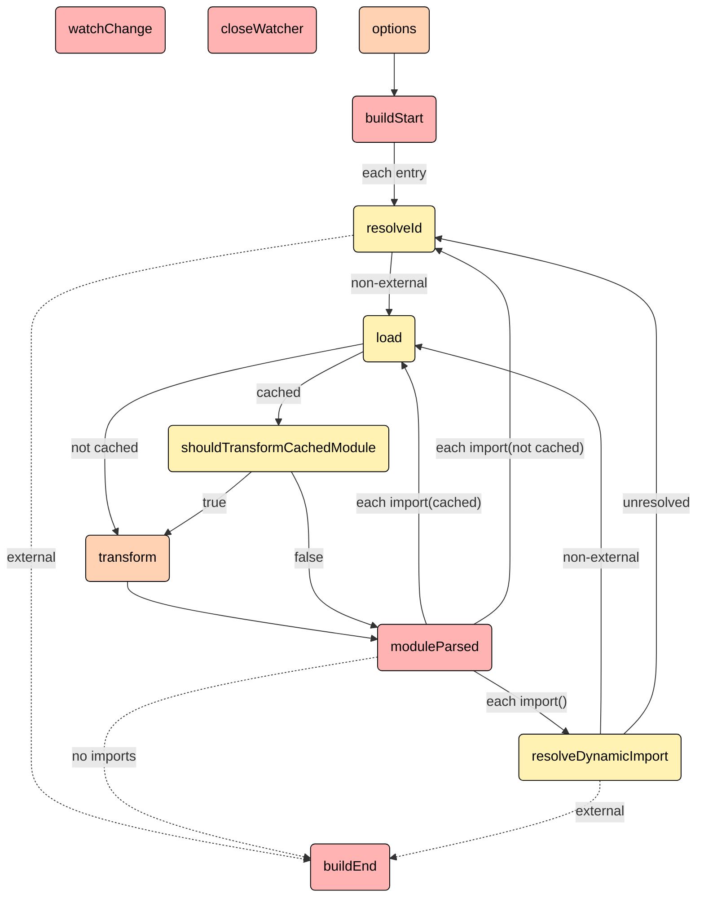

# Rollup生命周期

Rollup.js 的构建过程分为 **Build**（构建）和 **Output**（输出）两大阶段，每个阶段包含多个子流程，并通过**插件钩子（Hooks）** 实现扩展性。以下是各阶段的详细作用和执行流程：

	

		parallel
	

	

		sequential
	

	

		first
	

	

		async
	

	

		sync
	

## 🔧 **一、Build 阶段：依赖解析与模块图生成**
**目标**：解析入口文件，构建模块依赖图（Module Graph），生成模块的抽象语法树（AST）。  
**流程**：
1. **`options` 钩子**
    - **作用**：转换或修改 Rollup 配置（如修改输入路径）。
    - **类型**：`async, sequential`（按插件顺序执行）。

2. **`buildStart` 钩子**
    - **作用**：初始化构建状态（如清理缓存、预加载资源）。
    - **类型**：`async, parallel`（插件并行执行）。

3. **`resolveId` 钩子**
    - **作用**：解析模块路径（如处理别名 `@/utils` → `src/utils.js`）。
    - **类型**：`async, first`（一旦某个插件返回有效路径，则停止后续解析）。

4. **`load` 钩子**
    - **作用**：加载模块内容（如读取文件或返回虚拟模块）。
    - **示例**：加载 JSON 文件时，`@rollup/plugin-json` 将其转为 JS 对象。

5. **`transform` 钩子**
    - **作用**：转换模块代码（如 Babel 转译、替换环境变量）。
    - **类型**：`async, sequential`（插件串行执行，前一个结果作为下一个输入）。

6. **`moduleParsed` 钩子**
    - **作用**：模块 AST 解析完成后触发，收集 `import` 依赖关系，递归解析子模块。

7. **`buildEnd` 钩子**
    - **作用**：构建结束（成功或失败时执行清理操作）。

**输出**：生成 `bundle` 对象，包含模块依赖图、AST 和原始代码，但尚未打包。

## 📦 **二、Output 阶段：代码打包与产物生成**
**目标**：将模块依赖图转换为优化后的最终产物（如单文件或代码分割的 chunk）。  
**流程**：
1. **`outputOptions` 钩子**
    - **作用**：修改输出配置（如动态调整输出格式 `esm` → `cjs`）。

2. **`renderStart` 钩子**
    - **作用**：输出阶段开始的初始化。

3. **关键代码优化**
    - **Tree Shaking**：静态分析 AST，删除未使用的代码（需 ES 模块语法）。
    - **作用域提升（Scope Hoisting）**：将模块合并到单一作用域，减少运行时开销。

4. **`banner/footer/intro/outro` 钩子**
    - **作用**：在产物首尾添加自定义内容（如版权声明）。

5. **`renderChunk` 钩子**
    - **作用**：处理单个 chunk 的代码（如压缩、添加 Sourcemap）。
    - **常用插件**：`rollup-plugin-terser` 压缩代码。

6. **`generateBundle` 钩子**
    - **作用**：所有 chunk 生成后，修改最终产物（如注入全局变量）。

7. **`writeBundle` 钩子**
    - **作用**：产物写入磁盘前的最后操作（如校验文件大小）。

8. **`closeBundle` 钩子**
    - **作用**：构建完全结束（关闭文件句柄、释放内存）。

**输出**：
- 通过 `bundle.generate()` 返回内存中的代码（适用于 SSR）。
- 通过 `bundle.write()` 将产物写入磁盘（如 `dist/bundle.js`）。

## ⚙️ **三、插件钩子的核心类型与作用**
Rollup 的插件机制依赖以下钩子类型，控制执行逻辑：

| **钩子类型**       | **作用**                      | **示例钩子**           |  
|----------------|-----------------------------|--------------------|  
| **Async/Sync** | 异步钩子可返回 Promise；同步钩子需立即返回结果 | `transform`（Async） |  
| **Parallel**   | 并发执行插件逻辑（如 `buildStart`）    | `buildStart`       |  
| **Sequential** | 串行执行，前一个插件的返回值作为下一个的输入      | `transform`        |  
| **First**      | 一旦某个插件返回非 `null` 值，则停止后续执行  | `resolveId`        |  

## 🌟 **四、关键优化技术**
1. **Tree Shaking**
    - 依赖 ES 模块的静态结构，移除未使用的代码（如未导出的函数）。
2. **代码分割（Code Splitting）**
    - 通过动态导入（`import()`）分割代码，生成按需加载的 chunk。
3. **格式兼容**
    - 支持输出 `esm`、`cjs`、`iife` 等多种格式，适配不同环境。

## 💎 **总结**
Rollup 通过 **Build → Output** 两阶段实现高效打包：
- **Build 阶段**：解析模块依赖关系，粒度到**单个文件**，核心是生成模块图。
- **Output 阶段**：优化（Tree Shaking、作用域提升）并输出代码，粒度到 **chunk**（打包后的代码块）。  
  **插件系统**是 Rollup 扩展性的核心，开发者可通过钩子介入每个子流程，实现路径别名、代码压缩等复杂需求。
