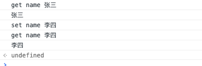
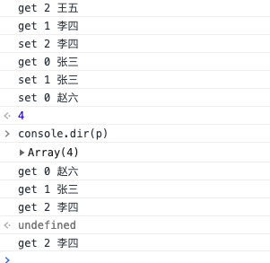
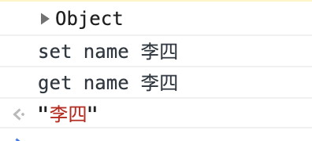
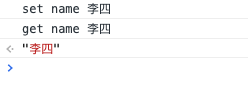
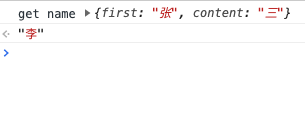
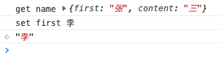
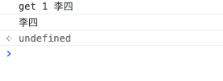
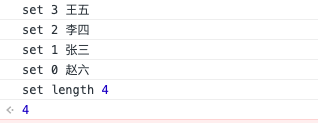

# Vue解析 defineProperty与Proxy


老说 vue2，数组对象不行，不行在哪？
老说 vue3 上来，这些数组对象的问题都解决了，到底解决了什么？是真的没有问题了吗？

## vue2 的 defineProperty

```ts
interface Props {
  // true 当且仅当该属性描述符的类型可以被改变并且该属性可以从对应对象中删除。
  // 默认为 false
  configurable: boolean;
  // true 当且仅当在枚举相应对象上的属性时该属性显现。
  // 默认为 false
  enumerable: false;

  // true 当且仅当在枚举相应对象上的属性时该属性显现。
  // 默认为 false
  value: any;

  // true当且仅当与该属性相关联的值可以用assignment operator改变时。
  // 默认为 false
  writable: boolean;

  // 作为该属性的 getter 函数，如果没有 getter 则为undefined。函数返回值将被用作属性的值。
  // 默认为 undefined
  get?: () => any;

  // 作为属性的 setter 函数，如果没有 setter 则为undefined。函数将仅接受参数赋值给该属性的新值。
  // 默认为 undefined
  set?:(value)=>void
}
/**
 * @params obj: 修改对象
 * @params key: 要修改的值
 * @params Props:
 */
Object.defineProperties(obj,key, props: Props)
```

描述符可以有的属性

|            | configurable | enumerable | value  | writable | get    | set    |
| ---------- | ------------ | ---------- | ------ | -------- | ------ | ------ |
| 数据描述符 | 可以         | 可以       | 可以   | 可以     | 不可以 | 不可以 |
| 存取描述符 | 可以         | 可以       | 不可以 | 不可以   | 可以   | 可以   |

example：

```js
var data = {
    name: '张三',
}

var p = defineReactive(data)

function defineReactive(data) {
    var result = data
    Object.keys(data).forEach((key) => {
        var value = data[key]
        Object.defineProperty(result, key, {
            enumerable: true,
            configurable: true,
            set(val) {
                console.log(`set`, key, val)
                value = val
            },
            get() {
                console.log(`get`, key, value)
                return value
            },
        })
    })

    return result
}

console.log(p.name)
p.name = '李四'
console.log(p.name)
```

console



遗留问题：

`Object.defineProperty`只能根据已存在的 key 来修改`get`、`set`方法，所以当`key`不存在的时候没有办法触发`get`和`set`所以需要强制刷新，使用`$set`

### vue2 数组对象有什么问题

数组可以看成`key`为 0，1...的对象，也可以使用`Object.defineProperty`改写`get`和`set`，也就是说`vue2`可以监控数组的数据变化，

问题 1. 当新增值的时候，数据的新的 key 没有被`Object.defineProperty`改写，也就没有办法触发页面刷新，因此需要用`$set`

问题 2. 当数组`unshift`插入值的时候，会修改整个数组的每个对象，所以要触发多次`get`，`set`， 如下图

```js
var data = ['张三', '李四', '王五']

var p = defineReactive(data)

function defineReactive(data) {
    var result = data
    Object.keys(data).forEach((key) => {
        var value = data[key]
        Object.defineProperty(result, key, {
            enumerable: true,
            configurable: true,
            set(val) {
                console.log(`set`, key, val)
                value = val
            },
            get() {
                console.log(`get`, key, value)
                return value
            },
        })
    })

    return result
}

p.unshift('赵六')
```

console



解析：数组将内部对象，依次往后移动一位，最后在开始位置插入`赵六`数据，所以需要重复的`get`,`set`特别，是最后一个值`王五`，移动到 3 号位置的时候，3 号位置没有被`Object.defineProperty`改写，因此打印出来的数据上 3 号位置没有`get`、`set`方法，也就没有触发`set`,`console.dir(p)`后也就没有触发`get`打印`get 3 王五`

### vue2 如何处理

> node_modules/vue/src/core/observer/array.js

```ts
const methodsToPatch = [
    'push',
    'pop',
    'shift',
    'unshift',
    'splice',
    'sort',
    'reverse',
]

/**
 * Intercept mutating methods and emit events
 */
methodsToPatch.forEach(function (method) {
    // cache original method
    const original = arrayProto[method]
    def(arrayMethods, method, function mutator(...args) {
        const result = original.apply(this, args) //执行方法
        const ob = this.__ob__
        let inserted
        switch (method) {
            case 'push':
            case 'unshift':
                inserted = args
                break
            case 'splice':
                inserted = args.slice(2)
                break
        }
        if (inserted) ob.observeArray(inserted) // 改写新插入的值
        // notify change
        ob.dep.notify()
        return result // 返回结果
    })
})
```

检测数组中的方法有没有被添加数据，如果添加了数据，就将添加的数据用`Object.defineProperty`改写。
因此也就解决了，push 后的值没有被监听的问题

### 遗留问题

因为要对对象的所有属性改写`set`、`get`方法，所以需要`递归遍历`数据的元素,所以性能比较差，所以不要在`vue`的`data`上挂不需要的值。如`window`，`jquery`等

## vue3 的 Proxy

```ts

interface Handler {
  get: Function
  set: Function
}

/**
 * @params target 代理对象
 * @params handler 处理对象
 */
const p = new Proxy(target:object, handler:Handler)
```

example

```js
var data = {
    name: '张三',
}

var p = defineReactive(data)

function defineReactive(data) {
    var result = data

    p = new Proxy(result, {
        set(obj, prop, value) {
            console.log(`set`, prop, value)
            obj[prop] = value
        },
        get(obj, prop) {
            console.log(`get`, prop, obj[prop])

            return obj[prop]
        },
    })

    return p
}

p.name = '李四'
p.name
```

console




### vue3 解决了 vue2 什么问题

Proxy 不需要遍历 data 的所有 key 修改 key 的 get 和 set，只需要在最上使用 Proxy，就能监听到当前对象 get 和 set。

那么当我们`p.name.first="李"`还能触发 set 吗

```js
var data = {
    name: {
        first: '张',
        content: '三',
    },
}

var p = defineReactive(data)

function defineReactive(data) {
    var result = data

    p = new Proxy(result, {
        set(obj, prop, value) {
            console.log(`set`, prop, value)
            obj[prop] = value
        },
        get(obj, prop) {
            console.log(`get`, prop, obj[prop])

            return obj[prop]
        },
    })

    return p
}

p.name.first = '李'
```

console



从 console 可以看出，只触发 data 的 name 的 get 方法，没有触发 set，也就是说 Proxy 只能监听代理数据的子项，不能监听代理数据的孙子项。

### 怎么办？

由于 Proxy 是在 Data 上监听，那么为什么不能在 get 被触发的时候，将子项也代理，从而达到监听孙子项的目的那

```js
var data = {
    name: {
        first: '张',
        content: '三',
    },
}

var p = defineReactive(data)

function defineReactive(data) {
    var result = data

    p = new Proxy(result, {
        set(obj, prop, value) {
            console.log(`set`, prop, value)
            obj[prop] = value
        },
        get(obj, prop) {
            console.log(`get`, prop, obj[prop])

            return defineReactive(obj[prop])
        },
    })

    return p
}

p.name.first = '李'
```

console



如图：监听到了 p.name.first 的 set 事件，这样就解决了数据递归遍历的噩运，提高了速度。

### vue3 遗留问题

```js
var data = ['张三', '李四', '王五']

var p = defineReactive(data)

function defineReactive(data) {
    var result = data

    p = new Proxy(result, {
        set(obj, prop, value) {
            console.log(`set`, prop, value)
            obj[prop] = value
        },
        get(obj, prop) {
            console.log(`get`, prop, obj[prop])
            return obj[prop]
        },
    })

    return p
}

console.dir(p[1])
```

console



当 data 为数组的时候也可以监听到。但是 `unshift`哪

```js
var data = ['张三', '李四', '王五']

var p = defineReactive(data)

function defineReactive(data) {
    var result = data

    p = new Proxy(result, {
        set(obj, prop, value) {
            console.log(`set`, prop, value)
            obj[prop] = value
            return true
        },
        get(obj, prop) {
            var val = obj[prop]

            if (typeof obj[prop] === 'object') {
                val = defineReactive(obj[prop])
            }

            return val
        },
    })

    return p
}

p.unshift('赵六')
```

console



由此可见：在 vue3 中使用了 Proxy 也没有解决触发多次 set 事件的问题。

vue3完整示例

```js
function reactive(data) {
    if (typeof data !== 'object' || data == null) {
        return data
    }

    const observed = new Proxy(data, {
        get(target, key, receiver) {
            let result = Reflect.get(target, key, receiver)

            return typeof result !== 'object' ? result : reactive(result)
        },

        set(target, key, value, receiver) {
            effective()
            const ret = Refect.set(target, key, value, receiver)
            return ret
        },

        deleteProperty(target, key) {
            const ret = Refect.deleteProperty(target, key)
            return ret
        },
    })

    return observed
}

```
