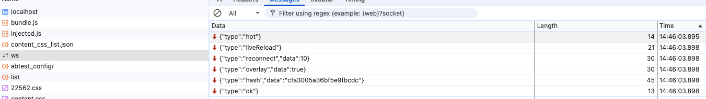
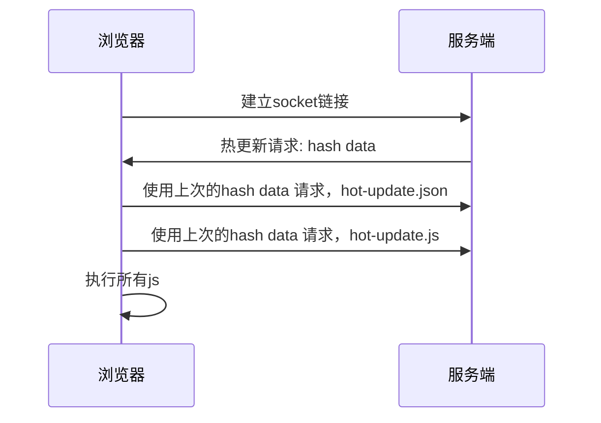

# HMR原理2
## 项目中添加热更新代码
这段代码加到哪里，那块的子模块更新，才不会全部reload
这里只是打开了一个开关，指出如果发生热更新，更新的范围是什么，
什么都不写，代表了更新当前的模块

```js
if (import.meta.webpackHot) {
    import.meta.webpackHot.accept()
}
```
```js

function accept (dep, callback, errorHandler) {
    /******/
    if (dep === undefined)
        hot._selfAccepted = true;
    /******/
    else if (typeof dep === "function")
        hot._selfAccepted = dep;
    /******/
    else if (typeof dep === "object" && dep !== null) {
        /******/
        for (var i = 0; i < dep.length; i++) {
            /******/
            hot._acceptedDependencies[dep[i]] = callback || function() {}
            ;
            /******/
            hot._acceptedErrorHandlers[dep[i]] = errorHandler;
            /******/
        }
        /******/
    } else {
        /******/
        hot._acceptedDependencies[dep] = callback || function() {}
        ;
        /******/
        hot._acceptedErrorHandlers[dep] = errorHandler;
        /******/
    }
    /******/
}
```


```js
    __webpack_require__.hu = (chunkId) => {
            /******/
            // return url for filenames based on template
            /******/
            return "" + chunkId + "." + __webpack_require__.h() + ".hot-update.js";
            /******/
        }
```

```js
function a(__webpack_require__) { // webpackRuntimeModules
(() => {
__webpack_require__.h = () => ("16b156e8dfe53fad7e33")
})();
}
```
每次返回新的更新json的时候，都会返回在原有函数的基础上添加一行代码，这样就将h的函数的返回值更新成了最新

```js

var hotEmitter = __webpack_require__(/*! ./emitter */ "./node_modules/webpack/hot/emitter.js");
hotEmitter.on("webpackHotUpdate", function (currentHash) {
    lastHash = currentHash;
    if (!upToDate() && module.hot.status() === "idle") {
        log("info", "[HMR] Checking for updates on the server...");
        check();
    }
});
```

页面开始的时候坚挺 websocket的 webpackHotUpdate消息
如果消息是`及时的`，且 hot的状态是 `及时的`

## 项目开始加载阶段

1. 项目打包的时候会自动引入 HMR相关代码，
2. 同时会启动WebSocket进行消息传输
3. 所有的代码都在bundle.js中

## 修改项目代码

当我们修改页面代码时如果是改的深层次的代码


1. 当我们修改了代码后，直接收到三个socket消息通知
2. 然后我们浏览器进行了刷新

现在我们需要进行确认是否可以不进行刷新



