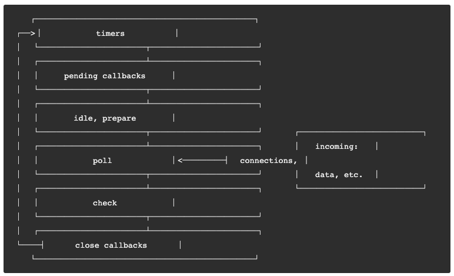

# NodeJs Event Loop

## NodeJS Event Loop 执行阶段

1. timers: 执行 `setTimeout` 和 `setImmediate` 的回调
2. pending callbacks: 执行延迟到下一个循环迭代的I/O回调
3. idle,prepare: 仅系统内部使用
4. poll: 检索新的I/O事件;执行与I/O相关的回调,事件上除了其他几个阶段处理的事件,其他几乎所有的异步都在这个阶段处理
5. check: setImmediate 在这里执行
6. close callbacks: 一些关闭的回调函数, 如: socket.on('close',..)

每个阶段都有一个自己的先进先出的队列,只有当这个队列的事件执行完或者达到该阶段的上限时, 才会进入下一个阶段,在每次事件循环之间,Node.js都会检查它是否在等待任何一个I/O或者定时器,如果没有的话,程序就关闭推出了,我们直观感受就是,如果一个node程序只有同步代码,你在控制台运行完后,他就自己推出了

