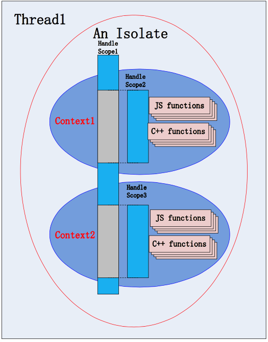

# V8

V8引擎是一个javascript 引擎实现, 最初由一些语言方面的专家设计,后被谷歌收购, 随后谷歌对其进行了开源

v8引擎使用C++ 开发,在运行JavaScript之前, 相比其他JavaScript的引擎转换成字节码或解析执行,V8将其编译成原生机器码(IA-32, X86-64, ARM, or MIPS CPUs)

并且使用如内联缓存(inline-cahcing) 等方法来提高性能.

有了这些功能, JavaScript程序在V8引擎的运行速度媲美二进制程序

V8支持众多操作系统, 如 windows, linux, android 等,也支持其他硬件架构. 如IA32 X64, ARM等,具有很好的可移植性和跨平台性

# Isolate

英文原意: 隔离.在操作系统中,我们有一个概念和之类似: 进程,进程是完全相互隔离的,一个进程里有多个线程, 同时各个进程之间并不相互共享资源.

Isolate 也是一样, Isolate1和Isolate2哥两拥有各自堆栈的虚拟机实例,且完全隔离

## V8的官方定义

Isolate 标示 V8 引擎的Isolate实例, v8 Isolate具有完全独立的状态,一个Isolate 中的对象不得在其他Isolate中使用, 初始化时v8隐式创建一个默认的Isolate. 
embedder可以创建其他Isolate, 并在多个线程中并行使用他们. 在任何给定实践, Isolate 最多只能接受一个线程的输入.必须使用Locker/UnLocker API进行同步处理

## 对比Context进行理解

在V8里面, Context 主要是用于创建一个JavaScript的运行上下文环境, A Context 中的js变量完全独立于 B Context, 一般用Context 来做js的安全隔离. 这里需要区别Isolate,context 依附于Isolate

Isolate 于 context 的区别

1. 一个Isolate 是一份独立的 V8 runtime, 包括但不限于 一个heap管理器, 垃圾回收器等. 在一个时间端内, 有且只有一个线程能使用此isolate. 不过多个线程可以同时使用多个Isolate
2. 单独的Isolate是不足以运行脚本的,我们在此需要一个全局对象, context 就是提供此全局变量的工具, 它在所处的Isolate 管理heap中建立一个对象, 并以此为全局变量构建出一个完整的执行环境供我们的脚本使用.
3. 因此, 对于一个给定的Isolate, 不仅其可以有多个Context, 并且这些Context之间可以共享某写对象.

