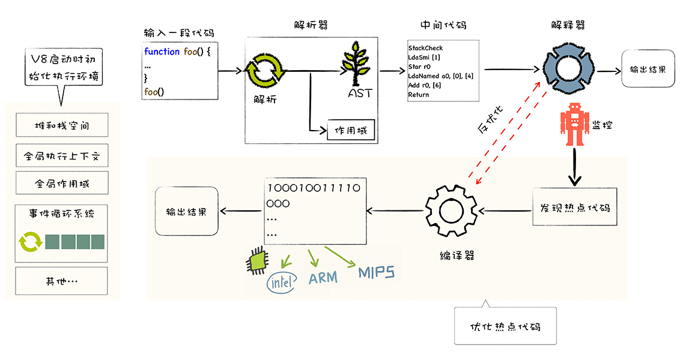

# 编程语言的运行

众所周知,我们通过编程语言完成的程序是通过处理器运行的,但是处理器不能直接理解我们通过高级语言(如C++、Go、Javascript等)编写的代码, 只能理解机器码,所以在执行程序前,需要经过一系列的步骤,将我们编写的代码翻译成机器语言,这个过程一般是由编译器(compiler) 或者解释器(Interpreter)来完成

## 编译器工作流程

源代码 - 词法分析- 语法分析 -  AST - 语义分析 - 中间代码 - 代码优化 - 机器码 - 执行

## 解释器

源代码 - 词法分析 - 语法分析 - AST - 语义分析 - 字节码 - 执行

那么既然编译器和解释器都可以完成代码的翻译工作, 为何还同时存在呢

这是因为编程语言有两个类别: 静态类型 和动态类型.

静态类型: 比如 C++、Go 等,都需要提前编译(AOT) 成机器码 然后执行, 这个过程主要使用编译器来运行;
动态类型: 比如 Javascript、 Python 等, 只在运行时进行编译执行(JIT), 这个过程主要使用解释器完成.

V8并没有采用某种单一的技术,而是混合编译执行和解释执行这两种手段,我们把这种混合使用编译器和解释器的技术称为JIT(JustIn Time)技术

这是一种权衡策略,因为这两种办法都各自有各自的优缺点,解释执行的启动速度快,但是执行时的速度慢,而编译执行的启动速度慢,但是执行的速度快

# v8执行js代码流程

V8启动执行javascript之前,它还需要准备执行JavaScript时所需要的一些基础环境,这些基础环境包括了 队空间、栈空间、全局执行上下文、全局作用域、消息循环系统、内置函数等, 这些内容都是执行javaScirpt 过程中 需要使用到的,比如:

1. javaScript全局执行上下文就包含了执行过程中的全局信息, 比如一些内置函数,全局变量等信息、
2. 全局作用域包含了一些全局变量,在执行过程中的数据都需要存放在内存中
3. 而v8采用了经典的堆和栈内存管理模式,所以V8还需要初始化内存中的堆和栈结构
4. 另外,想要我们的V8系统活起来,还需要初始化消息循环系统,消息循环系统包含了消息驱动器和消息队列,它如同V8的心脏,不断接受消息并决策如何处理消息
   
基础环境准备好之后,接下来就可以向V8提交要执行的JavaScript代码了

1. 首先V8会接收到要执行的Javascirpt源代码,不过这对V8来说只是一堆字符串,V8并不能直接理解这段字符串的含义, 他需要结构化这段字符串,生成了抽象语法树(AST),AST是便于V8理解的结构.在生成AST的同时,V8还会生成相关的作用域, 作用域中存放相关的变量
2. 有了AST和作用域之后,接下来就可以生成字节码了,字节码是介于AST和机器代码中间代码. 但是与特定类型的机器代码无关, 解释器可以直接解释执行行字解码,或者通过编译器将其编译为二进制的机器码,并输出执行结果
3. 解释器就登场了,他会按照顺序解释执行字节码,并输出执行结果
4. 有一个监控解释器执行状态的模块, 在解释执行字节码过程中,如果发现了某一段代码会被重复执行,那么监控机器人就会将这段代码标记为热点代码,
5. 当某段代码被标记化为热点代码后,V8就会将这段字节码丢给优化编译器, 优化编译器会在后台将字节码编译为二进制代码, 然后再对编译后的二进制代码执行优化操作,优化后的二进制机器代码的执行效率会得到大大提升,如果下面再执行到这段代码时, 那么V8会优先选择优化之后的二进制代码,这样代码的执行速度就会大幅度提升
6. 不过,和静态语言不同的是, javascript是一种非常灵活的动态语言, 对象的结构和属性是可以在运行时任意修改的, 而经过优化编译器优化的代码只能针对某种固定的结构,一旦在执行过程中, 对象的结构被动态修改了,那么优化之后的代码势必会变成无效的代码,这时候优化编译器就需要执行去优化操作,经过去优化的代码, 下次执行时就会回退到解释器解释执行

# 总结 V8执行一段JS代码的大致流程

1. 初始化基础环境
2. 解释源码生成AST和作用域
3. 依据AST和作用域生成字节码;
4. 解释执行字节码
5. 监听热点代码
6. 优化热点代码为二进制的机器代码
7. 去优化生成的二进制机器代码