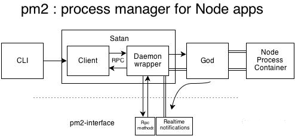
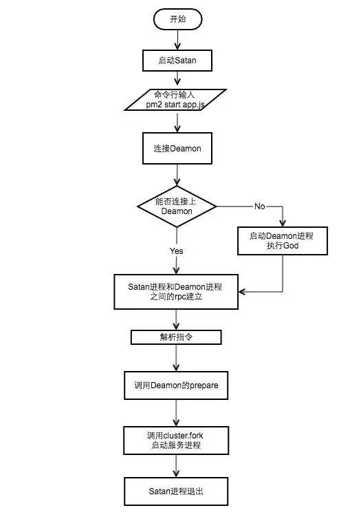

# pm2

PM2 是一个带有负载均衡功能的Node应用的进程管理器

# 主要特征

1. 启动多子进程,充分使用CPU
2. 子进程之间负载均衡
3. 0秒重启
4. 界面友好
5. 提供进程交互(例如:监控) 接口

# 常用命令

| 命令                          | 说明                         |
| ----------------------------- | ---------------------------- |
| pm2 start app.js              | 启动进程/应用                |
| pm2 start app.js --name wb123 | 重命名进程或应用             |
| pm2 start bin/www --watch     | 添加进程应用 watch           |
| pm2 stop www                  | 结束进程/应用                |
| pm2 stop all                  | 结束所有应用                 |
| pm2 delete www                | 删除进程/应用                |
| pm2 delete all                | 删除所有进程                 |
| pm2 list                      | 列出所有进程/应用            |
| pm2 describe www              | 查看某个进程或应用的具体情况 |
| pm2 monit                     | 查看进程或应用的资源消耗情况 |
| pm2 logs                      | 查看 pm2 日志                |
| pm2 logs wwww                 | 查看某个进程/应用的日志      |
| pm2 restart www               | 重新启动进程/应用            |
| pm2 restart all               | 重新启动所有进程             |
| pm2-dev start ...             | 启用开发调试                 |
| pm2 starup centos             | 设置开机自启动               |
| pm2 save                      | 保存设置                     |

# 原理

使用 Cluster 模块 实现

简易版 DEMO

```js
// master
var cluster = require('cluster');
var numCPUs = require('os').cpus().length;
 
if (cluster.isMaster) {
    console.log(numCPUs);
    for (var i = 0; i < numCPUs; i++) {
        var worker = cluster.fork();
    }
} else {
    require("./app.js");
}
```
```js
// work
var http = require('http');
http.createServer(function(req, res) {
    res.writeHead(200);
    res.end("hello world\n");
}).listen(8000);
```
# 参考链接
[pm2 原理](https://segmentfault.com/a/1190000021230376)


# 架构图

 pm2: Process manager for Node apps



 pm2包括Satan进程,God Deamon 守护进程、进程间的远程调用rpc,cluster等几个概念.pm2中采用God Deamon 守护进程,God进程启动后一直运行, 它相当与cluster中的Master进程,守护者worker进程的正常运行

# 执行流程



每次命令的输入都会执行一次satan程序, 如果God进程不再运行,首先需要启动God进程, 然后耕具指令, satan通过rpc调用God中对应的方法执行相应的逻辑

# 依据什么重启服务

pm2 采用心跳检测查看子进程是否处于活跃状态

每隔数秒向子进程发送心跳包,子进程如果不回复,那么调用kill杀死这个进程,然后再重新cluster.fork()一个新的进程,子进程可以监听到错误事件,这个时候可以发送消息给主进程,请求杀死自己,并且主进程此时重新调用cluster.fork()一个新的子进程

# 拥有的能力

1. 日志管理: 两种日志, pm2系统日志与管理的进程日志,默认会把进程的控制台输出记录到日志中
2. 负载均衡: PM2可以通过创建共享一个服务器端口的多个子进程来扩展应用程序,这样做可以还允许以零秒停机事件重启应用程序
3. 终端监控: 可以在终端中监控应用程序并检查应用程序运行状态(CPU使用率, 使用的内存, 请求/分钟等)
4. SSH部署: 自动部署,避免逐个在所有服务器中进行ssh
5. 静态服务: 支持静态服务器功能
6. 支持开发调试模式: 非后台运行, `pm2-dev start <appName>`
