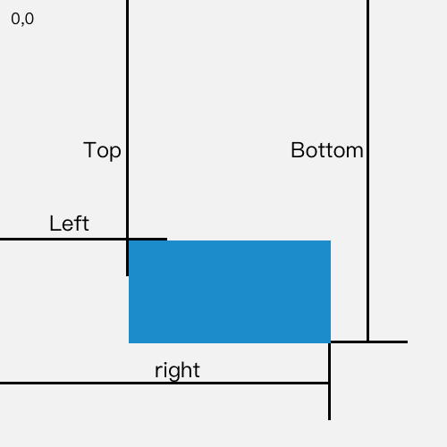
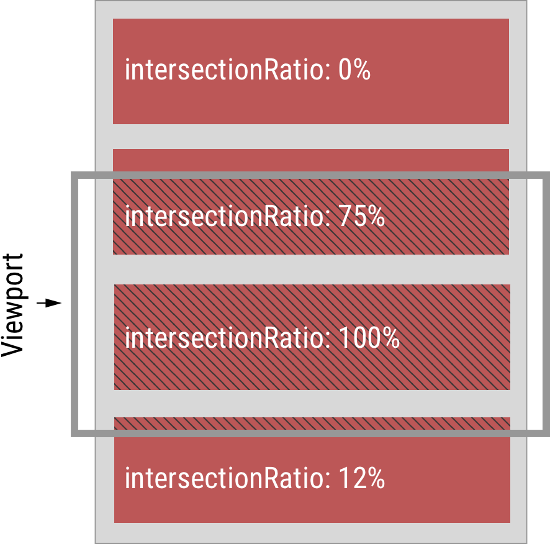

# 实现方案

1. 在img元素时, 自定义一个属性data-src,用于存放图片的地址
2. 获取屏幕可是区域的尺寸
3. 获取元素到窗口边缘的距离
4. 判断元素是否在可视区域内.在则将data-src的值赋给src,否则不执行其他操作

## 实质

当图片在可视区域内时,才加载,否则不加载;也可一个给个默认的图片占位

## 用到的api

1. `IntersectionObserver` 它提供了一种异步观察目标元素与顶级文档viewport的交集中的变化的方法
2. `window.requestIdleCallback()` 方法将浏览器的空闲时段内调用的函数排队. 这使开发者在主事件循环上执行后台和底优先级工作, 而不会影响延迟关键事件, 如动画和输入响应

## 几个细节

1. 提前加载,可以+100 像素
2. 滚动时只处理未加载的图片即可
3. 函数节流

## 简单代码示例

判断是否是在可视区域的三种方法

1. 屏幕可视区域的高度 + 滚动条滚动距离 > 元素到文档顶部的距离
```
document.documentElement.clientHeight + document.documentElement.scrollTop > element.offsetTop
```  

2. 使用getBoundingClientRect() 获取 元素大小和位置
3. IntersectionObserver 自动观察元素是否在可视区域内

```html   
<!DOCTYPE html>
<html lang="en">
    <head>
        <meta charset="UTF-8" />
        <meta name="viewport" content="width=device-width, initial-scale=1.0" />
        <title>图片懒加载</title>
        <style>
            img {
                display: block;
                height: 450px;
                margin-bottom: 20px;
                border: 1px solid blue;
                width: 450px;
            }
        </style>
    </head>
    <body>
        
        
        
        
        
        
    </body>

    <script>
        var imgs = document.querySelectorAll('img')

        // 节流函数, 定时器版本
        function throttle(func, wait) {
            let timer = null

            return (...args) => {
                if (!timer) {
                    func(...args)
                    timer = setTimeout(() => {
                        timer = null
                    }, wait)
                }
            }
        }

        // H + S > offsetTop
        function lazyLoad1(imgs) {
            // offsetTop 是元素与offsetParent 的距离, 循环获取直到页面顶部
            function getTop(e) {
                var T = e.offsetTop
                while ((e = e.offsetParent)) {
                    T += e.offsetTop
                }
                return T
            }

            var H = document.documentElement.clientHeight // 获取可视区域的高度
            var S =
                document.documentElement.scrollTop || document.body.scrollTop

            //  + 100 像素 提前100个像素就开始加载
            // 并且只处理没有src即没有加载过的图片
            Array.from(imgs).forEach((img) => {
                if (H + S + 100 > getTop(img) && !img.src) {
                    img.src = img.dataset.src
                }
            })
        }

        const throttleLazyLoad1 = throttle(lazyLoad1, 200)

        function lazyLoad2(imgs) {
            function isIn(el) {
                var bound = el.getBoundingClientRect()
                var clientHeight = window.innerHeight
                return bound.top <= clientHeight + 100
            }

            Array.from(imgs).forEach((img) => {
                if (isIn(img) && !img.src) {
                    img.src = img.dataset.src
                }
            })
        }

        const throttleLazyLoad2 = throttle(lazyLoad2, 200)

        // 监听滚动事件
        window.onload = window.onscroll = () => {
            // throttleLazyLoad1(imgs)
            throttleLazyLoad2(imgs)
        }

        function lazyLoad3(imgs) {
            const io = new IntersectionObserver((ioes) => {
                ioes.forEach((ioe) => {
                    const img = ioe.target
                    const intersectionRatio = ioe.intersectionRatio
                    if (intersectionRatio > 0 && intersectionRatio <= 1) {
                        if (!img.src) {
                            img.src = img.dataset.src
                        }
                    }

                    img.onload = img.onerror = () => io.unobserve(img)
                })
            })

            imgs.forEach((img) => io.observe(img))
        }

        // lazyLoad3(imgs)
    </script>
</html>
```

# API说明

## getBoundingClientRect

1. 返回值是一个DOMRect对象, 这个对象是由该元素的getClientRects() 方法返回的一组矩形的集合, 就是该元素的css边框大小.返回的结果是包含完整元素的最小矩形,并且拥有 left,top,right,bottom,x, y, width, height 这几个以像素为单位的只读属性用于描述整个边框, 除了width和height以外的属性是相对于视图窗口的左上角来计算的
2. 如果需要获得相对于整个网页左上角定位的属性,那么只要给top、left属性加上当前的滚动位置,(通过window.scrollX和window.scrollY),这样就可以获取与当前滚动位置无关的值




## IntersectionObserver交叉观察器<http://www.ruanyifeng.com/blog/2016/11/intersectionobserver_api.html>

`IntersectionObserverEntry` 对象提供目标元素信息

```js
{
  time: 3893.92,
  rootBounds: ClientRect {
    bottom: 920,
    height: 1024,
    left: 0,
    right: 1024,
    top: 0,
    width: 920
  },
  boundingClientRect: ClientRect {
     // ...
  },
  intersectionRect: ClientRect {
    // ...
  },
  intersectionRatio: 0.54,
  target: element
}
```

1. time: 可见性发生变化的时间, 是一个高精度时间戳,单位为毫秒
2. target: 被观察的元素,是一个DOM节点对象
3. rootBounds: 根元素的矩形区域的信息, getBoundingClientRect()方法的返回值,如果没有根元素(即直接相对于视口滚动), 则返回null
4. boundingClientRect: 当前目标元素的矩形区域信息
5. intersectionRect: 目标元素与视口(或根元素)的交叉区域的信息
6. intersectionRatio: 目标元素的可见比例, 即intersectionRect占boundingClientRect的比例,完全时可为1, 完全不可见时小于等于0



上图中,灰色的水平方框代表视口, 深红色的区域代表四个被观察的元素,