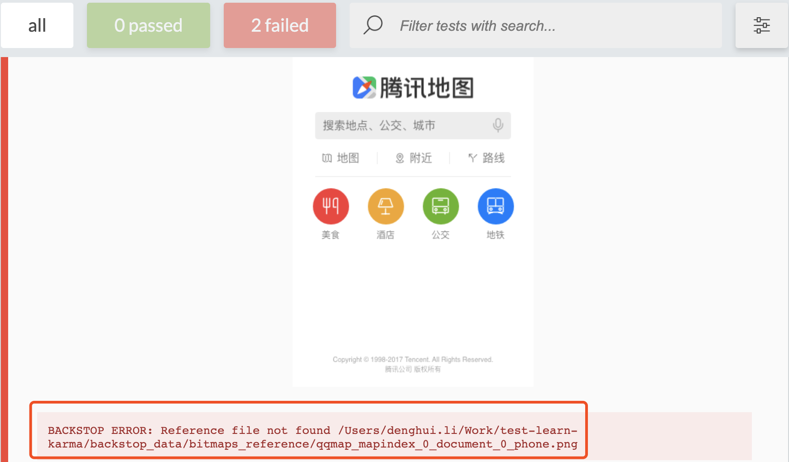
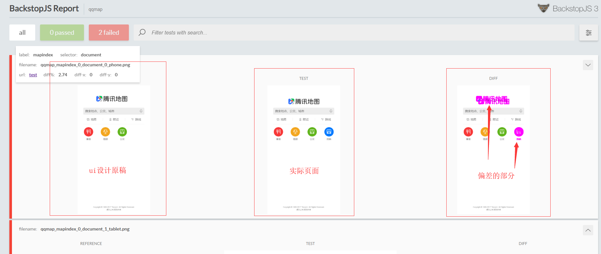

# UI测试之backstopjs

用来比较实际做出来的项目与UX的设计图的差异,像素级比较

## 安装

```bash
npm install backstopjs
```

## 初始化

```bash
backstop init
```
会在根目录下生成一个`backstop.json`文件

```json
{
    "id": "qqmap",
    "viewports": [
        {
            "label": "phone",
            "width": 320,
            "height": 480
        },
        {
            "label": "tablet",
            "width": 1024,
            "height": 768
        }
    ],
    "onBeforeScript": "puppet/onBefore.js",
    "onReadyScript": "puppet/onReady.js",
    "scenarios": [
        {
            "label": "mapindex",
            "cookiePath": "backstop_data/engine_scripts/cookies.json",
            "url": "https://map.qq.com/m/",
            "referenceUrl": "",
            "readyEvent": "",
            "readySelector": "",
            "delay": 0,
            "hideSelectors": [],
            "removeSelectors": [],
            "hoverSelector": "",
            "clickSelector": "",
            "postInteractionWait": 0,
            "selectors": [],
            "selectorExpansion": true,
            "expect": 0,
            "misMatchThreshold": 0.1,
            "requireSameDimensions": true
        }
    ],
    "paths": {
        "bitmaps_reference": "backstop_data/bitmaps_reference",
        "bitmaps_test": "backstop_data/bitmaps_test",
        "engine_scripts": "backstop_data/engine_scripts",
        "html_report": "backstop_data/html_report",
        "ci_report": "backstop_data/ci_report"
    },
    "report": ["browser"],
    "engine": "puppeteer",
    "engineOptions": {
        "args": ["--no-sandbox"]
    },
    "asyncCaptureLimit": 5,
    "asyncCompareLimit": 50,
    "debug": false,
    "debugWindow": false
}
```
| 字段               | 说明        |
| ------------------ | ----------- |
| viewports          | 环境尺寸    |
| scenarios[n].label | 配置别名    |
| scenarios[n].url   | 配置比较url |

## 运行测试
```console
backstop test
```

打开页面



如图,提示为设计图缺失,在`./backstop_data/bitmaps_reference/`目录下补充设计图即可

同时会生成如下文件夹

```
./backstop_data
├── bitmaps_reference // 设计图,默认没有
│   ├── qqmap_mapindex_0_document_0_phone.png
│   └── qqmap_mapindex_0_document_1_tablet.png
├── bitmaps_test // 生成对比结果
│   └── 20200814-230618
│       ├── qqmap_mapindex_0_document_0_phone.png
│       ├── qqmap_mapindex_0_document_1_tablet.png
│       └── report.json
├── engine_scripts
│   ├── cookies.json
│   ├── imageStub.jpg
│   └── puppet
│       ├── clickAndHoverHelper.js
│       ├── ignoreCSP.js
│       ├── interceptImages.js
│       ├── loadCookies.js
│       ├── onBefore.js
│       ├── onReady.js
│       └── overrideCSS.js
└── html_report // 报告入口
    ├── a96f14595379b7c348d66e115ec65a93.png
    ├── assets
    │   └── fonts
    │       ├── Lato-Bold.ttf
    │       ├── Lato-Regular.ttf
    │       ├── lato-bold-webfont.woff
    │       ├── lato-bold-webfont.woff2
    │       ├── lato-regular-webfont.woff
    │       └── lato-regular-webfont.woff2
    ├── b815e28b1e230cff6e9d7b749edcd562.png
    ├── config.js
    ├── diff.js
    ├── diverged.js
    ├── divergedWorker.js
    ├── index.html
    └── index_bundle.js
```

## 补充完设计图再次运行
```bash
backstop test
```

