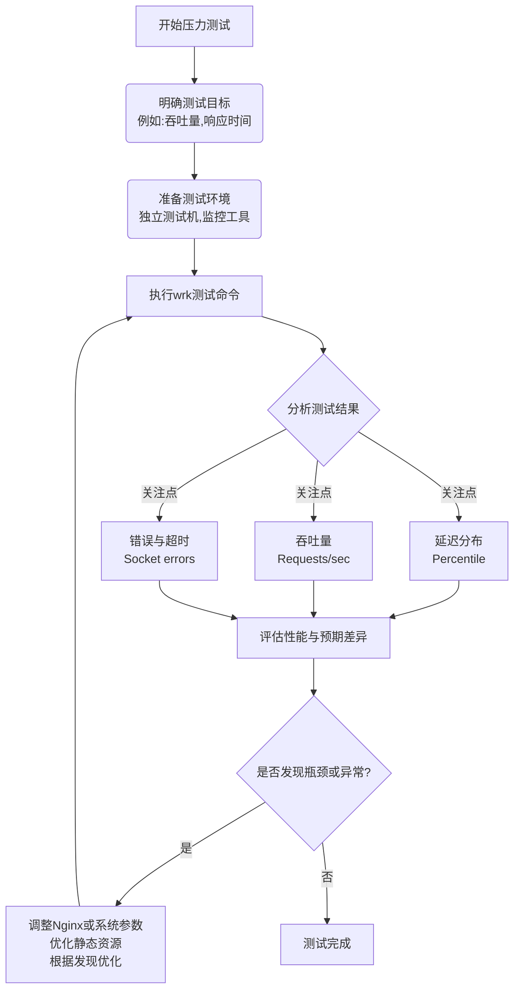

在Mac上对Nginx SSG（静态站点生成）进行压力测试，我推荐使用 **wrk** 🚀。这款工具轻量、高性能，且安装使用简单，非常适合快速验证Nginx服务的性能。

下面是一份用wrk对Nginx进行压力测试的指南。

# 🖥️ 使用wrk对Nginx进行压力测试

## 📊 1. 压力测试简要流程
一个完整的压力测试通常包括几个关键步骤：明确测试目标、准备测试环境、执行测试命令以及分析解读结果。下图简要说明了这一流程：



你可以根据上述流程，规划并执行你的测试。

## 🔧 2. 安装wrk

在Mac上，你可以使用Homebrew轻松安装wrk：

```bash
brew install wrk
```

安装完成后，可以通过运行 `wrk -v` 来验证安装是否成功。

## 🚀 3. 编写wrk命令

wrk的基本命令格式如下：

```bash
wrk -t <线程数> -c <连接数> -d <测试时间> --latency <测试URL>
```

### 🎯 常用参数说明

| 参数           | 说明                          | 建议值范围（仅供参考） |
| :------------- | :------------------------------------ | :--------------------- |
| `-t`           | 使用的**线程数**                      | 不超过Mac CPU物理核心数 |
| `-c`           | 保持打开的**并发连接数**              | 可根据测试目标逐步增加   |
| `-d`           | **测试持续时间**                      | 例如 `30s`, `1m`       |
| `--latency`    | 显示详细的**延迟分布统计信息**        | 无参数                 |
| `-H, --header` | 添加HTTP请求头                       | 例如 `"User-Agent: wrk"` |
| `-s, --script` | 指定Lua脚本**实现复杂请求**（如POST） |                        |

### 💻 测试命令示例

假设你的Nginx SSG本地访问地址是 `http://localhost:8080`，你可以尝试以下命令：

#### ⚡ 快速测试（轻负载摸底）

```bash
wrk -t2 -c10 -d10s --latency http://localhost:8080
```

#### 🔥 压力测试（模拟高并发）

```bash
wrk -t4 -c100 -d30s --latency http://localhost:8080
```

这个命令会使用4个线程、100个HTTP连接，对服务器持续测试30秒，并最终输出延迟分布统计。

#### 📝 带特定HTTP头的测试

如果你需要为请求附加特定的Header（比如模拟特定的User-Agent或处理缓存），可以使用 `-H` 参数：

```bash
wrk -t4 -c100 -d30s --latency -H "User-Agent: wrk" http://localhost:8080
```

## 📈 4. 解读wrk结果

执行测试命令后，wrk会输出类似以下的结果：

```
Running 30s test @ http://localhost:8080
  4 threads and 100 connections
  Thread Stats   Avg      Stdev     Max   +/- Stdev
    Latency    24.76ms   10.12ms 199.55ms   85.12%
    Req/Sec     1.03k   201.26     1.98k    69.00%
  Latency Distribution
     50%   23.01ms
     75%   28.54ms
     90%   36.65ms
     99%   61.85ms
  123456 requests in 30.10s, 1.23GB read
Requests/sec:   4101.23
Transfer/sec:     41.82MB
```

你需要关注这些关键指标：
*   **Latency (延迟)**：特别是 **Latency Distribution** 部分，它显示了不同百分比请求的响应时间（如P50, P90, P99）。**P99** 或 **P95** 值能告诉你最慢的那部分请求的体验。
*   **Req/Sec (每秒请求数)**：即**吞吐量**，表示服务器每秒处理的请求数。这个值通常是**越高越好**。
*   **Thread Stats**：展示了延迟 (`Latency`) 和每秒请求数 (`Req/Sec`) 的**平均值、标准差、最大值**等，帮你了解数据的波动情况。
*   **Socket errors**：如果出现大量的连接错误、读写错误或超时，可能意味着服务器或测试机遇到了资源瓶颈（如端口数、打开文件数限制）。
*   **Requests/sec**：所有线程加总的**平均每秒请求数**，是衡量服务器整体吞吐能力的核心指标。
*   **Transfer/sec**：每秒从服务器接收的**数据量**。

## ⚠️ 5. 压力测试注意事项

进行压力测试时，请注意以下几点：
*   **测试环境隔离**：最好在**独立的测试环境**进行，避免影响生产或其他开发环境。
*   **循序渐进**：不要一开始就使用极高的并发数。从较低的 `-c` 和 `-t` 参数开始，逐步增加，观察系统指标（如CPU、内存）的变化。
*   **监控系统资源**：在运行wrk的同时，使用Mac的**活动监视器**或命令行工具（如 `top`, `htop`）监控Nginx进程和系统整体的CPU、内存占用情况。
*   **Nginx日志**：观察Nginx的访问日志和错误日志，可以发现是否有异常错误。
*   **调整系统限制**：Mac对单个进程可打开的文件描述符数量有一定限制。如果进行高并发测试时遇到 `too many open files` 错误，可以尝试临时提高限制：
    ```bash
    ulimit -n 10000 # 将当前会话的文件描述符限制提高到10000
    ```
*   **理解测试对象**：由于你的站点是SSG（静态站点生成），内容主要是静态资源（HTML, CSS, JS, 图片）。Nginx在处理静态资源时通常性能很高，瓶颈可能出现在磁盘I/O、网络带宽或Nginx自身的工作进程配置上。

## 💎 总结

使用wrk对Nginx SSG进行压力测试，**核心步骤**是安装工具、设计并执行测试命令，然后**重点关注结果中的延迟分布（特别是高百分位值）、吞吐量（Requests/sec）和错误信息**。

结合系统资源监控，你就能比较全面地评估Nginx服务在当前配置下的性能表现，并找到可能的瓶颈所在。