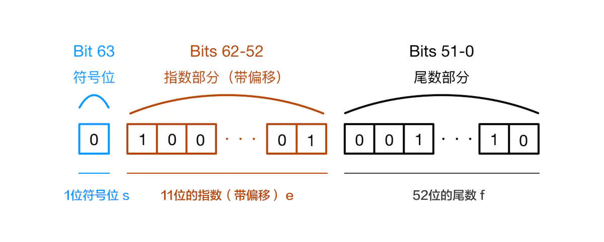
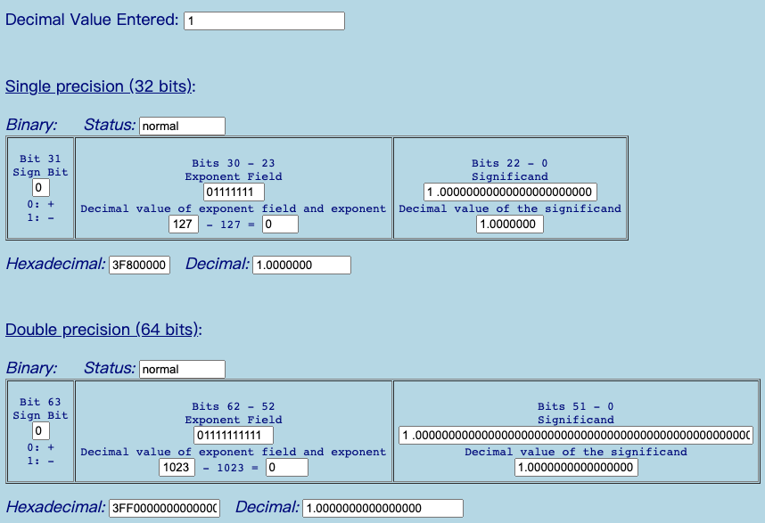
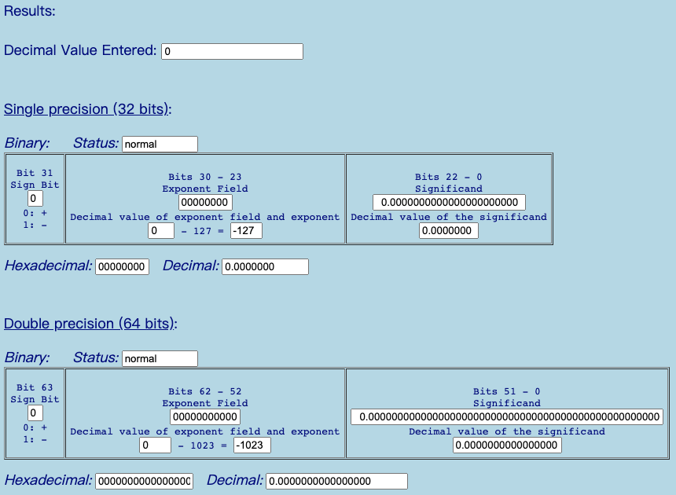
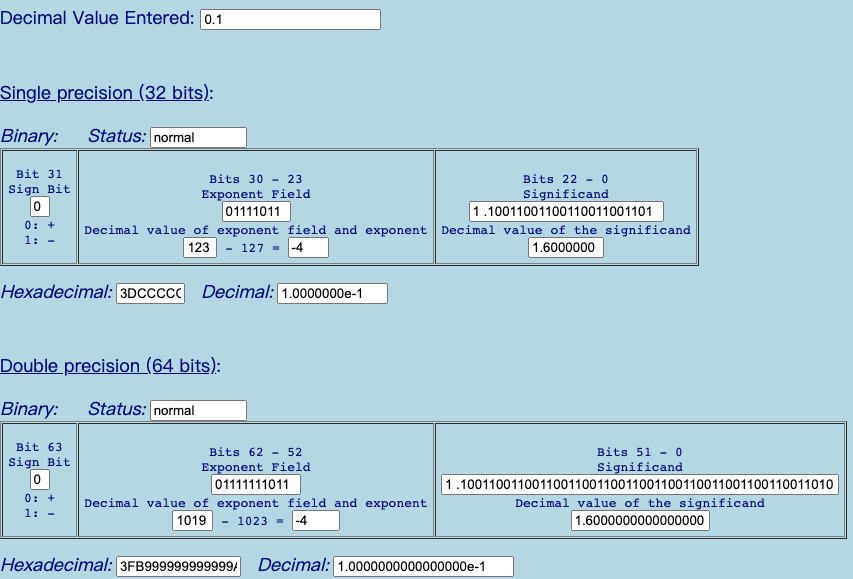
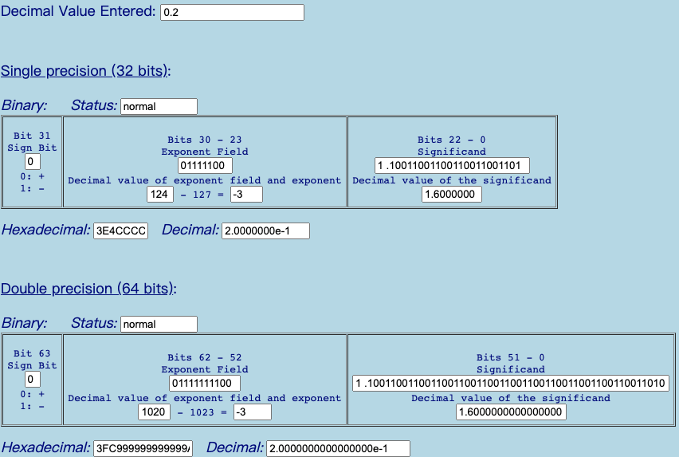

# 计算机中数的表示

* 64位浮点数, 1 位符号位 + 11 位指数(带偏移量) + 52 位的尾数
* 32位浮点数, 1 位符号位 + 8 位指数(带偏移量) + 23 位的尾数

## 1 如何存储

1 * 2^0 = 1;

## 0 如何存储

0 * 2 ^ 0 = 0

## 0.1 如何存储

1.10011001100110011 * 2 ^ -4

## 0.2 如何存储

1.10011001100110011 * 2 ^ -3

## NAN 如何存储

NaN在内存中的值则是阶码全1，尾数不全0

## Infinity 如何存储

在内存中的值是阶码为全1，尾数全0

## Max如何存储

## 参考文档

1. [查看浮点数存储](https://babbage.cs.qc.cuny.edu/IEEE-754.old/Decimal.html)
2. [掘金0.1 + 0.2 != 0.3](https://juejin.cn/post/6844903680362151950)
3. [IEEE754维基百科](https://juejin.cn/post/6844903680362151950)
# TODO:小数在计算机中的表示

# TODO:0.1 + 0.2 发生了什么