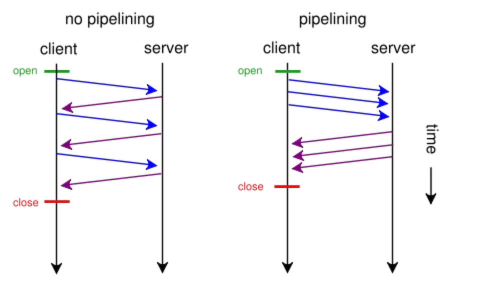
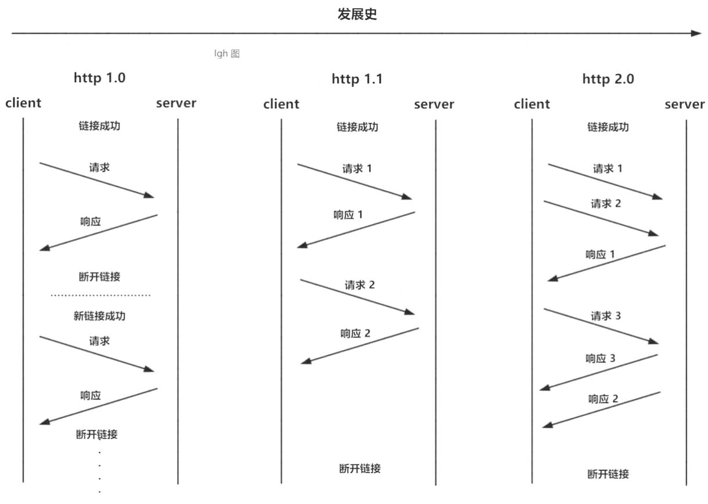

# HTTP2.0特征

## 多路复用

多路复用代替原来的序列和阻塞机制, 所有就是请求的都是通过一个TCP连接并发完成. 同时也很好的解决了浏览器限制同一个域名下的请求数量的问题

在HTTP/2中,有了二进制分帧之后, HTTP/2不再依赖TCP链接去实现多流并行了,在HTTP/2中:

1. 同域名下所有的通信都在单个链接上完成, 同个域名只需要占用一个TCP链接,使用一个连接并行发送多个请求和响应
2. 单个连接可以承载任意数量的双向数据流,单个连接上可以并行交错的请求和响应,之间互不干扰
3. 数据流以消息的形式发送, 而消息又由一个或多帧组成, 多个帧之间可以乱序发送, 因为根据帧首部的流标识可以重新组装, 每个请求都可以带一个31bit的优先值, 0标示最高优先级, 数值越大优先级越低

## 帧和流

### 帧(frame)
HTTP/2 中数据传输的最小单位, 因此帧不仅要细分表达 HTTP/1.x中的各个部分,也优化了HTTP/1.x表达不好的地方, 同时还增加了HTTP/1.x表达不了的方式

每一帧包含几个字段, 有 length、type、flags、stream、identifier、frame playload等, 其中 type 代表帧的类型

在HTTP/2的标准中定义了10种不同的类型

1. HEADERS frame
2. DATA frame
3. PRIOPRITY (设置流的优先级)
4. RST_STREAM (终止流)
5. SETTINGS(设置此连接的参数)
6. PUSH_PROMISE (服务器推送)
7. PING(测量RTT)
8. GOAWAY(终止连接)
9. WINDOW——UPDATE(流量控制)
10. CONTINUATION (继续传输头部数据)

在HTTP2.0中, 它把数据报的两达部分分成了Header frame 和 data frame 也就是 头部帧和数据体帧

### 流(stream)

流: 存在于连接中的一个虚拟通道.流可以承载双向消息, 每个流都有一个唯一的整数ID. HTP/2 长连接中的数据报不是按照请求-响应顺序发送的, 一个完整的请求或响应(称一个数据流stream, 每个数据流都有一个独一无二的编号)可能会分成非连续多次发送.

特点:
1. 双向性: 同一个流内,可同时发送和接受数据
2. 有序性: 流中被传输的数据就是二进制帧. 帧在流上的被发送于被接收都是按照顺序进行的
3. 并行性: 流中的二进制帧 都是被并行传输的,无需按顺序等待
4. 流的创建: 流可以被客户端和服务器单方面建立, 使用、共享
5. 流的关闭: 流也可以被任意一方关闭
6. HEADERS 帧在DATE 帧前面
7. 流的ID都是奇数,说明是由客户端发起的,服务端发起的就是偶数
   
## 发展历程

从 HTTP/0.9 到 Http/2 要发送多个请求, 从多个TCP连接 => Keep-alive => 管道化 => 多路复用 不断的减少多次创建 TCP 等等带来的性能损耗

### 多个TCP连接

在最早的时候没有 keep-alive 只能创建多个TCP连接来做多次请求. 一次请求完成就会关闭本次的TCP 连接, 下个请求又要重新建立新的TCP连接传输完成数据再次关闭,造成很大的性能消耗

### Keep-alive

Keep-alive 解决的核心问题是: 一定时间内,同一域名多次请求数据,只建立一次HTTP请求,其他请求可复用每一次建立的连接通道,以达到提高请求效率的问题, 这里面所说的一定时间是可以配置的,不管你用的是Apache还是nginx

以往,浏览器判断响应数据是否接收完毕,是看连接是否关闭.在使用持久连接后,就不能这样了,这就要求服务器对持久连接的响应头部一定要返回content-length标识body的长度,供浏览器判断界限.有时,content-length的方法并不是太准确,也可以使用transfer-encoding:chunked头部发送一串一串的数据,最后长度为0的chunked标示结束

多次http请求效果如下图所示

Keep-alive 还是存在如下问题:

1. 串行的文件传输
2. 同域并行请求限制带来的阻塞(6~8)个

### 管线化

HTTP管线化可以克服同域并行请求限制带来的阻塞,它是建立在持久连接上的,是把所有的请求一并发给服务器, 但是服务器需要按照顺序一个一个的响应,而不是等到一个响应回来才能发下一个请求,这样就节省了很多请求到服务器的时间,不过HTTP管线化依旧有阻塞的问题,若上一响应迟迟不回,后面的响应都会被阻塞到

### 多路复用

多路复用代替原来的序列和阻塞机制.所有就是请求的都是通过一个TCP连接并发完成.因为在多路复用之前所有的传输是基于基础文本的,在多路复用中是基于二进制数据帧的,传输、消息、流,所以可以做到乱序的传输.多路复用对同一域名下所有请求都是基于流,所以不存在同域并行的阻塞.多次请求如下图:

HTTP/1.x默认开启持久连接,在一个TCP连接上可以传送多个HTTP请求和响应,减少了建立和关闭连接的消耗和延迟

HTTP/2.0 支持多路复用,这是HTTP/1.x持久连接的升级版, 多路复用,就是在一个TCP 连接中可以存在多条流, 也就是可以发送多个请求,服务端则可以通过帧中的标识知道该帧属于哪个流(即请求), 通过重新排序还原请求, 多路复用允许并发多个请求,每个请求及该请求的响应不需要等待其他的请求或响应,避免了线头阻塞问题.这样某个请求任务耗时严重,不会影响其他连接的正常执行, 极大的提高传输性能

### 总结

在 HTTP/2 中, 有两个非常重要的概念,分别是帧(frame)和流(stream).

帧代表着最小的数据单位,每个帧会标识出该帧属于哪个流, 流也就是多个帧组成的数据流

HTTP2 采用二进制数据帧传输, 取代了HTTP1.x的文本格式,二进制格式解析更高效.

多路复用代替了 HTTP1.x的序列和阻塞机制没,所有的相同域名请求都通过同一个TCP连接并发完成.同一TCP中可以发送多个请求,对端可以通过帧中的标识知道属于哪个请求,通过这个技术,可以避免HTTP旧版本中的队头阻塞问题,极大的提高传输性能.
