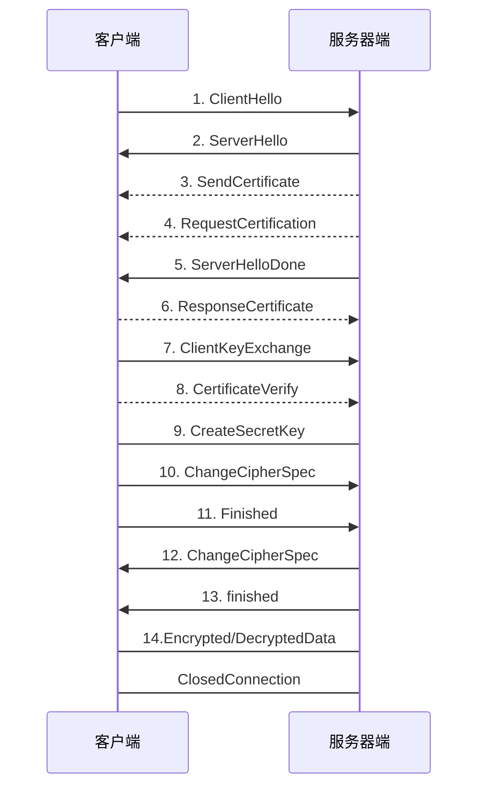

# TLS 握手步骤

1. ClientHello: 客户端发送所支持的 SSL/TLS 最高协议版本号和所支持的加密算法集合及压缩方法集合等信息给服务器端
2. ServerHello: 服务器端收到客户端信息后,. 选定双方都能够支持的 SSL/TLS 协议版本和加密方法及压缩方法,返回给客户端
3. SendCertificate (可选): 服务器端发送服务端证书给客户端
4. RequestCertification (可选): 如果选择双向验证,服务端向客户端请求客户端证书
5. ServerHelloDone : 服务端通知客户端初始协商结束
6. ResponseCertificate (可选): 如果选择双向验证,客户端向服务器端发送客户端证书
7. ClientKeyExchange: 客户端使用服务器端的公钥, 对客户端公钥和密钥种子进行加密, 再发送给服务器端.
8. CertificateVerify (可选): 如果选择双向验证,客户端本地私钥生成数字签名, 并发送给服务器端, 让其通过收到的客户端公钥进行身份验证.
9. CreateSecretKey: 通讯双方基于密钥种子等信息生成通讯密钥
10. ChangeCipherSpec: 客户端通知服务器端已将通讯方式切换到加密模式
11. Finished: 客户端做好加密通讯准备
12. ChangeCipherSpec: 服务器端通知客户端已将通讯方式切换到加密模式
13. Finished: 服务器做好加密通讯的准备
14. Encrypted/DecryptedData: 双方使用客户端密钥, 通过对称加密算法对通讯内容进行加密
15. ClosedConnection: 通讯结束后. 任何一方发出断开 SSL 链接的消息

