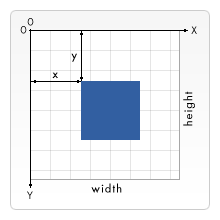

# Canvas

## 渲染上下文

`<canvas> `会创建一个固定大小的画布，会公开一个或多个渲染上下文(画笔)

```js
var canvas = document.getElementById('tutorial');

if (canvas.getContext){
  var ctx = canvas.getContext('2d');
  // drawing code here
} else {
  // canvas-unsupported code here
}
```

## 绘制形状



### 绘制矩形

1. fillRect(x, y, width, height): 绘制填充矩形
2. strokeRect(x,y, width,height): 绘制矩形边框
3. clearRect(x,y,width,height): 清除指定的矩形区域,然后这块区域就会变成完全透明

### 绘制路径(path)

步骤:
1. 创建路径起始点
2. 调用绘制方法去绘制出路径
3. 把路径封闭

方法:

1. beginPath(): 新建一条路径,路径一旦创建成功,图形绘制命令就会被指向路径上生成路径
2. moveTo(x, y): 把画笔移动到指定的坐标(x, y).相当于设置路径的起始点坐标
3. closePath(): 闭合路径之后,图形绘制命令又重新指向到上下文, 也可以选择不闭合
4. stroke(): 通过线条来绘制图形轮廓
5. fill(): 通过填充路径的内容区域生成实心图形
   
### 绘制圆弧


方法:

1. arc(x, y, r, startAngle. engAngle, anticlockwise): 以(x, y)为圆心,以r为半径,从startAngle弧度开始到endAngle弧度结束,anticlosewise 是 boolean, true表示逆时针,false表示顺时针
2. arcTo(x1,y1,x2,y2,radius): 根据给定的控制点和半径画一段圆弧,最后再以直线连接两个控制点


### 绘制贝塞尔曲线

方法

1. quadraticCurveTo(cp1x, cp1y, x, y): 二次贝塞尔曲线: cp1x、cp1y控制点, x,y为结束点
2. quadraticCurveTo(cp1x, cp1y, cp2x, cp2y,x,y): 三次贝塞尔曲线: cp1x、cp1y控制点1, cp2x、cp2y控制点2, x,y为结束点

## 添加样式和颜色

### 颜色

1. fillStyle = color: 设置图形的填充颜色
2. strokeStyle = color: 设置图形的轮廓颜色

### 透明度

1. globalAlpha = transparencyValue: 这个属性影响多canvas 里所有的图形的透明度, 有效的值的范围是 0.0 (完全透明) 到 1.0 (完全不透明), 默认是1.0
2. lineWidth = 10; 线款只能是正值, 默认是1.0. 起始点和终点的连线为中心,上下各占线宽的一半
3. lineCap  = “butt”|“round”|“square”; 
   > 1. "butt": 线段末端以方形结束, 
   > 2. “round”: 线段末端以圆形结束, 
   > 3. “square”: 线段末端以方形结束, 但是增加了一个宽度和线段相同, 高度是线段厚度一半的矩形区域
4. lineJoin = “round”| “bevel”|“miter”;
   > 1. round: 通过填充一个额外的,圆心在相连部分末端的扇形, 绘制拐角的形状.圆角的半径是线段的宽度
   > 2. bevel: 在相连部分的末端填充一个额外的以三角形为底的区域,每个部分都有各自独立的矩形拐角
   > 3. miter(默认): 通过延伸相连部分的外边缘,使其相交于一点,形成一个额外的菱形区域
5. 虚线:
   > setLineDash([20,5]) : 实线长度, 间隙长度
   > lineDashOffset = -0 : 设置起始偏移量

## 绘制文本

1. fillText(text, x, y, [,maxWidth]) 在指定的(x,y)位置填充指定的文本, 绘制的最大宽度是可选的
2. strokeText(text, x,y, [,maxWidth]) 在指定的(x,y)位置绘制文本边框, 绘制的最大宽度是可选的

### 文本样式

1. font = “10px sans-serif" 与 CSS Font 属性相同
2. textAlign = “start,end,left,right,center” 默认 start
3. textBaseLine =“top,hanging,middle,alphabetic,ideographic,bottom” 默认 “alphabetic”
4. direction = value 文本方向, 可能的值包括 ltr,rtl,inherit 默认的值是 inherit

## 绘制图片

drawImage(image, x, y)

### 缩放
> drawImage(image, x, y, width, height); width\height 表示image画入canvas时的缩放大小

### 切片(slice)

> drawImage(image, sx, sy, sWidth, sHeight, dx,dy,dWidth, dHeight)
> 前四个定义图片源的切片位置和大小,后4个定义切片的目标显示位置和大小

## 状态的保存和恢复

1. save: canvas状态存储在栈中, 每当save方法被调用后,当前的状态就会被推送到栈中保存
   > 1. 当前应用的变形(即移动, 旋转,缩放) 
   > 2. storkeStyle\fillStyle\globalAlpha\lineWidth\lineCap\lineJoin\miterLimit\shadowOffsetX\shadowOffsetY\shadowBlur\shadowColor\globalCompositeOpeeration
   > 3. 当前的裁剪路径(clipping path);
2. restore: 每一次调用restore方法,上一个保存的状态就从栈中弹出

## 变形

1. translate(x, y): 平移
2. rotate(angle): 先转角度(angle),它是顺时针移动,以弧度为单位值, 顺时针移动45度 为 Math.PI / 180 * 45
3. scale(x,y): 必须为正值,比1大放大,比1小缩小
3. transform(a,b,c,d,e,f) 变形矩阵
```
[
  [a,c,e],
  [b,d,f],
  [0,0,1]
]
```
## 合成

1. 默认设置: 新图像会覆盖在原有图像上
2. source-in:  仅仅会出现新图像与原来图像重叠的部分,其他区域都变成透明的(其他的老图像区域也会透明)
3. source-out: 仅仅显示新图像与老图像没有重叠的部分,其余部分全部透明(老图像也不显示)
4. source-stop: 新图像仅仅显示与老图像重叠区域.老图像仍然可以显示
5. destination-over: 新图像会在老图像的下面
6. destination-in: 仅仅新老图像重叠部分的老图像被显示, 其他区域全部透明
7. destination-out: 仅仅老图像与新图像没有重叠的部分.注意显示的是老图像的部分区域
8. destination-stop: 老图像仅仅显示重叠部分,新图像会显示在老图像的下面
9. lighter: 新老图像都显示,但是重叠区域的颜色做加处理
10. darken: 保留重叠部分最黑的像素.(每个颜色位进行比较,得到最小的)
11. lighten: 保证重叠部分最大的量的像素值(每个颜色位进行比较,得到最大的)
12. xor: 重叠部分会变成透明
13. copy: 只有新图像会被保留,其余的全部被清除(边透明)

## 裁剪路径

clip() 把已经创建的路径转换成裁剪路径.裁剪路径的作用是遮罩.只显示裁剪路径内的区域,裁剪路径外的区域会被隐藏.
注意: clip() 只能遮罩在这个方法调用之后绘制的图像,如果是clip()方法调用之前绘制的图像,则无法实现遮罩

## 动画

### 动画的基本步骤

1. 清空canvas 再绘制每一帧动画之前,需要清空所有.清空所有最简单的做法就是clearReact()方法
2. 保存canvas 状态 如果在绘制过程中会更改canvas的状态(颜色、移动了坐标原点等),又在绘制每一帧时都是原始状态的话,则最好保存下canvas的状态
3. 绘制动画图形这一步才是真正绘制动画帧
4. 绘制canvas状态如果你保存了canvas状态,则应该在绘制完成一帧之后恢复canvas状态

### 控制动画

1. setInterval()
2. setTimeout()
3. requestAnimationFrame()


