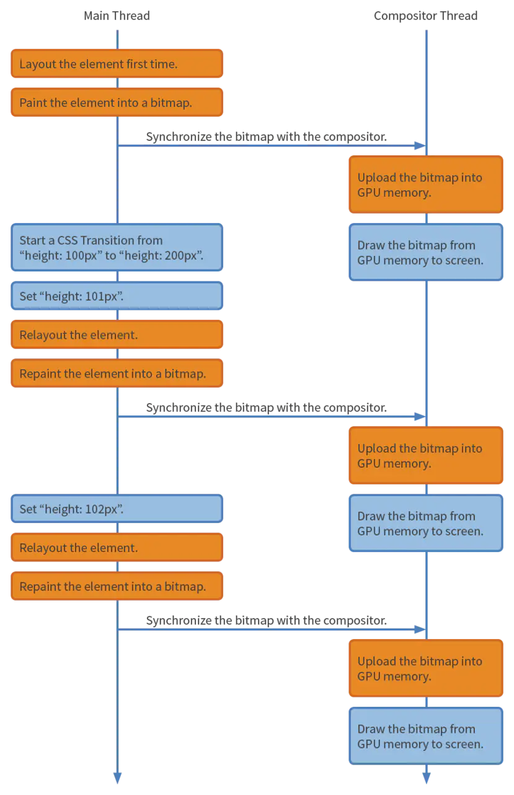
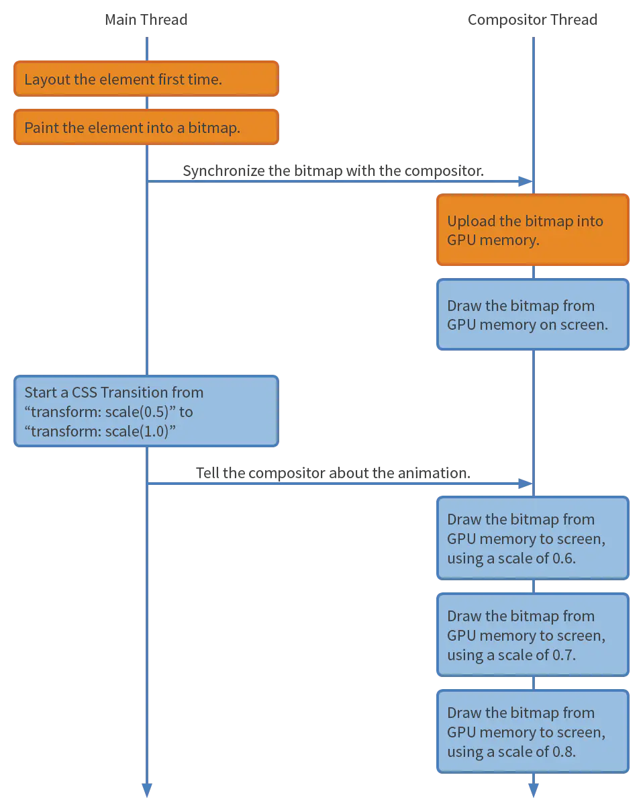

# 什么是重绘、重排,如何避免

## 重绘重排

当我们改变了一个元素的尺寸位置属性时, 会重新进行样式计算(computed style)布局 (layout) 绘制(paint)以及后面的所有流程, 这种行为称为`重排`

当改变了某个元素的颜色属性时不会重新触发布局, 但是还是会触发样式计算和绘制这就是重绘

我们可以发现重绘和重排都会占用主线程,还有JS也会运行在主线程,所以就会出现抢占执行时间的问题,如果你写了一个不断导致重绘重排的动画,浏览器则需要在每一帧都运行样式计算布局和绘制的操作

## 优化方式

我们知道当前页面以没60帧的刷新频率刷新时才不会让用户感觉到卡顿,如果在运行动画还有大量js任务需要执行,因为布局,绘制和js执行都是在主线程运行的,当在一帧的时间内布局和绘制结束后,还有剩余时间js就会拿到主线程权,如果js执行时间过长, 就会导致在下一帧开始时js没有及时归还主线程,导致下一帧动画没有按时渲染,就会出现页面卡顿


### 优化方案一

requestAnimationFrame, 它会在每一帧被调用,通过回调API的回调,可以把JS运行任务分成一些更小的任务快,在每一帧时间用完前暂停js执行归还主线程,这样的话在下一帧开始时,主线程就可以按时执行布局和绘制

### 优化方案二

栅格化的整个流程不占用主线程, 只在合成线程和栅格线程中运行,这就意味着它无需和js抢占线程, 如果反复进行绘制和重排可能会导致掉帧,这是因为有可能js执行阻塞了主线程, 而css中有个动画属性transform,通过该属性实现的动画不会经过布局和绘制,而是直接运行在合成器线程和栅格线程中的,所以不会受到主线程中js执行的影响.更重要的是要听过transform实现的动画由于不需要经过布局绘制样式计算等操作,所以节省了很多运算时间

# 避免重绘重排具体方案

## CSS

* 使用transform代替top等位移;
* 使用visibility代替display:none;
* 避免使用table布局
* 尽可能在DOM树的最末端改变class
* 避免设置多层内联样式,尽可能层级平铺
* 将动画效果应用到position属性为absolute或fixed的元素上
* 避免使用css表达式
* 将频繁重绘或者回流的节点设置为图层,比如video,iframe
* css3硬件加速(GPU加速),可以是transform: translateZ(0)、opacity、filters、will-change、Will-change提前告诉浏览器元素会发生什么变化

## JS

* 避免频繁操作样式,合并操作
* 避免频繁操作DOM,合并操作
* 防抖截流控制频率
* 避免频繁读取会引发回流/重绘的属性,比如上面的C、O、S、属性
* 对具有复杂动画的元素使用绝对定位

## 实例

```css
div {
    height: 100px;
    transition: height 1s linear;
}

div:hover {
    height: 200px;
}

```



如果代码变成了

```css
div {
    transform: scale(0.5);
    transition: transform 1s linear;
}

div:hover {
    transform: scale(1.0);
}
```



也就是 Main Thread 不用重排, 不用重绘, Draw 也不是他完成的,

重绘是以合成层为单位的

合成层提升前后的Paint步骤

