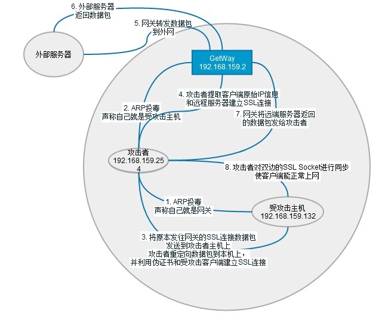
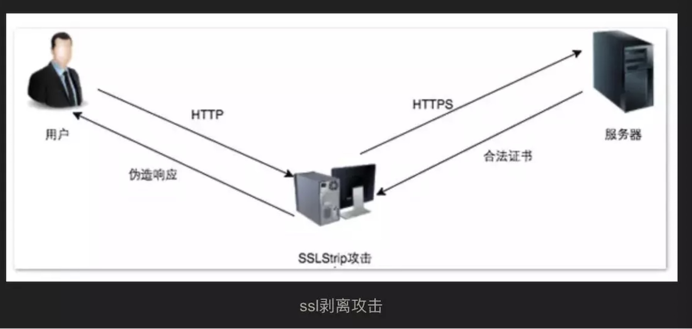

# 中间人攻击

## 定义

中间人攻击（Main-in-the-middle attack, 缩写： MITM）是指攻击与通讯的两端分别创建独立的联系，并交换其所收到的数据，使通讯的两端认为他们正在通过一个私密的连接与对方直接对话，但事实上整个会话都被攻击者完全控制，在中间人攻击中，攻击者可以拦截通讯双方的通话并插入新的内容

从攻击这的攻击方式可以分为一下几类

1. 数据包嗅探
   1. 文明嗅探
   2. 接种中间人代理进行密文嗅探
2. 数据注入
   1. CRIME 中的数据包中注入javascript代码实现攻击目的
3. 数据流量劫持
   1. 使用IPTables工具对数据包的IP地址进行强制重定向
4. 数据包篡改
   1. DNS劫持中篡改DNS返回数据包的IP地址，达到DNS劫持的目的
   
## ARP 投毒

ARP： 地址解析协议，即ARP（Address Resolution Protocol）, 根据 **IP地址获取物理地址的一个TCP/IP协议

ARP欺骗的3种方式：

1. 攻击者仅仅欺骗被攻击主机（单向）
2. 攻击者仅仅欺骗被攻击主机，同时在本地进行Iptable NAT 转发（双向）
3. 攻击者同时欺骗被攻击主机和网关（双向）

## ARP 投毒 + 中间人伪造 SSL 证书攻击

SSL 证书中间人伪造攻击的思想如下：

1. 攻击这对目标客户端和网关发送ARP投毒攻击，污染他们的ARP 缓存表
2. 客户端在浏览器中输入 https://mail.google.com/ 的地址， 浏览器会尝试和https://mail.google.com/的443端口建立SSL连接，但是因为客户端受到了ARP投毒攻击，原本发往网关的数据包被发往了攻击者的主机
3. 攻击者在本机使用　iptables将接收到443目的端口的数据包重定向到本机IP地址
4. 这样，受到攻击者客户端的浏览器就只会和攻击者主机进行SSL连接
5. 攻击者在本机使用监听443端口， 并且伪造一个假的SSL证书， 用于和客户端的连接，同时，提取客户端发送的数据包的原始目的IP地址， 用于和客户端原始请求的服务器建立另一个ssl连接
6. 中间人攻击者在双向的SSL Socket 通信都建立完成后， 对两边的Socket进行数据读写同步，将数据通道打通， 使客户端的浏览器能够正常访问（受攻击者不会察觉到已经收到SSL中间人攻击）
7. 在数据同步的同时没记录下明文数据，达到SSL中间人攻击的目的

## ARP 投毒 + 中间人SSL 剥离攻击

SSL 剥离（SSLtrip）就是客户端的HTTPS 请求降级成HTTP请求， 阻止HTTP请求重定向成HTTPS

中间人SSL 剥离攻击思想如下：

1. ARP 欺骗， 使得攻击者能截取所有目标主机的网络流量
2. 攻击这利用用户对于地址栏中HTTPS和HTTP的疏忽，将所有的HTTPS连接都用HTTP来代替
3. 同时，与目标服务器建立正常的HTTPS连接
4. 由于HTTP通信是明文传输， 攻击者能轻松实施嗅探
5. 受到攻击客户端与原始请求服务器之间的全部通信经过了代理转发
6. 其中，出现的图标被替换成用户熟悉的“小黄锁”图标，以建立信任
7. 这样，中间人攻击就成功骗取了密码，账号等信息，而受害者一无所知

这种漏洞发生的原因是：

1. 大部分使用SSL的网站并非“全站加密”，仅对部分重要的网页使用SSL，这就给攻击者以可乘之机，可以简答理解为，网站在普通页面，非机密页面都是采用HTTP方式访问， 而在进入登陆页面的时候也采用HTTPS加密处理
2. 大多数网站为了保证用户习惯的兼容性，都同时支持HTTP、HTTPS的访问，大多数情况下，这两种访问方式并没有太大的安全问题，但是当用户访问的页面涉及机密信息的登陆页面时，服务端往往会采用“重定向”的方式，“强制”用户的浏览器以HTTPS的方式来登陆页面，为的是保证密钥信息的安全传输

其中原因（2）是我们能够利用SSL Strip发动攻击的关键， 服务端为了“强制”用户以HTTPS方式进行登陆，会向浏览器返回重定向数据包，即“302 Moved Temporiarily”， 正常情况下，浏览器收到这个数据包之后，就会重新使用新的URL发起一个新的HTTPS连接，而SSL Strip 是就盯准了这个时机，当发现浏览器试图加密即采用https传输数据时， 他就适时的介入中间，充当代理作用，然后主机认为安全会话开始， 这是上文中被动加密的提示就不会出现，SSL Strip 也是通过https连接了安全的服务器， 那么所有用户到SSL Strip 的连接时 http，所有的传输数据就能被拦截

## 基于中间人攻击的SSL BEAST 攻击

关于BEAST 攻击， 我的大致理解如下

1. SSL/TLS 中使用 “记录协议数据包”来封装上层的应用数据
2. SSL/TLS 使用CBC 加密模式进行分组对称加密，并且不同“记录协议数据包”之间并不是独立的IV， 不同的数据包之间形成一个整体的CBC模式
3. 中间人攻击可以在返回流量中注入javascript代码，根据攻击者已知的IV和Ciper，来穷举下一个数据中包含Cookie信息

## 基于DNS劫持的SET社会工程钓鱼攻击

DNS 劫持攻击是攻击者伪造的IP冒名顶替正常的DNS服务器的IP，让受攻击访问到假的服务器

基于中间人攻击的DNS劫持思路如下

1. 发送中间人攻击，劫持目标客户端流量
2. 进行DNS劫持，将http://www.jnrain.com 这个URL劫持到攻击者所在的本机上
3. 目标客户端在访问http://www.jnrain.com的时候实际访问的是攻击者所在的服务器
4. 攻击者在本机服务器上搭建一个钓鱼页面，对http://www.jnrain.com 进行高度仿真，并加入记录密码的代码
5. 通过钓鱼页面直接获取目标客户端的账号、密码
   
## 基于中间人攻击的会话劫持攻击（Session Hajacking)

发送这种攻击方式的一个根本原因是“当前的HTTP环境采用Cookie当作一种连接状态的标识符”，即服务端根据Cookie来识别当前登陆用户的身份，对攻击者来说，如果能获取到这个Cookie值，等于也就获取了对应用户的“身份令牌”，即可以不需要账号，密码就以目标用户的身份合法登陆网站（XSS 攻击的目的）

“基于中间人攻击的会话劫持”属于前面说的“数据包流浪嗅探”类别，他的思路如下：

1. 攻击者对目标客户端发送中间人攻击，劫持流浪
2. 使用ferret 抓取web通信流量包
3. 使用hamster对抓取的数据包进行重组， 分析，得出包含cookie信息的HTTP包
4. 攻击者使用hamster 组合出的HTTP包进行重放， 以目标用户的身份登陆目标网站，达到会话劫持

## 一些预防方案

1. 用可信的第三方CA厂商
2. 不下载未知来源的证书，不要去下载一些不安全的文件
3. 确认你访问的URL是https的，确保网站使用了SSL，确保禁用一些不安全的SSL，只开启TLS1.1， TLS1.2
4. 不要使用公用网络发送一些铭感的信息
5. 不要去点击一些不安全的连接或恶意链接或邮件信息

