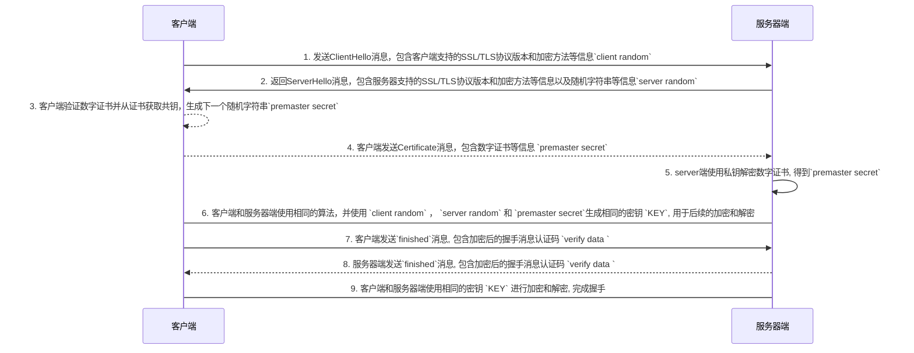

# TLS握手

## 1. **客户端发送"ClientHello"消息**

包含客户端支持的 SSL/TLS 协议版本和加密方法及压缩方法等信息 `client random`. "ClientHello" 消息是第一个被发送的消息, 其目的是为了让服务器端知道客户端的信息, 并选择双方都能够支持的 SSL/TLS 协议版本和加密方法及压缩方法等信息

## 2. **返回"ServerHello"消息**,

包含服务器支持的 SSL/TLS 协议版本和加密方法及压缩方法等信息以及随机字符串等信息`server random`. "ServerHello" 消息是第二个被发送的消息, 其目的是为了让客户端知道服务器端的信息,

## 3. 客户端验证数字证书并从证书获取公钥，生成下一个随机字符串`premaster secret`
## 4.客户端发送"Certificate"消息, 包含数字证书等信息 `premaster secret`
## 5. 服务器端使用私钥解密数字证书, 得到`premaster secret`
## 6. 客户端和服务器端使用相同的算法，并使用 `client random` ， `server random` 和 `premaster secret`生成相同的密钥 `KEY`, 用于后续的加密和解密
## 7. 客户端发送`finished`消息, 包含加密后的握手消息认证码 `verify data`
## 8. 服务器端发送`finished`消息, 包含加密后的握手消息认证码 `verify data`
## 9. 客户端和服务器端使用相同的密钥 `KEY` 进行加密和解密, 完成握手

