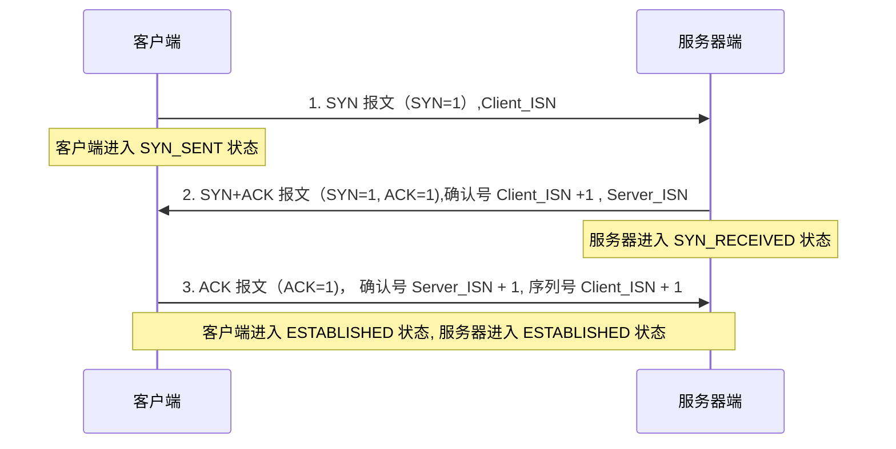
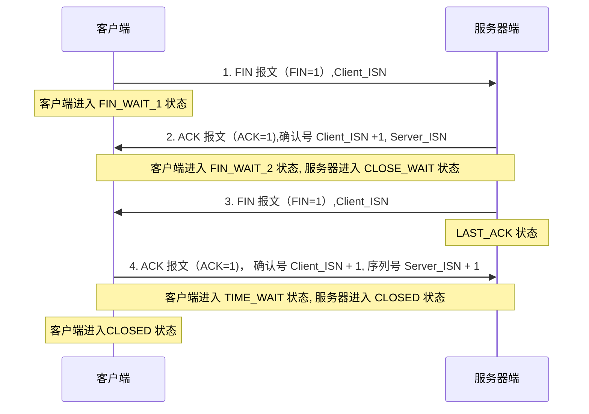

# 三次握手和四次挥手

TCP（传输控制协议）使用 **三次握手（Three-way Handshake）** 建立连接，使用 **四次挥手（Four-way Handshake）** 终止连接。这是保证可靠、面向连接通信的核心机制。

## 一、三次握手（建立连接）

目的：确保**双方都具有发送和接收数据的能力**，并同步初始序列号（Sequence Number）。

1.  **第一次握手（SYN）：**
    *   客户端发送一个 TCP 报文段给服务器。
    *   设置 **SYN 标志位为 1**（表示这是一个连接请求）。
    *   选择一个**初始序列号（Client_ISN）**（通常是随机数）。
    *   客户端进入 `SYN_SENT` 状态。

2.  **第二次握手（SYN + ACK）：**
    *   服务器收到客户端的 SYN 报文。
    *   如果同意建立连接，则发送一个 TCP 报文段给客户端。
    *   设置 **SYN 标志位为 1**（表示这也是一个连接请求）。
    *   设置 **ACK 标志位为 1**（表示确认）。
    *   **确认号（Acknowledgment Number）** 设置为 `Client_ISN + 1`（表示期望收到客户端的下一个字节的序号是这个值）。
    *   选择一个自己的**初始序列号（Server_ISN）**（通常是随机数）。
    *   服务器进入 `SYN_RECEIVED` 状态。

3.  **第三次握手（ACK）：**
    *   客户端收到服务器的 SYN+ACK 报文。
    *   客户端发送一个 TCP 报文段给服务器。
    *   设置 **ACK 标志位为 1**（表示确认）。
    *   **确认号（Acknowledgment Number）** 设置为 `Server_ISN + 1`（表示期望收到服务器的下一个字节的序号是这个值）。
    *   （此时可以携带应用层数据）序列号为 `Client_ISN + 1`（因为第一次握手的 SYN 消耗了一个序号）。
    *   客户端进入 `ESTABLISHED` 状态。
    *   服务器收到 ACK 后，也进入 `ESTABLISHED` 状态。

**为什么需要三次？**
*   **防止旧的重复连接初始化请求造成混乱：** 主要是为了防止在网络延迟的情况下，一个早已失效的连接请求报文突然又传到了服务器，导致服务器错误地打开连接（历史连接问题）。第三次握手让客户端有机会确认这个连接请求是否是当前最新的、有效的请求。
*   **确保双方初始序列号同步：** 第一次握手告知 Client_ISN，第二次握手确认 Client_ISN 并告知 Server_ISN，第三次握手确认 Server_ISN。只有双方都确认了对方的初始序列号，才能保证后续数据包传输的有序性。
*   **验证双向通信能力：** 第一次握手证明客户端能发送到服务器；第二次握手证明服务器能接收（收到第一次）并能发送到客户端；第三次握手证明客户端能接收（收到第二次）并能发送到服务器。

## 二、四次挥手（终止连接）
目的：**双方都确认数据发送完毕**，并安全、有序地关闭连接。TCP 连接是全双工的，每个方向必须独立关闭。

1.  **第一次挥手（FIN）：**
    *   主动关闭方（可以是客户端或服务器，假设是客户端）发送一个 TCP 报文段。
    *   设置 **FIN 标志位为 1**（表示它已经没有数据要发送了）。
    *   指定一个序列号（假设为 `Seq = u`），这个序列号等于它已传送数据的最后一个字节的序号加 1。
    *   客户端进入 `FIN_WAIT_1` 状态。

2.  **第二次挥手（ACK）：**
    *   被动关闭方（服务器）收到 FIN 报文。
    *   发送一个 ACK 确认报文。
    *   设置 **ACK 标志位为 1**。
    *   **确认号（Acknowledgment Number）** 设置为 `u + 1`（表示期望收到主动关闭方的下一个字节的序号是这个值）。
    *   （此时，服务器可能还有数据要发送给客户端）。
    *   服务器进入 `CLOSE_WAIT` 状态。
    *   客户端收到这个 ACK 后，进入 `FIN_WAIT_2` 状态（等待服务器的 FIN 报文）。

3.  **第三次挥手（FIN）：**
    *   被动关闭方（服务器）完成了它所有数据的发送。
    *   服务器发送一个 FIN 报文给主动关闭方（客户端）。
    *   设置 **FIN 标志位为 1**。
    *   指定一个序列号（假设为 `Seq = w`），这个序列号等于它已传送数据的最后一个字节的序号加 1（可能包含在第二次挥手之后发送的数据）。
    *   服务器进入 `LAST_ACK` 状态（等待最后一个 ACK）。

4.  **第四次挥手（ACK）：**
    *   主动关闭方（客户端）收到服务器的 FIN 报文。
    *   客户端发送一个 ACK 确认报文。
    *   设置 **ACK 标志位为 1**。
    *   **确认号（Acknowledgment Number）** 设置为 `w + 1`。
    *   客户端进入 `TIME_WAIT` 状态（也称为 `2MSL` 等待状态）。
    *   服务器收到这个 ACK 后，进入 `CLOSED` 状态（连接关闭）。
    *   客户端在 `TIME_WAIT` 状态等待 **2MSL（Maximum Segment Lifetime，报文最大生存时间，通常 1-4 分钟）** 后，也进入 `CLOSED` 状态。

**为什么需要四次？**
因为 TCP 连接是全双工的：
*   第一次挥手（FIN）表示“**我（主动方）没有数据要发给你了**”。
*   第二次挥手（ACK）表示“**我知道你没数据发给我了**”（此时被动方可能还有数据要发给主动方）。
*   第三次挥手（FIN）表示“**我（被动方）也没有数据要发给你了**”。
*   第四次挥手（ACK）表示“**我知道你也没数据发给我了**”，最终确认关闭。

**为什么主动关闭方需要 TIME_WAIT 状态？**
1.  **确保最后一个 ACK 可靠到达：** 如果这个 ACK 丢失，被动关闭方（处于 `LAST_ACK`）会超时重传 FIN。主动关闭方在 `TIME_WAIT` 状态下收到重传的 FIN 后，会重新发送 ACK 并重置 `TIME_WAIT` 计时器。
2.  **让旧连接的重复报文在网络中消逝：** 等待 2MSL 时间，确保本次连接中产生的所有报文都已在网络中消失，不会干扰后续使用相同 IP 地址和端口号建立的新连接。

### 总结

*   **三次握手：** SYN -> SYN+ACK -> ACK。**建立连接**，确认双方通信能力和初始序列号。
*   **四次挥手：** FIN -> ACK -> FIN -> ACK。**终止连接**，双方独立确认数据发送完毕并关闭各自方向的通道。

这两个过程是 TCP 协议实现可靠传输、面向连接特性的基石。理解它们对于诊断网络问题和学习网络协议栈至关重要。
