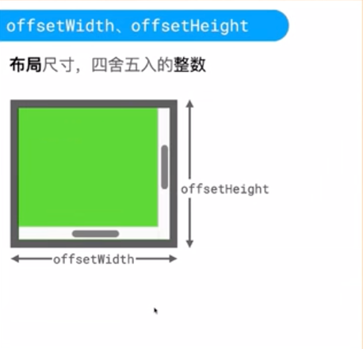
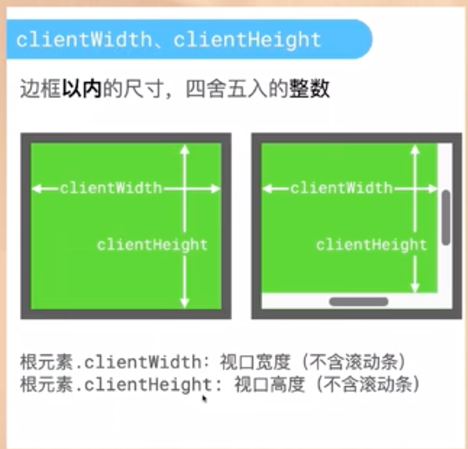
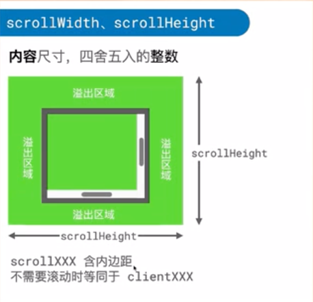
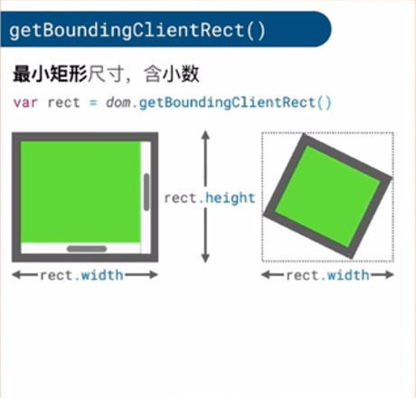

# 元素的尺寸

在 DOM 中，元素的各种尺寸属性用于描述元素的布局和几何信息。以下是常见的尺寸属性及其含义：

---

### **1. 偏移尺寸（Offset Dimensions）**


与元素的**视觉占据空间**相关，包括边框、滚动条和内边距，但不包括外边距。
- **`offsetWidth`**: 元素的总宽度（内容宽度 + 左右内边距 + 左右边框 + 垂直滚动条宽度）。
- **`offsetHeight`**: 元素的总高度（内容高度 + 上下内边距 + 上下边框 + 水平滚动条高度）。
- **`offsetLeft`**: 元素左上角相对于**最近定位父元素**（或 `offsetParent`）的左边缘的水平距离。
- **`offsetTop`**: 元素左上角相对于**最近定位父元素**（或 `offsetParent`）的上边缘的垂直距离。
- **`offsetParent`**: 指向最近的定位祖先元素（`position` 不为 `static`），决定 `offsetLeft/Top` 的参照。

---

### **2. 客户端尺寸（Client Dimensions）**


 表示元素的**可视区域**（内容 + 内边距），不包括边框、滚动条和外边距。
- **`clientWidth`**: 内容宽度 + 左右内边距（不包含滚动条和边框）。
- **`clientHeight`**: 内容高度 + 上下内边距（不包含滚动条和边框）。
- **`clientLeft`**: 左边框的宽度（通常与 `border-left-width` 相同）。
- **`clientTop`**: 上边框的高度（通常与 `border-top-width` 相同）。

---

### **3. 滚动尺寸（Scroll Dimensions）**

  与元素的**滚动内容区域**相关。
- **`scrollWidth`**: 元素内容的实际总宽度（包括不可见部分），无水平滚动条时等于 `clientWidth`。
- **`scrollHeight`**: 元素内容的实际总高度（包括不可见部分），无垂直滚动条时等于 `clientHeight`。
- **`scrollLeft`**: 元素内容向左滚动的像素数（可读写，用于控制滚动位置）。
- **`scrollTop`**: 元素内容向上滚动的像素数（可读写，用于控制滚动位置）。

---

### **4. 边界矩形（Bounding Rectangle）**


通过 `getBoundingClientRect()` 获取，返回元素相对于**视口**的几何信息：
- **`width`**: 元素的宽度（包括内容、内边距、边框）。
- **`height`**: 元素的高度（包括内容、内边距、边框）。
- **`left`/`x`**: 元素左边界相对于视口左边的距离。
- **`top`/`y`**: 元素上边界相对于视口顶部的距离。
- **`right`**: 元素右边界相对于视口左边的距离。
- **`bottom`**: 元素下边界相对于视口顶部的距离。

---

### **关键区别总结**
| 属性/方法                     | 包含内容                | 参照系          | 典型用途          |
|---------------------------|---------------------|--------------|---------------|
| `offsetWidth/Height`      | 内容 + 内边距 + 边框 + 滚动条 | 元素自身         | 获取元素占据的总空间    |
| `clientWidth/Height`      | 内容 + 内边距（无滚动条）      | 元素自身         | 获取可视区域大小      |
| `scrollWidth/Height`      | 实际内容总大小（可滚动部分）      | 元素自身         | 检测内容是否溢出      |
| `getBoundingClientRect()` | 内容 + 内边距 + 边框       | 视口（viewport） | 计算元素在屏幕中的精确位置 |

---

### **示例场景**
```javascript
const box = document.getElementById("box");

// 获取元素总宽度（含边框、内边距）
console.log(box.offsetWidth);

// 获取可视区域高度（不含边框、滚动条）
console.log(box.clientHeight);

// 检测内容是否溢出
if (box.scrollHeight > box.clientHeight) {
  console.log("内容有垂直滚动条！");
}

// 获取元素相对于视口的位置
const rect = box.getBoundingClientRect();
console.log(`元素距离视口顶部：${rect.top}px`);
```

---

### **注意事项**
1. 所有值均为整数（像素单位，四舍五入）。
2. 滚动尺寸（`scrollWidth/Height`）可能因浏览器对子元素边距的处理略有差异。
3. 修改 CSS 的 `box-sizing` 会影响 `clientWidth/Height` 的计算（例如设为 `border-box` 时，宽度包含边框）。

理解这些属性有助于精准控制布局、实现滚动检测或动态定位！