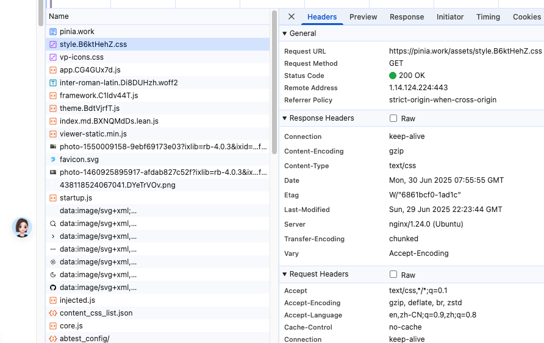

# 强缓存与协商缓存

浏览器缓存中的**强缓存**和**协商缓存**是优化网页加载速度、减少服务器压力的核心机制，它们的核心区别在于**是否向服务器发送请求验证资源有效性**。以下是详细对比和作用说明：

---

## **一、强缓存（本地缓存）**
**核心特点**：**不发送请求到服务器**，直接使用本地缓存。  
**实现方式**（通过HTTP响应头控制）：
1. **`Cache-Control`**（优先级更高，HTTP/1.1）
    - `max-age=3600`：资源有效期（秒），例如1小时。
    - `no-cache`：**跳过强缓存**，直接进入协商缓存。
    - `no-store`：禁止任何缓存（包括协商缓存）。
    - `public`：允许代理服务器缓存资源。
    - `private`：仅允许浏览器缓存（禁止代理缓存）。

2. **`Expires`**（HTTP/1.0，兼容性保留）
    - 指定资源的绝对过期时间（如`Expires: Wed, 21 Oct 2025 07:28:00 GMT`）。
    - 问题：依赖客户端时间，若时间不准确会导致缓存失效。

**缓存生效流程**：
```
浏览器请求资源 → 检查缓存头（Cache-Control/Expires） → 
  若未过期 → 直接读取本地缓存（状态码 `200 (from disk cache)` 或 `200 (from memory cache)`）
```

**作用**：
- **极速加载**：避免网络请求，显著提升页面打开速度。
- **降低服务器压力**：减少无效请求。

---

## **二、协商缓存（对比缓存）**
**核心特点**：**向服务器发送请求验证资源是否变更**，未变更则使用缓存（返回304），变更则返回新资源。  
**实现方式**（通过两组HTTP头组合）：
1. **`Last-Modified` & `If-Modified-Since`**：
    - 服务器返回`Last-Modified`（资源最后修改时间，如`Last-Modified: Wed, 21 Oct 2025 07:28:00 GMT`）。
    - 浏览器下次请求时携带`If-Modified-Since`（值为上次收到的`Last-Modified`）。
    - 服务器对比时间：若未修改 → 返回 **`304 Not Modified`**（无响应体）；若修改 → 返回 **`200`** + 新资源。

2. **`ETag` & `If-None-Match`**（优先级更高，解决时间精度问题）：
    - 服务器返回`ETag`（资源的唯一标识符，如`ETag: "33a64df551425fcc55e4d42a148795d9f25f89d4"`）。
    - 浏览器下次请求时携带`If-None-Match`（值为上次收到的`ETag`）。
    - 服务器对比`ETag`：一致 → 返回 **`304`**；不一致 → 返回 **`200`** + 新资源。

**缓存生效流程**：
```
浏览器请求资源 → 携带缓存标识（If-Modified-Since/If-None-Match）→ 
  服务器验证资源是否变更 → 
    未变更 → 返回 `304` → 浏览器读取本地缓存
    已变更 → 返回 `200` + 新资源 → 浏览器更新缓存
```

**作用**：
- **保证资源时效性**：确保用户获取最新资源。
- **节省带宽**：304响应无响应体，减少数据传输量。

---

## **三、关键区别对比**
| **特性**      | 强缓存                         | 协商缓存                     |
|-------------|-----------------------------|--------------------------|
| **是否请求服务器** | 否（直接读缓存）                    | 是（发送验证请求）                |
| **响应状态码**   | `200 (from cache)`          | `304 Not Modified`       |
| **控制优先级**   | `Cache-Control` > `Expires` | `ETag` > `Last-Modified` |
| **网络消耗**    | 零请求（最快）                     | 有请求（但304无响应体）            |
| **资源更新**    | 过期前无法获取新资源                  | 实时验证，及时更新                |

---

## **四、实际应用场景**
1. **强缓存适用**：
    - 静态资源（JS/CSS/图片）：设置`Cache-Control: max-age=31536000`（1年），配合文件名哈希（如`app.abc123.js`），内容变更后URL改变，强制重新下载。
    - 不常变化的资源（如字体文件）。

2. **协商缓存适用**：
    - HTML文件：设置`Cache-Control: no-cache`，确保页面内容及时更新。
    - 频繁更新的资源（如用户头像）。

---

## **五、缓存策略最佳实践**
```nginx
# Nginx 配置示例
location /static {
  # 强缓存：1年（通过文件名哈希避免旧缓存）
  add_header Cache-Control "public, max-age=31536000";
}

location / {
  # 协商缓存：HTML文件禁用强缓存
  add_header Cache-Control "no-cache";
}
```

---

## **总结**
- **强缓存**：速度极致，适合长期不变的静态资源。
- **协商缓存**：灵活性高，适合需及时更新的内容。  
  **二者协同工作**：浏览器先检查强缓存，失效后再触发协商缓存，兼顾性能与资源准确性。  
  通过合理配置HTTP缓存头，可显著提升用户体验并降低服务器负载。

## 测试结果

没有开启强缓存



开启强缓存
