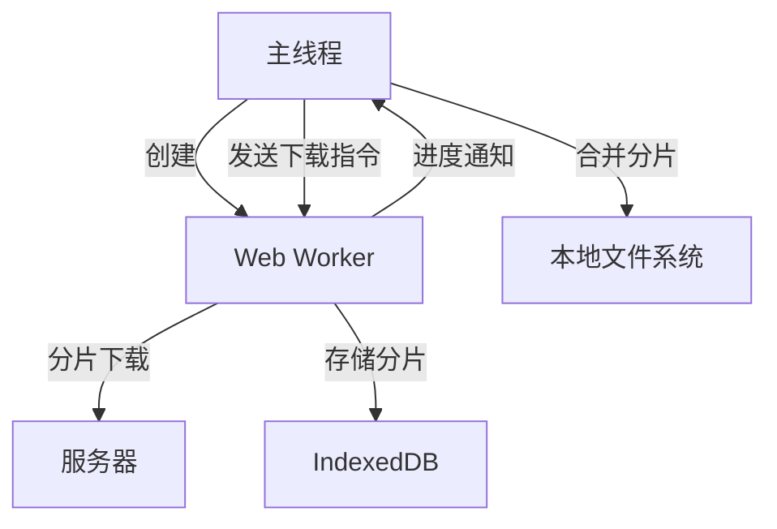
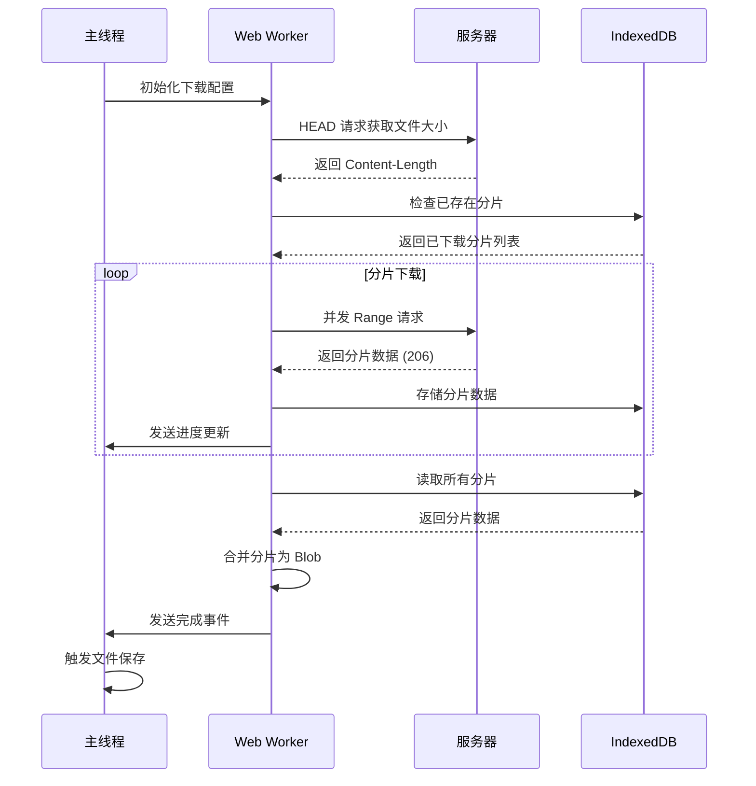

以下是使用 Web Worker 实现大文件分片下载的完整方案：

---

## Web Worker 分片下载实现方案
### 1. 架构设计


---

### 2. 核心代码实现
#### 2.1 主线程代码
```javascript
class DownloadManager {
  constructor(url) {
    this.worker = new Worker('download.worker.js');
    this.url = url;
    this.setupListeners();
  }

  setupListeners() {
    this.worker.onmessage = (e) => {
      const { type, data } = e.data;
      switch (type) {
        case 'progress':
          this.updateProgress(data);
          break;
        case 'complete':
          this.saveFile(data);
          break;
        case 'error':
          this.handleError(data);
          break;
      }
    };
  }

  startDownload() {
    this.worker.postMessage({
      type: 'start',
      config: {
        url: this.url,
        chunkSize: 10 * 1024 * 1024, // 10MB/chunk
        maxConcurrent: 3
      }
    });
  }

  pauseDownload() {
    this.worker.postMessage({ type: 'pause' });
  }

  resumeDownload() {
    this.worker.postMessage({ type: 'resume' });
  }

  updateProgress({ downloaded, total }) {
    console.log(`进度: ${(downloaded / total * 100).toFixed(1)}%`);
  }

  async saveFile(blob) {
    const url = URL.createObjectURL(blob);
    const a = document.createElement('a');
    a.href = url;
    a.download = 'downloaded-file';
    a.click();
    URL.revokeObjectURL(url);
  }
}
```

---

#### 2.2 Web Worker 代码 (`download.worker.js`)
```javascript
// 初始化状态
let state = {
  chunks: new Map(),
  activeRequests: new Set(),
  controller: null,
  isPaused: false
};

// IndexedDB 配置
const DB_NAME = 'downloadDB';
const STORE_NAME = 'chunks';

// 打开数据库
const openDB = () => {
  return new Promise((resolve, reject) => {
    const request = indexedDB.open(DB_NAME, 1);
    
    request.onupgradeneeded = (e) => {
      const db = e.target.result;
      if (!db.objectStoreNames.contains(STORE_NAME)) {
        db.createObjectStore(STORE_NAME, { keyPath: 'id' });
      }
    };

    request.onsuccess = (e) => resolve(e.target.result);
    request.onerror = reject;
  });
};

// 存储分片
const saveChunk = async (id, data) => {
  const db = await openDB();
  const tx = db.transaction(STORE_NAME, 'readwrite');
  tx.objectStore(STORE_NAME).put({ id, data });
  return new Promise(resolve => tx.oncomplete = resolve);
};

// 获取分片
const getChunk = async (id) => {
  const db = await openDB();
  const tx = db.transaction(STORE_NAME, 'readonly');
  const request = tx.objectStore(STORE_NAME).get(id);
  return new Promise(resolve => {
    request.onsuccess = (e) => resolve(e.target.result?.data);
  });
};

// 下载逻辑
const downloader = {
  async start(config) {
    state.controller = new AbortController();
    
    // 获取文件元数据
    const fileSize = await this.getFileSize(config.url);
    const totalChunks = Math.ceil(fileSize / config.chunkSize);

    // 恢复进度
    const downloadedChunks = await this.checkExistingChunks(totalChunks);
    
    // 创建下载队列
    const queue = Array.from({ length: totalChunks }, (_, i) => i)
      .filter(i => !downloadedChunks.has(i));

    // 并发控制
    while (queue.length > 0 && !state.isPaused) {
      const tasks = queue.splice(0, config.maxConcurrent)
        .map(i => this.downloadChunk(i, config));
      
      await Promise.all(tasks);
    }

    // 合并文件
    if (!state.isPaused) {
      const blob = await this.mergeChunks(totalChunks);
      self.postMessage({ type: 'complete', data: blob });
    }
  },

  async getFileSize(url) {
    const response = await fetch(url, { method: 'HEAD' });
    return parseInt(response.headers.get('Content-Length'), 10);
  },

  async checkExistingChunks(total) {
    const chunks = new Set();
    for (let i = 0; i < total; i++) {
      if (await getChunk(i)) chunks.add(i);
    }
    return chunks;
  },

  async downloadChunk(index, config) {
    const start = index * config.chunkSize;
    const end = start + config.chunkSize - 1;
    
    try {
      const response = await fetch(config.url, {
        headers: { Range: `bytes=${start}-${end}` },
        signal: state.controller.signal
      });

      const buffer = await response.arrayBuffer();
      await saveChunk(index, buffer);
      
      // 更新进度
      self.postMessage({
        type: 'progress',
        data: {
          downloaded: (index + 1) * config.chunkSize,
          total: config.chunkSize * (await this.checkExistingChunks(total)).size
        }
      });
    } catch (error) {
      if (error.name !== 'AbortError') {
        self.postMessage({ type: 'error', data: error.message });
      }
    }
  },

  async mergeChunks(total) {
    const buffers = [];
    for (let i = 0; i < total; i++) {
      const data = await getChunk(i);
      buffers.push(new Uint8Array(data));
    }
    return new Blob(buffers);
  }
};

// Worker 消息监听
self.addEventListener('message', async (e) => {
  switch (e.data.type) {
    case 'start':
      await downloader.start(e.data.config);
      break;
    case 'pause':
      state.isPaused = true;
      state.controller?.abort();
      break;
    case 'resume':
      state.isPaused = false;
      downloader.start(e.data.config);
      break;
  }
});
```

---

### 3. 优化策略
#### 3.1 流式合并（内存优化）
```javascript
async mergeChunks(total) {
  const stream = new ReadableStream({
    async start(controller) {
      for (let i = 0; i < total; i++) {
        const data = await getChunk(i);
        controller.enqueue(new Uint8Array(data));
      }
      controller.close();
    }
  });

  return new Response(stream).blob();
}
```

#### 3.2 分片校验
```javascript
// 在下载完成后校验
const verifyChunk = async (index, config) => {
  const data = await getChunk(index);
  const hash = await crypto.subtle.digest('SHA-256', data);
  const expectedHash = await fetchHashFromServer(index);
  return hash === expectedHash;
};
```

#### 3.3 断点续传增强
```javascript
// 持久化存储状态
const saveState = () => {
  localStorage.setItem('downloadState', JSON.stringify({
    url: config.url,
    downloadedChunks: Array.from(downloadedChunks)
  }));
};

// 异常恢复
window.addEventListener('beforeunload', () => {
  if (state.activeRequests.size > 0) {
    saveState();
  }
});
```

---

### 4. 时序图


---

### 5. 注意事项
1. **内存管理**
    - 使用流式处理避免大文件内存溢出
    - 及时清理 IndexedDB 中的临时数据
2. **错误恢复**
    - 实现分片级重试机制
    - 存储最后成功分片索引
3. **浏览器兼容性**

```javascript
// 检查特性支持
if (!window.Worker) {
  throw new Error('当前浏览器不支持 Web Worker');
}
if (!indexedDB) {
  throw new Error('当前浏览器不支持 IndexedDB');
}
```

4. **性能监控**

```javascript
// 添加性能埋点
const perf = {
  startTime: 0,
  markStart() { this.startTime = performance.now(); },
  getSpeed() {
    const duration = (performance.now() - this.startTime) / 1000;
    return (downloadedBytes / 1024 / 1024 / duration).toFixed(2) + 'MB/s';
  }
};
```

---

该方案通过 Web Worker 实现后台分片下载，结合 IndexedDB 存储分片数据，主线程保持流畅响应。可根据实际需求扩展以下功能：

+ **下载加速**：通过多个 CDN 域名并发下载
+ **加密传输**：在 Worker 中进行 AES 解密
+ **压缩传输**：支持 Brotli 压缩分片
+ **跨设备续传**：通过服务端同步下载状态
