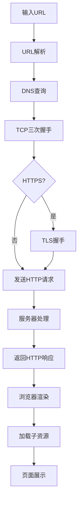

# 从url输入到页面渲染

当你在浏览器中输入一个URL并按下回车时，整个过程涉及多个步骤和技术协同工作。以下是详细流程：

---

## 1. **URL解析**
- 浏览器解析你输入的URL（例如 `https://www.example.com/page`），提取协议（`https`）、域名（`www.example.com`）、端口（默认443）、路径（`/page`）等信息。
- 如果输入的不是完整URL（如直接输入关键词），浏览器会使用默认搜索引擎进行搜索。

---

## 2. **DNS查询（域名解析）**
- **目标**：将域名转换为IP地址。
- **步骤**：
    1. 检查**浏览器缓存** → 若无则查**操作系统缓存** → 若无则查**本地Hosts文件**。
    2. 若仍无结果，向**本地DNS服务器**（如ISP提供的服务器）发起请求。
    3. 本地DNS服务器递归查询：
        - 根DNS服务器 → 顶级域服务器（`.com`） → 权威DNS服务器（`example.com`）。
    4. 获取IP地址后，逐级缓存结果。


## 3. **建立TCP连接（三次握手）**
- 浏览器通过操作系统内核的**网络协议栈**，向目标服务器的IP地址发起TCP连接：
    1. **SYN**：客户端发送连接请求包（序列号=x）。
    2. **SYN-ACK**：服务器回复确认包（序列号=y，确认号=x+1）。
    3. **ACK**：客户端发送最终确认包（确认号=y+1）。
- **结果**：建立可靠的TCP连接（目标端口：HTTP为80，HTTPS为443）。


## 4. **TLS握手（仅HTTPS）**
- 若使用HTTPS，在TCP连接后需建立加密通道：
    1. **ClientHello**：客户端发送支持的TLS版本、加密套件、随机数。
    2. **ServerHello**：服务器选择加密套件，发送数字证书（含公钥）和随机数。
    3. **验证证书**：浏览器检查证书是否由可信CA签发、是否过期、域名是否匹配。
    4. **密钥交换**：客户端生成预主密钥，用服务器公钥加密后发送。
    5. **生成会话密钥**：双方通过随机数和预主密钥生成对称加密密钥。
    6. **加密通信**：后续数据使用对称加密传输。


## 5. **发送HTTP请求**
- 浏览器构建**HTTP请求报文**，格式如下：
  ```http
  GET /page HTTP/1.1
  Host: www.example.com
  User-Agent: Mozilla/5.0
  Accept: text/html
  Cookie: user_id=123
  ```
- 请求通过TCP连接发送到服务器。

---

## 6. **服务器处理请求**
- 服务器（如Nginx/Apache）接收请求，根据路径路由到后端应用（如Node.js/Python）。
- 后端可能执行操作：
    - 读取数据库（如MySQL）。
    - 调用外部API。
    - 渲染模板（如Jinja）。
- 生成**HTTP响应**：
  ```http
  HTTP/1.1 200 OK
  Content-Type: text/html
  Set-Cookie: session_id=abc
  
  <html>...</html>
  ```

---

## 7. **浏览器渲染页面**
1. **解析HTML**：构建DOM树（文档对象模型）。
2. **解析CSS**：构建CSSOM树（CSS对象模型）。
3. **合并渲染树**：DOM + CSSOM → 渲染树（Render Tree）。
4. **布局（Layout）**：计算元素大小和位置（重排）。
5. **绘制（Painting）**：将渲染树转换为像素（重绘）。
6. **执行JavaScript**：
    - 遇到`<script>`标签时暂停HTML解析，下载并执行JS。
    - 若JS修改DOM/CSS，可能触发重新布局或绘制。

---

## 8. **加载子资源**
- 解析过程中发现子资源（如图片、CSS、JS）：
  ```html
  
  <link rel="stylesheet" href="style.css">
  ```
- 浏览器为每个资源**重新发起HTTP请求**（复用已有TCP连接或新建）。

---

## 9. **连接终止**
- 默认HTTP/1.1使用`Keep-Alive`复用TCP连接。
- 页面关闭后，TCP连接通过**四次挥手**关闭：
    1. 客户端发送`FIN`。
    2. 服务器回复`ACK`。
    3. 服务器发送`FIN`。
    4. 客户端回复`ACK`（等待2MSL后关闭）。

---

## 关键优化技术
- **缓存**：浏览器缓存静态资源（通过`Cache-Control`/`ETag`控制）。
- **CDN**：静态资源分发到边缘节点加速访问。
- **HTTP/2**：多路复用、头部压缩提升效率。
- **预加载**：`<link rel="preload">`提前加载关键资源。

---

## 流程图概览


整个过程通常在几百毫秒内完成，依赖网络、服务器性能及页面复杂度。
