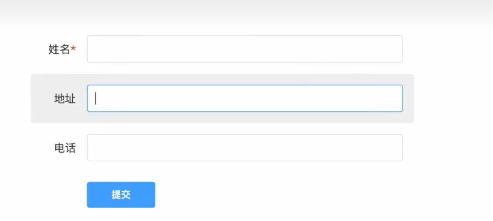
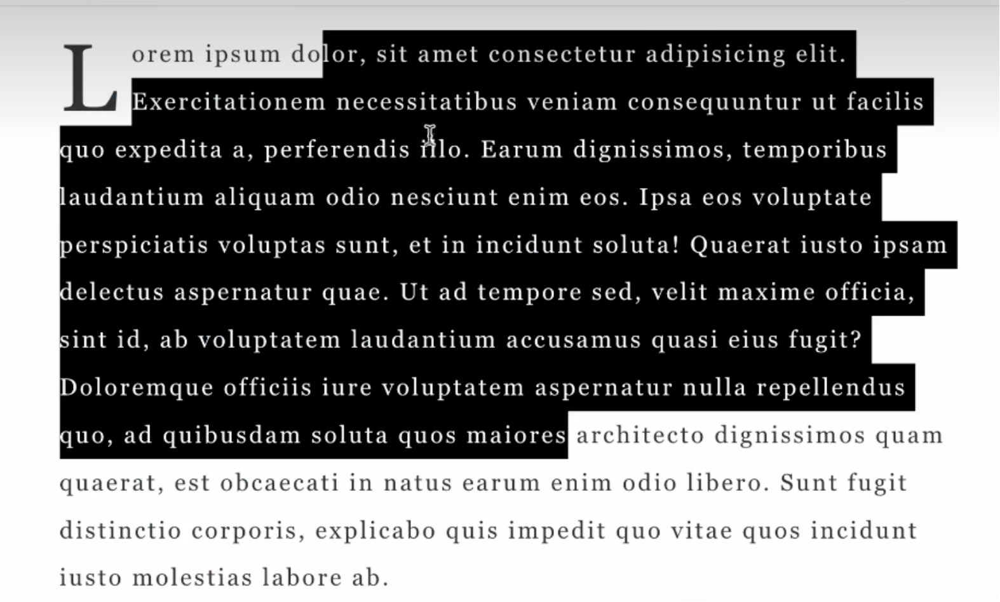

# CSS 伪类和伪元素

CSS 的伪类和伪元素是强大的选择器，用于选择元素的特定状态或文档树中不存在的部分（虚拟元素）。它们以 `:` 或 `::` 开头。

## 核心区别

*   **伪类 (`:`):** 选择处于**特定状态**的**已有元素**（例如：鼠标悬停、被点击、是第一个子元素、被聚焦等）。
*   **伪元素 (`::`):** 选择并样式化元素的**特定部分**或**创建新的虚拟元素**（例如：元素的第一行、第一个字母、在元素内容之前或之后插入内容等）。

---

## 一、 伪类 (Pseudo-Classes)

伪类以一个冒号 (`:`) 开头，用于定义元素的特殊状态。**触发依赖于用户交互、元素在文档树中的位置、表单状态等。**

### 常见伪类及其触发条件

1.  **动态/用户交互伪类 (最常用):**
    *   `:hover`: 当用户将鼠标指针悬停在元素上时触发。
    *   `:active`: 当元素被用户激活（例如鼠标点击按下时）时触发。
    *   `:focus`: 当元素获得焦点时触发（例如通过键盘 Tab 键聚焦到输入框，或鼠标点击输入框）。
    *   `:focus-visible`: 当元素获得焦点且浏览器认为焦点应该可见（通常是键盘操作获得焦点）时触发。更符合可访问性。
    *   `:focus-within`: 当元素自身或其**任何后代元素**获得焦点时触发。常用于高亮整个表单区域。
    *   `:visited`: 选择用户已访问过的链接 (`<a>`)。出于隐私限制，可应用的样式有限（通常只能改颜色）。

2.  **结构伪类 (基于位置):**
    *   `:first-child`: 选择是其父元素的**第一个**子元素的元素。
    *   `:last-child`: 选择是其父元素的**最后一个**子元素的元素。
    *   `:nth-child(n)`: 选择是其父元素的**第 n 个**子元素的元素。`n` 可以是数字、关键词 (`even`, `odd`) 或公式 (`2n+1`)。计算基于所有子元素类型。
    *   `:nth-last-child(n)`: 类似 `:nth-child(n)`，但从最后一个子元素开始**倒序**计数。
    *   `:first-of-type`: 选择是其父元素中**同类型**兄弟元素中的**第一个**元素。
    *   `:last-of-type`: 选择是其父元素中**同类型**兄弟元素中的**最后一个**元素。
    *   `:nth-of-type(n)`: 选择是其父元素中**同类型**兄弟元素中的**第 n 个**元素。
    *   `:nth-last-of-type(n)`: 类似 `:nth-of-type(n)`，但从最后一个同类型元素开始**倒序**计数。
    *   `:only-child`: 选择是其父元素的**唯一**子元素的元素（没有兄弟元素）。
    *   `:only-of-type`: 选择是其父元素中**唯一**的该类型元素的元素（可能有其他类型的兄弟元素）。
    *   `:root`: 选择文档的根元素（在 HTML 中总是 `<html>`）。通常用于声明全局 CSS 变量。

3.  **表单状态伪类:**
    *   `:checked`: 选择被选中的**单选按钮 (`<input type="radio">`)**、**复选框 (`<input type="checkbox">`)** 或 **下拉选项 (`<option>`) **。
    *   `:disabled`: 选择被禁用的表单元素（具有 `disabled` 属性）。
    *   `:enabled`: 选择未被禁用的表单元素（`disabled` 属性的反面）。
    *   `:required`: 选择设置了 `required` 属性的表单元素。
    *   `:optional`: 选择没有设置 `required` 属性的表单元素（`:required` 的反面）。
    *   `:valid`: 选择其内容**通过验证**的表单元素（根据 `type`, `pattern`, `required` 等属性）。
    *   `:invalid`: 选择其内容**未通过验证**的表单元素。
    *   `:in-range`: 选择值在指定 `min`/`max` 范围内的 `<input type="number">` 或 `<input type="range">`。
    *   `:out-of-range`: 选择值超出指定 `min`/`max` 范围的 `<input type="number">` 或 `<input type="range">`。
    *   `:read-only`: 选择设置了 `readonly` 属性的元素（用户不可编辑）。
    *   `:read-write`: 选择没有 `readonly` 属性（且不是 `disabled`）的元素（用户可编辑）。

4.  **语言伪类:**
    *   `:lang(language-code)`: 选择设置了特定语言（通过 `lang="xx"` 属性或 HTTP 头）的元素。比属性选择器 `[lang|="xx"]` 更健壮。

5.  **逻辑组合伪类 (CSS Selectors Level 4):**
    *   `:is()` / `:matches()` / `:any()`: 接受一个选择器列表作为参数，匹配列表中**任意一个**选择器能选中的元素。用于简化复杂选择器的分组。`(:any()` 是旧别名，`:matches()` 被弃用，推荐 `:is()`)。
    *   `:not()`: 接受一个**简单选择器**或**选择器列表**作为参数，匹配**不符合**该参数的元素。
    *   `:where()`: 功能类似 `:is()`，但**其选择器的优先级总是 0**。用于引入不影响优先级的选择器。

6.  **其他:**
    *   `:target`: 当元素的 `id` 与当前 URL 的片段标识符（`#id`）匹配时触发。常用于页面内锚点导航的样式。
    *   `:empty`: 选择**完全没有子元素**（包括文本节点，甚至空格）的元素。
    *   `:link`: 选择**未被访问过**的链接 (`<a>` 带有 `href` 属性)。通常在 `:visited` 之前定义。

---

## 二、 伪元素 (Pseudo-Elements)

伪元素以**两个冒号 (`::`)** 开头（CSS3 规范要求，但单冒号 `:` 在旧浏览器中通常仍有效，推荐使用 `::`）。它们用于样式化元素的特定部分或创建不在文档树中的内容。

### 常见伪元素及其作用

1.  **`::before`**: 在**选定元素的内容之前**插入一个虚拟元素作为其第一个子元素。需要与 `content` 属性一起使用来生成内容（即使内容是空字符串 `content: "";`，也常用于纯装饰）。
2.  **`::after`**: 在**选定元素的内容之后**插入一个虚拟元素作为其最后一个子元素。同样需要 `content` 属性。
3.  **`::first-letter`**: 选择**块级元素**（如 `<p>`, `<h1>`, `<div>`）**第一行**的**第一个字母**（或首字符，如数字、标点、`::before` 生成的内容）。常用于实现首字下沉效果。
4.  **`::first-line`**: 选择**块级元素**的**第一行**文本。根据视口宽度动态变化。
5.  **`::selection`**: 选择用户**用鼠标或其他指针设备高亮选中的**文本部分。只能应用少数 CSS 属性（`color`, `background-color`, `text-shadow`, `cursor`, `caret-color`, `outline` 等）。
6.  **`::placeholder`**: 选择表单元素（如 `<input>`, `<textarea>`）的**占位符文本** (`placeholder` 属性中的文本)。可以改变其样式。
7.  **`::marker`**: 选择**列表项**（`<li>`）的**标记框**（通常是项目符号或数字）。可以改变列表标记的样式（颜色、内容、位置等）。
8.  **`::backdrop` (实验性)**: 当元素以全屏模式（如 `dialog.showModal()` 或 `Element.requestFullscreen()`）显示时，创建覆盖在元素下方但位于其他页面内容之上的背景层。可用于设置模态框背后的灰色遮罩样式。

---

## 总结表格

| 类型      | 语法前缀 | 目的                      | 触发/作用依据            | 常见示例                                                                                        |
|:--------|:-----|:------------------------|:-------------------|:--------------------------------------------------------------------------------------------|
| **伪类**  | `:`  | 选择元素的**特定状态**           | 用户交互、文档位置、表单状态、语言等 | `:hover`, `:active`, `:focus`, `:first-child`, `:checked`, `:disabled`, `:target`, `:not()` |
| **伪元素** | `::` | 选择/创建元素的**特定部分**或**内容** | 元素内容的特定位置、需要生成虚拟内容 | `::before`, `::after`, `::first-letter`, `::first-line`, `::selection`, `::placeholder`     |

**关键要点：**

*   **伪类 = 状态 (`:`)**
*   **伪元素 = 部分/新内容 (`::`)**
*   伪类基于元素在**特定时刻的条件**（状态或位置）。
*   伪元素基于元素**内容的结构**或需要**生成新的内容**。
*   使用 `::` 来明确表示伪元素（现代最佳实践），但大多数浏览器对旧的单冒号 `:` 写法有良好兼容性。
*   `::before` 和 `::after` **必须**与 `content` 属性一起使用才能生效（即使 `content: "";`）。

理解并熟练运用伪类和伪元素是编写高效、灵活、交互性强的 CSS 的关键技能。它们极大地扩展了 CSS 选择器的能力。

## examples
### 表单样式控制



```css
.form-block:focus-within {
    backgroudn: #ccc;
}

.label span:has(+ input[data-required])::after {
    content: "*";
    color: red;
}
```

### 首字母样式和选中样式


```css
.content::first-letter {
    text-transform: uppercase;
    font-size: 4em;
    float: left;
    line-height: 1;
    margin-right: 10px;
}

.content::selection {
    background-color: #000;
    color: #fff;
    text-decoration: underline;
}
```
