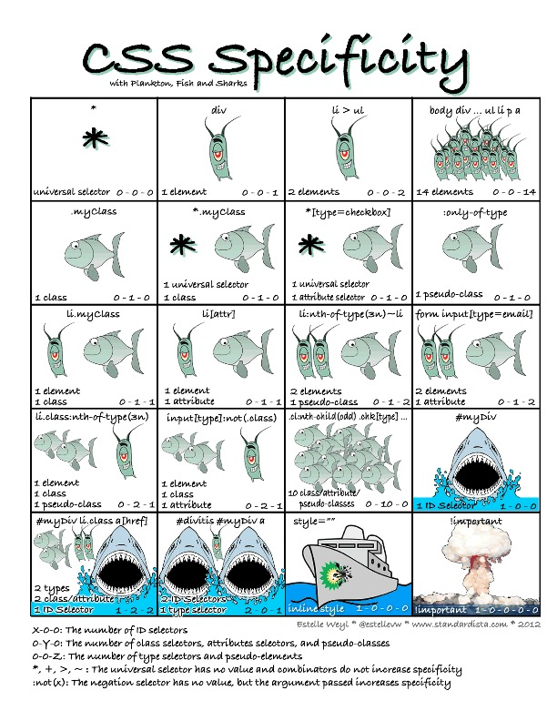

# css优先级


important  >  id >  class >  *



CSS优先级（Specificity）用于确定当多个规则作用于同一元素时，哪个样式将生效。其计算规则基于选择器的类型，**优先级从高到低**如下：

---

## **1. 优先级层级（由高到低）**
| 选择器类型           | 示例                  | 权重值表示法 (A,B,C,D) |
|-----------------|---------------------|------------------|
| **内联样式**        | `<div style="...">` | `1,0,0,0`        |
| **ID选择器**       | `#header`           | `0,1,0,0`        |
| **类/伪类/属性选择器**  | `.class`, `:hover`  | `0,0,1,0`        |
| **元素/伪元素选择器**   | `div`, `::before`   | `0,0,0,1`        |
| **通配符/继承/子选择器** | `*`, `>`            | `0,0,0,0`        |

---

## **2. 计算规则**
- **将选择器拆分为四组 `(A, B, C, D)`**：
    - **A**：内联样式（存在则为1，否则0）。
    - **B**：ID选择器的数量。
    - **C**：类、伪类（`:hover`）、属性选择器（`[type="text"]`）的数量。
    - **D**：元素选择器（`div`）、伪元素（`::before`）的数量。

- **比较方法**：  
  从左到右逐级比较（A → B → C → D），数值大的优先级更高。  
  **示例**：
  ```css
  #nav .item a:hover  /* (0,1,2,1) → A=0, B=1, C=2, D=1 */
  body #sidebar .link  /* (0,1,1,1) → A=0, B=1, C=1, D=1 */
  ```
  第一个选择器优先级更高（比较到C时，2 > 1）。

---

## **3. 特殊情况规则**
- **`!important`**：  
  直接覆盖所有其他规则（**慎用**），但内联样式加 `!important` 的优先级最高。
  ```css
  p { color: red !important; } /* 最高优先级 */
  ```

- **相同优先级**：  
  后定义的样式覆盖先定义的（源码顺序靠后的生效）。

- **继承的样式**：  
  优先级最低（低于通配符 `*`）。

- **组合选择器**：  
  `+`, `>`, `~` 等组合符不增加优先级，仅影响选择逻辑。

- **`:not()` 伪类**：  
  自身不计入优先级，但内部的选择器参与计算。
  ```css
  div:not(#id)  /* 优先级 = (0,1,0,1)（#id 参与计算） */
  ```

---

## **4. 示例对比**
| 选择器示例                   | 权重值       | 计算逻辑              |
|-------------------------|-----------|-------------------|
| `style="color:red"`     | `1,0,0,0` | 内联样式              |
| `#main .list li.active` | `0,1,2,1` | 1个ID + 2个类 + 1个元素 |
| `ul#menu li.item`       | `0,1,1,2` | 1个ID + 1个类 + 2个元素 |
| `a:hover`               | `0,0,1,1` | 1个伪类 + 1个元素       |
| `div p`                 | `0,0,0,2` | 2个元素              |
| `*`                     | `0,0,0,0` | 通配符               |

---

## **5. 优先级速记技巧**
- **ID选择器** 是最高权重（除内联和`!important`）。
- **100个类** < **1个ID**（因为比较顺序：B > C）。
- 实际开发中避免过度嵌套，用类选择器更可控。

> 💡 总结：优先级计算 = **内联 > ID > 类/伪类 > 元素**，比较时从左到右逐级对比。
