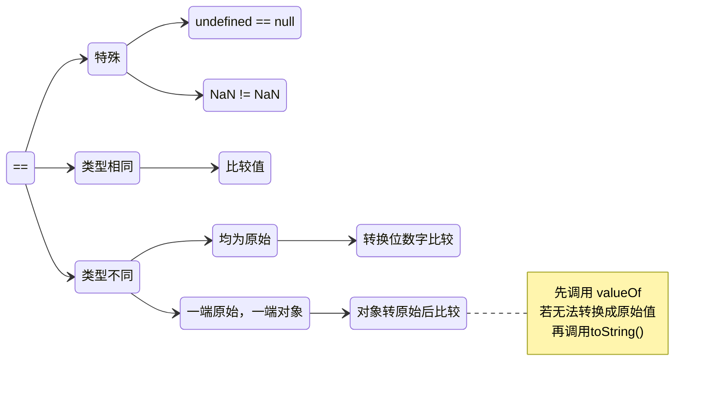

# ==

在 JavaScript 中，`==` 是**宽松相等运算符**（Loose Equality Operator），它会在比较两个值时进行**类型转换**（Type Coercion），然后再比较转换后的值是否相等。这种类型转换有时会导致一些不符合直觉的结果，因此理解 `==` 的工作机制非常重要。



## **`==` 的运算规则**
1. **如果两个值的类型相同**，则直接比较它们的值：
    - `5 == 5` → `true`
    - `"hello" == "hello"` → `true`
    - `true == true` → `true`
    - `null == null` → `true`
    - `undefined == undefined` → `true`
    - `NaN == NaN` → `false`（`NaN` 不等于任何值，包括它自己）

2. **如果两个值的类型不同**，JavaScript 会尝试进行类型转换，规则如下：
    - **数字 vs 字符串** → 字符串会被转换成数字：
      ```js
      5 == "5"  // true，因为 "5" 被转成数字 5
      ```
    - **布尔值 vs 非布尔值** → 布尔值会先转换成数字（`true`→`1`，`false`→`0`），然后再比较：
      ```js
      true == 1    // true，因为 true → 1
      false == 0   // true，因为 false → 0
      true == "1"  // true，因为 true → 1，"1" → 1
      false == ""  // true，因为 false → 0，"" → 0
      ```
    - **对象 vs 基本类型** → 对象会调用 `valueOf()` 或 `toString()` 转换成基本类型再比较：
      ```js
      [1] == 1      // true，因为 [1].toString() → "1" → 1
      [] == 0       // true，因为 [].toString() → "" → 0
      {} == "[object Object]"  // Error，因为 {} 认为是代码块
      ```
    - **`null` 和 `undefined`**：
        - `null == undefined` → `true`
        - `null` 和 `undefined` 不会转换成其他类型：
          ```js
          null == 0      // false
          undefined == 0 // false
          ```

---

## **`==` 的奇怪行为（容易踩坑）**
由于类型转换的规则，`==` 可能会导致一些不符合直觉的结果：
```js
"" == 0        // true（"" → 0）
"0" == false   // true（false → 0，"0" → 0）
[] == false    // true（[] → "" → 0，false → 0）
[1, 2] == "1,2" // true（数组转字符串）
" \t\r\n " == 0 // true（空白字符串 → 0）
```

---

## **`===`（严格相等） vs `==`（宽松相等）**
- `===` **不会进行类型转换**，只有类型和值都相同才返回 `true`。
- `==` **会进行类型转换**，可能导致意外结果。

**推荐使用 `===`**，除非你明确需要类型转换的逻辑。

---

## **总结**
- `==` 会进行隐式类型转换，可能导致意外行为。
- `===` 更严格，推荐使用。
- 特殊规则：
    - `NaN == NaN` → `false`（`NaN` 不等于任何值）
    - `null == undefined` → `true`（但它们不等于其他值）
    - 对象会尝试转换成基本类型再比较。

如果你不确定 `==` 的行为，可以优先使用 `===` 或使用 `console.log()` 查看转换后的值。