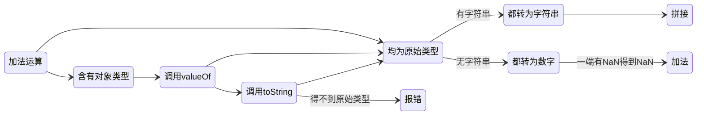

# Add

以下是 JavaScript 加法运算的逻辑图，采用 Mermaid 语法绘制：

1. **类型检查**：首先检查运算中是否包含非原始类型（对象）
2. **对象处理**：
    - 调用对象的 `valueOf()` 方法
    - 如果返回原始值，进入原始类型处理流程
    - 如果返回对象，继续调用 `toString()` 方法
    - 如果 `toString()` 返回原始值，进入原始类型处理
    - 如果仍返回对象，抛出 `TypeError`
3. **原始类型处理**：
    - **存在字符串**：双方转为字符串后拼接
    - **无字符串**：
        - 双方转为数字
        - 任一为 `NaN` 则结果为 `NaN`
        - 否则执行数字加法

## 关键点：
- 对象到原始值的转换遵循 `valueOf()` → `toString()` 的优先级
- 只有运算双方均为非字符串的原始类型时才会转为数字计算
- 字符串的存在会触发字符串拼接，优先级高于数字计算

