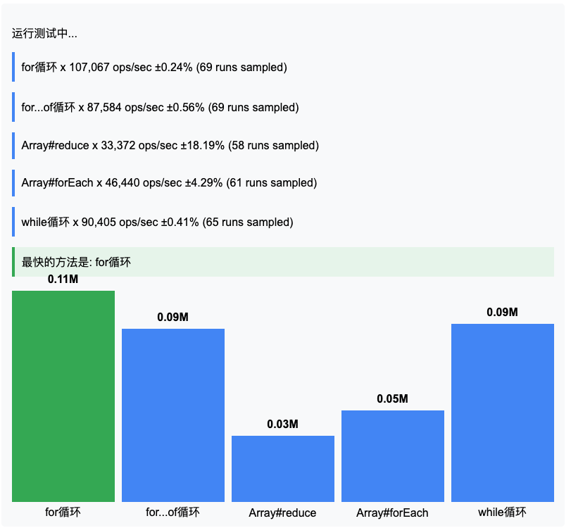

# Benchmark测试性能

Benchmark.js 是一个强大的 JavaScript 基准测试库，用于精确测量代码性能。本文将详细介绍其使用方法，包含完整示例代码。

## 安装方法

### 使用 npm 安装
```bash
npm install benchmark --save
```

### 浏览器直接引入
```html
<script src="https://cdn.jsdelivr.net/npm/lodash@4.17.21/lodash.min.js"></script>
<script src="https://cdn.jsdelivr.net/npm/benchmark@2.1.4/benchmark.min.js"></script>
```

## 基础用法

```javascript
const Benchmark = require('benchmark');
const suite = new Benchmark.Suite;

// 添加测试用例
suite
  .add('RegExp#test', () => {
    /o/.test('Hello World!');
  })
  .add('String#indexOf', () => {
    'Hello World!'.indexOf('o') > -1;
  })
  .add('String#includes', () => {
    'Hello World!'.includes('o');
  })
  // 添加事件监听器
  .on('cycle', event => {
    console.log(String(event.target));
  })
  .on('complete', function() {
    console.log('最快的方法是: ' + this.filter('fastest').map('name'));
  })
  // 运行测试
  .run({ 'async': true });
```

## 关键概念

### 1. Suite（测试套件）
测试用例的容器，用于组织和管理多个基准测试

### 2. Test（测试用例）
单个需要测试的代码片段

### 3. 重要事件：
- `cycle`: 每个测试完成时触发
- `complete`: 所有测试完成后触发
- `start`: 测试套件开始时触发
- `error`: 测试出错时触发

## 高级配置

### 测试用例配置选项
```javascript
suite.add('Custom test', {
  fn: function() { /* 测试代码 */ },
  minSamples: 50,     // 最小样本数
  maxTime: 5,          // 最大运行时间（秒）
  delay: 0.1,          // 测试之间的延迟
  initCount: 5,        // 初始预热次数
  name: '自定义测试',   // 测试名称
  onStart: function() { /* 测试开始时 */ },
  onCycle: function() { /* 每次循环后 */ },
  onComplete: function() { /* 测试完成后 */ },
  onError: function() { /* 出错时 */ }
});
```

### 异步测试
```javascript
suite.add('Async test', {
  defer: true,
  fn: function(deferred) {
    setTimeout(function() {
      // 异步操作
      deferred.resolve();
    }, 50);
  }
});
```

## 测试结果解析

测试结果包含的关键指标：
```text
String#indexOf x 62,405,689 ops/sec ±1.21% (92 runs sampled)
```
- **ops/sec**: 每秒操作次数（越高越好）
- **±1.21%**: 误差范围（越小越稳定）
- **(92 runs sampled)**: 采样次数

## 最佳实践

1. **避免死码消除**：确保测试代码有实际输出
```javascript
// 错误方式（会被优化掉）
let sum = 0;
for (let i = 0; i < array.length; i++) {}

// 正确方式
let sum = 0;
for (let i = 0; i < array.length; i++) {
  sum += array[i];
}
return sum;
```

2. **使用Setup/Teardown**：准备测试环境
```javascript
suite.add('Array#forEach', {
  setup: function() {
    this.array = Array(1000).fill().map((_, i) => i);
  },
  fn: function() {
    let sum = 0;
    this.array.forEach(n => sum += n);
    return sum;
  }
});
```

3. **控制测试环境**：
```javascript
// 在Node.js中禁用优化
function noop() {}
const testFn = Benchmark.prototype._createTest(test);
testFn();
noop(testFn);
```

## 完整示例

```html
<!DOCTYPE html>
<html>
<head>
  <title>Benchmark.js 示例</title>
  <script src="https://cdn.jsdelivr.net/npm/lodash@4.17.21/lodash.min.js"></script>
  <script src="https://cdn.jsdelivr.net/npm/benchmark@2.1.4/benchmark.min.js"></script>
  <style>
    body { font-family: Arial, sans-serif; max-width: 800px; margin: 0 auto; padding: 20px; }
    .results { margin-top: 20px; padding: 15px; background: #f8f9fa; border-radius: 5px; }
    .test-case { margin-bottom: 15px; padding: 10px; border-left: 4px solid #4285f4; }
    .fastest { border-left-color: #34a853; background-color: #e6f4ea; }
    .chart { height: 300px; margin: 20px 0; display: flex; align-items: flex-end; gap: 10px; }
    .bar { flex: 1; background: #4285f4; position: relative; }
    .bar-label { position: absolute; bottom: -25px; width: 100%; text-align: center; }
    .bar-value { position: absolute; top: -25px; width: 100%; text-align: center; font-weight: bold; }
    button { padding: 10px 20px; background: #4285f4; color: white; border: none; border-radius: 4px; cursor: pointer; }
    button:hover { background: #3367d6; }
  </style>
</head>
<body>
  <h1>Benchmark.js 性能测试</h1>
  <button id="runTests">运行测试</button>
  <div class="results" id="results"></div>
  
  <script>
    document.getElementById('runTests').addEventListener('click', runBenchmarks);
    
    function runBenchmarks() {
      const resultsElement = document.getElementById('results');
      resultsElement.innerHTML = '<p>运行测试中...</p>';
      
      const suite = new Benchmark.Suite;
      const testData = Array(10000).fill().map((_, i) => i);
      let results = [];
      
      // 添加测试用例
      suite
        .add('for循环', function() {
          let sum = 0;
          for (let i = 0; i < testData.length; i++) {
            sum += testData[i];
          }
          return sum;
        })
        .add('for...of循环', function() {
          let sum = 0;
          for (const value of testData) {
            sum += value;
          }
          return sum;
        })
        .add('Array#reduce', function() {
          return testData.reduce((sum, val) => sum + val, 0);
        })
        .add('Array#forEach', function() {
          let sum = 0;
          testData.forEach(val => sum += val);
          return sum;
        })
        .add('while循环', function() {
          let sum = 0;
          let i = testData.length;
          while (i--) {
            sum += testData[i];
          }
          return sum;
        })
        .on('cycle', event => {
          const result = {
            name: event.target.name,
            hz: event.target.hz,
            stats: event.target.stats
          };
          results.push(result);
          resultsElement.innerHTML += `<div class="test-case">${String(event.target)}</div>`;
        })
        .on('complete', function() {
          const fastest = this.filter('fastest')[0].name;
          resultsElement.innerHTML += `<div class="test-case fastest">最快的方法是: ${fastest}</div>`;
          
          // 渲染柱状图
          renderBarChart(results, fastest);
        })
        .run({ 'async': true });
    }
    
    function renderBarChart(results, fastest) {
      const maxOps = Math.max(...results.map(r => r.hz));
      const chartElement = document.createElement('div');
      chartElement.className = 'chart';
      
      results.forEach(result => {
        const height = (result.hz / maxOps) * 100;
        const isFastest = result.name === fastest;
        
        const bar = document.createElement('div');
        bar.className = 'bar';
        bar.style.height = `${height}%`;
        bar.style.background = isFastest ? '#34a853' : '#4285f4';
        
        const value = document.createElement('div');
        value.className = 'bar-value';
        value.textContent = (result.hz / 1000000).toFixed(2) + 'M';
        
        const label = document.createElement('div');
        label.className = 'bar-label';
        label.textContent = result.name;
        
        bar.appendChild(value);
        bar.appendChild(label);
        chartElement.appendChild(bar);
      });
      
      document.getElementById('results').appendChild(chartElement);
    }
  </script>
</body>
</html>
```

## 常见问题解决

1. **测试结果波动大**：
    - 增加 `minSamples` 和 `maxTime`
    - 关闭后台应用程序
    - 禁用浏览器扩展

2. **测试函数被优化掉**：
    - 确保有实际输出
    - 使用 `this` 上下文存储结果
   ```javascript
   suite.add('Test', function() {
     this.result = /* 计算结果 */;
   });
   ```

3. **内存问题**：
    - 在 `setup` 中初始化数据
    - 在 `teardown` 中清理资源
    - 避免在测试中创建大型对象

Benchmark.js 提供了专业级的性能测试能力，通过合理配置和遵循最佳实践，您可以获得准确的性能数据来优化代码。
