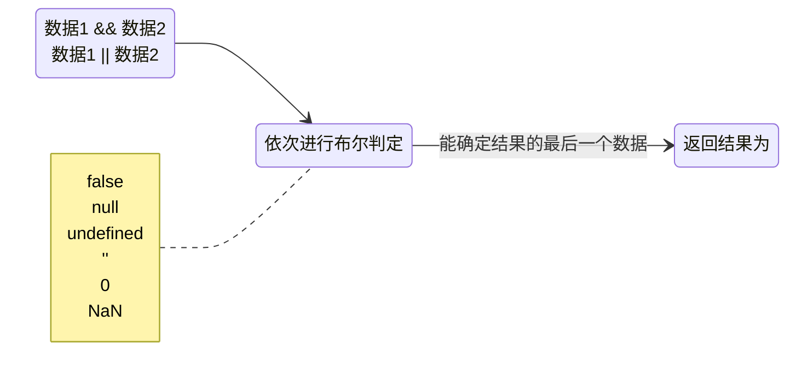

# Boolean

```mermaid

stateDiagram
    direction LR
    state "数据1 && 数据2
           数据1 || 数据2" as S
    S --> 依次进行布尔判定
  
    依次进行布尔判定 --> 返回结果为: 能确定结果的最后一个数据

    note left of 依次进行布尔判定
        false
        null
        undefined
        ''
        0
        NaN

    end note
```