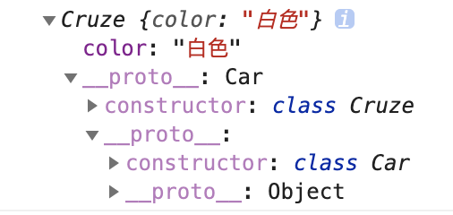
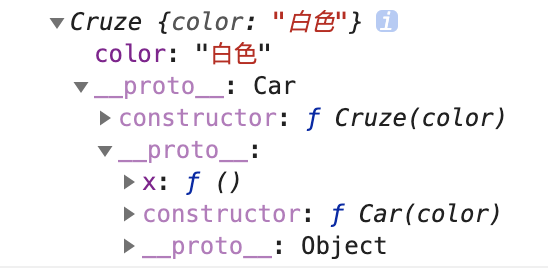
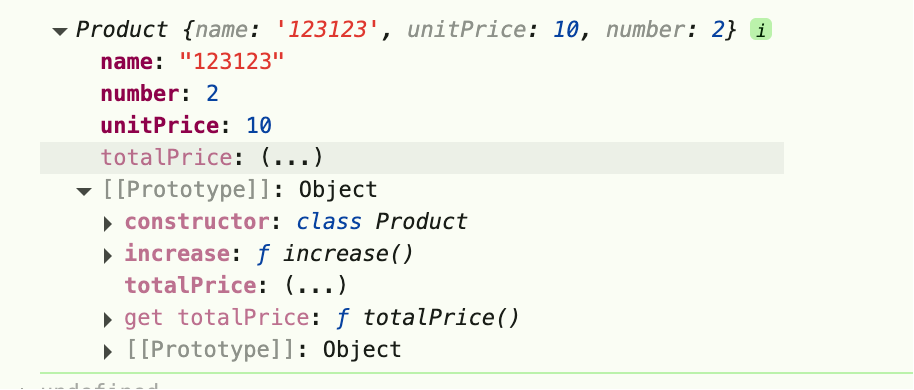

# ES5继承实现


## ES6版本继承

```js
class Car {
    constructor(color) {
        this.color = color;
    }

    static yideng = "京城一灯";
}

class Cruze extends Car {
    constructor(color) {
        super(color);
    }
}
const cruze = new Cruze("白色");

console.log(cruze); // Cruze { color: '白色' }
console.log(cruze instanceof Cruze); // true
console.log(cruze instanceof Car); // true
```



1. 实例cruze的是class Cruze，

## ES5继承

```js
function Car(color) {
    this.color = color;
}
Car.myname = "京城一灯";
Car.prototype.x = function () {
    console.log("父类方法");
};

function Cruze(color) {
    Car.call(this, color);
}

Cruze.prototype = Object.create(Car.prototype, {
    constructor: {
        value: Cruze,
        writable: false,
    },
});

Object.entries(Car).forEach(([key, value]) => {
    Cruze[key] = value;
});
const cruze = new Cruze("白色");
console.log(cruze);
console.log(cruze instanceof Cruze);
console.log(cruze instanceof Car);
```



## ES6 Product 实现

```js
class Product {
    
    static count = 0;
    
    constructor(name, unitPrice, number) {
        this.name = name;
        this.unitPrice = unitPrice;
        this.number = number;
        Product.count++;
    }
    
    get totalPrice() {
        return this.number + this.unitPrice
    }
    
    increase() {
        return this.number++;
    }
}

console.log(new Product("123123", 10, 2))
```



## ES5实现

### 解决的问题
1. Class暂存性死区问题
2. 只能被new调用
3. this上的 totalPrice问题，且不可枚举
4. 类上方法不能被new

### 实现

```js
var Product = (function () {
    function Product(name, unitPrice, number) {
        if(Object.getPrototypeOf(this) !== Product.prototype) {
            throw new TypeError("Class constructor Product cannot be invoked without 'new'")
        }
        
        this.name = name;
        this.unitPrice = unitPrice;
        this.number = number;
        Product.count++;

     
    }
    
    Product.count = 0;

    Object.defineProperty(Product.prototype, "totalPrice", {
        get() {
            return this.number * this.unitPrice
        },
        enumerable: false
    })
    
    Object.defineProperty(Product.prototype, "increase", {
        enumerable: false,
        value: function () {
            if(Object.getPrototypeOf(this)=== Product.prototype.increase.prototype) {
                throw new TypeError("increase is not a constructor")
            }
            this.number++;
        }
    })
     
    return Product;
})()

console.log(new Product("123123", 10, 2))

```
