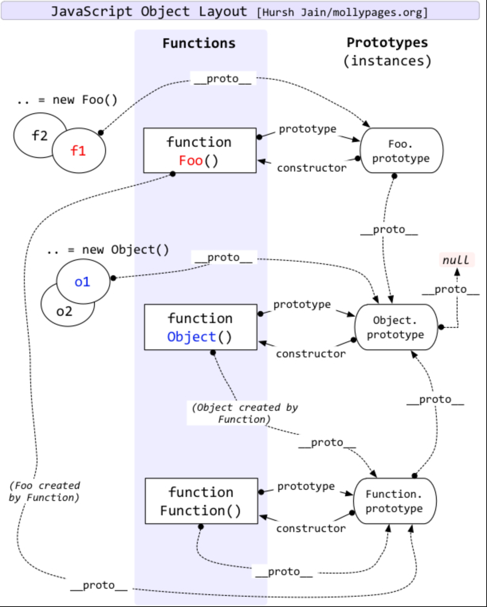

# JS 原型链


```js
// Object是一个函数
console.log(Object.__proto__ === Function.prototype); // true
console.log(Function.prototype.__proto__ === Object.prototype);// true
// 无为万物之始
console.log(Object.prototype.__proto__ === null);// true
// Function是一个函数
console.log(Function.__proto__ === Function.prototype);// true

console.log(Array.__proto__ === Function.prototype);// true
console.log(Array.prototype.__proto__ === Object.prototype);// true

class A {
    x() {
        console.log(this);
    }
}

const a = new A();

console.log(a.__proto__ === A.prototype);// true
console.log(A.__proto__ === Function.prototype);// true

class B extends A {}

const b = new B();

console.log(b.__proto__ === B.prototype);// true
console.log(B.prototype.__proto__ === A.prototype);// true
console.log(B.__proto__ === A);// true


```
JavaScript 的**原型链（Prototype Chain）** 是理解 JavaScript 面向对象编程的核心机制之一。它是一种让对象能够**继承**属性和方法的方式。下面用通俗的方式解释它的核心概念和工作原理：

---

## 核心概念
1. **每个对象都有一个隐藏属性 `[[Prototype]]`**
    - 当你访问对象的属性时，如果对象本身没有该属性，JavaScript 会沿着 `[[Prototype]]` 向上查找（这就是“链”）。
    - 可通过 `Object.getPrototypeOf(obj)` 或 `obj.__proto__`（非标准，但被广泛支持）访问。

2. **函数有一个 `prototype` 属性**
    - 只有**函数**拥有显式的 `prototype` 属性（箭头函数除外）。
    - 当使用 `new` 调用函数时，新创建对象的 `[[Prototype]]` 会指向该函数的 `prototype`。

---

## 原型链如何工作？
### 例子代码
```javascript
// 1. 定义一个构造函数
function Person(name) {
  this.name = name;
}

// 2. 向构造函数的 prototype 添加方法
Person.prototype.sayHello = function() {
  console.log(`Hello, I'm ${this.name}`);
};

// 3. 创建实例
const alice = new Person("Alice");

// 4. 调用方法（自身没有，但原型上有）
alice.sayHello(); // 输出: "Hello, I'm Alice"
```

### 查找过程：
1. 访问 `alice.sayHello`
2. `alice` 自身无 `sayHello` → 查找 `alice.__proto__`
3. `alice.__proto__` 指向 `Person.prototype` → 找到 `sayHello`，执行！

---

## 原型链示意图
```
alice (实例)        → 有 name 属性
  ↓ [[Prototype]]    
Person.prototype   → 有 sayHello 方法
  ↓ [[Prototype]]    
Object.prototype   → 有 toString() 等方法
  ↓ [[Prototype]]    
null (终点)
```

---

## 关键点总结
| 概念                  | 说明                                                |
|---------------------|---------------------------------------------------|
| **`[[Prototype]]`** | 对象的隐藏属性，指向其原型（通过 `Object.getPrototypeOf(obj)` 获取） |
| **`prototype`**     | **函数的属性**，决定用 `new` 创建实例时的原型                      |
| **继承机制**            | 属性查找沿原型链向上，直到 `null`（类似“作用域链”）                    |
| **修改原型**            | 动态添加方法：`Constructor.prototype.newMethod = ...`    |

---

## 经典面试题解析
```javascript
function Person() {}
const p = new Person();

// 原型链关系
p.__proto__ === Person.prototype; // true
Person.prototype.__proto__ === Object.prototype; // true
Object.prototype.__proto__ === null; // true

// 函数本身的原型
Person.__proto__ === Function.prototype; // true
```

---

## 为什么重要？
1. **实现继承**：ES6 的 `class` 本质是原型链的语法糖。
2. **共享方法**：所有实例共享原型上的方法，节省内存。
3. **扩展内置对象**：如给 `Array.prototype` 添加自定义方法（谨慎使用）。

---

## 注意事项
- **避免修改内置原型**（如 `Object.prototype`），可能引发冲突。
- **性能问题**：过长的原型链会影响查找速度。
- **`instanceof` 的原理**：检查构造函数是否在对象的原型链上出现。

理解原型链是解锁 JavaScript 面向对象编程的关键一步！ 🚀

在 JavaScript 中，**`Function` 的原型（prototype）** 是一个关键概念，它关系到所有函数的继承机制。以下是详细解释：

### 核心结论
1. **`Function.prototype`** 是所有函数的基原型
2. **`Function.__proto__`** 指向 `Function.prototype`（形成闭环）
3. **`Function.prototype` 本身是个空函数**（可执行但无效果）

---

## 原型关系图解
```
[任何函数] (如 Object, Array, 自定义函数)
  ↓ [[Prototype]] (即 __proto__)
Function.prototype  → 提供 call/apply/bind 等方法
  ↓ [[Prototype]]
Object.prototype   → 提供 toString/hasOwnProperty 等方法
  ↓ [[Prototype]]
null
```

---

## 关键验证代码
```javascript
// 1. Function 自身的显式原型
console.log(typeof Function.prototype); // "function"

// 2. Function 作为对象的隐式原型
console.log(Function.__proto__ === Function.prototype); // true（特殊闭环）

// 3. 普通函数的原型继承
function test() {}
console.log(test.__proto__ === Function.prototype); // true

// 4. 内置构造函数的原型继承
console.log(Array.__proto__ === Function.prototype);   // true
console.log(Object.__proto__ === Function.prototype);  // true

// 5. 原型链终点
console.log(Function.prototype.__proto__ === Object.prototype); // true
console.log(Object.prototype.__proto__); // null
```

---

## 重要特性说明

| 特性 | 说明 |
|------|------|
| **`Function.prototype` 是函数** | 可以执行 `Function.prototype()`（无效果，返回 `undefined`） |
| **提供核心方法** | 包含 `call()`, `apply()`, `bind()` 等函数核心方法 |
| **所有函数的基类** | 任何函数（包括 `Object`/`Array` 等内置构造函数）的原型链都指向它 |
| **特殊闭环结构** | `Function.__proto__ === Function.prototype` 是 JavaScript 刻意设计的特性 |
| **原型链终点** | 最终通过 `Object.prototype` 连接到 `null` |

---

## 实际意义
1. **方法共享**：所有函数自动获得 `call/apply/bind` 等方法
   ```javascript
   function example() {}
   console.log(example.hasOwnProperty('call')); // false
   console.log('call' in example); // true（来自 Function.prototype）
   ```

2. **原型链检测**：
   ```javascript
   // instanceof 检查原型链
   console.log(Function.prototype instanceof Object); // true
   console.log(Function.prototype instanceof Function); // false（特殊点！）
   ```

3. **修改影响**：修改 `Function.prototype` 会影响所有函数（**慎用！**）
   ```javascript
   Function.prototype.customMethod = () => console.log("All functions inherit this!");
   Array.customMethod(); // 输出 "All functions inherit this!"
   ```

---

### 特殊注意点
- **箭头函数没有 `prototype`**：
  ```javascript
  const arrow = () => {};
  console.log(arrow.prototype); // undefined
  ```
  但仍有 `__proto__`（指向 `Function.prototype`）

- **与 `Object.prototype` 的关系**：
  ```javascript
  // Function.prototype 继承自 Object.prototype
  console.log(Function.prototype.__proto__ === Object.prototype); // true
  ```

理解 `Function.prototype` 是掌握 JavaScript 函数本质和原型链机制的关键！ 🚀

# 原型链图

