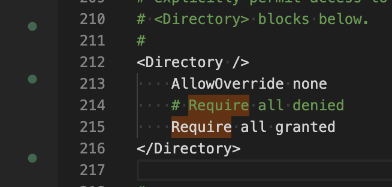

## 安装

XAMPP

## 修改配置文件

`.bitnami/stackman/machines/xampp/volumes/root/etc`

`httpd.conf`




## 命令

```bash
sudo apachectl restart
```

## 安装

### 安装XAMPP

1. 停止mysql
2. proftpd

在`/Applications/XAMPP/xamppfiles/etc/proftpd.conf`中添加
```config

DefaultAddress 192.168.31.36
```


### 先安装composer
```bash

curl -s http://getcomposer.org/installer | php

mv composer.phar /usr/local/bin/composer
```

### 进入web目录，在终端执行
```bash
composer global require "fxp/composer-asset-plugin"
```

### 创建目录
```bash

composer create-project --prefer-dist yiisoft/yii2-app-basic yii
```

## 换源

### 配置只在当前项目生效

```bash
composer config repo.packagist composer https://mirrors.aliyun.com/composer/

# 取消当前项目配置
composer config --unset repos.packagist
```

### 配置全局生效

```bash
composer config -g repo.packagist composer https://mirrors.aliyun.com/composer/

# 取消全局配置
composer config -g --unset repos.packagist
```

## YII启动

```
php yii serve --port=8888

```

```sql
CREATE TABLE `books` (
  `code` CHAR(11) NOT NULL PRIMARY KEY,
  `name` CHAR(250) NOT NULL,
  `author` CHAR(250),
  `publisher` CHAR(250)
) ENGINE=InnoDB DEFAULT CHARSET=utf8;

INSERT INTO `books` VALUES ('01','JavaScript高级程序设计','司徒1','北京邮电出版社1');
INSERT INTO `books` VALUES ('02','你不知道的JavaScript','司徒2','北京邮电出版社2');
INSERT INTO `books` VALUES ('03','JavaScript设计模式与开发实践','司徒3','北京邮电出版社3');
INSERT INTO `books` VALUES ('04','CSS揭秘','司徒4','北京邮电出版社4');
INSERT INTO `books` VALUES ('05','CSS世界','司徒5','北京邮电出版社5');
INSERT INTO `books` VALUES ('06','WebKit技术内幕','司徒6','北京邮电出版社6');
INSERT INTO `books` VALUES ('07','Node.js：来一打 C++ 扩展','司徒7','北京邮电出版社7');
INSERT INTO `books` VALUES ('08','深入浅出Node.js','司徒8','北京邮电出版社8');
INSERT INTO `books` VALUES ('09','HTML5 Canvas核心技术图形动画与游戏开发','司徒9','北京邮电出版社9');
```
